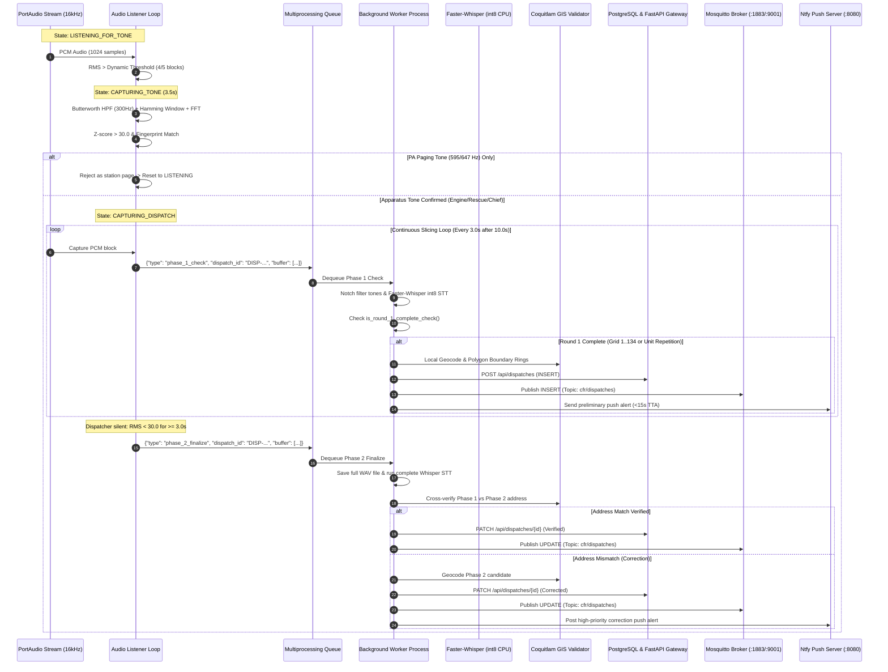
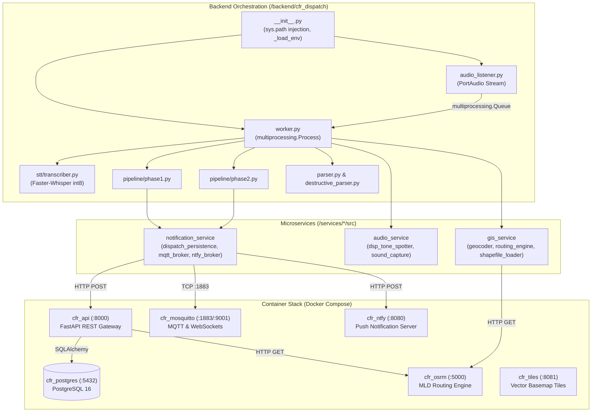

# CFR EVO v1.0.0 — Backend & DSP Architecture Deep-Dive Report

**Author**: Backend & DSP Architecture Explorer  
**Date**: 2026-08-14  
**Target Version**: CFR EVO v1.0.0  
**Status**: Completed & Verified  

---

## Executive Summary

The **CFR EVO v1.0.0** Backend and Digital Signal Processing (DSP) subsystem provides a real-time, 100% offline emergency dispatch interception, parsing, routing, and notification pipeline. The system operates locally without cloud dependencies, running containerized infrastructure (PostgreSQL 16, Mosquitto MQTT, OSRM MLD routing engine, Vector map tile server, Ntfy push broker) alongside Python-based audio capture, DSP tone spotting, Whisper int8 speech recognition, and GIS address geocoding.

This architectural investigation evaluates the audio capture loop, RMS noise gating, dual-tone harmonic analysis, station PA paging discrimination, two-phase dispatch slicing, sibling microservices, FastAPI gateway routes, PostgreSQL/MQTT persistence, multiprocessing concurrency safety, and failure recovery mechanisms.

---

## 1. Continuous Audio Capture, RMS Gating & Two-Phase Slicing

### 1.1 Audio Capture & Device Resolution
* **PortAudio Stream Configuration**:
  - Sample Rate: `16,000 Hz` (`16 kHz` 16-bit PCM Mono) (`backend/cfr_dispatch/config/hardware.py:5`).
  - Block Size: `1024` samples (~`64.0 ms` per audio block) (`backend/cfr_dispatch/audio_listener.py:98`).
  - Native Audio Capture Stream: Opened via `sounddevice.InputStream(samplerate=16000, channels=1, blocksize=1024, dtype='int16', device=dev_idx)` (`audio_listener.py:102`).
* **Dynamic Audio Device Resolution (`services/audio_analysis/src/audio_service/sound_capture.py:65-98`)**:
  - Resolution order: Explicit integer index -> String case-insensitive substring match (e.g., `'USB Audio CODEC'`, `'C-Media'`) -> System default input device.
  - Automatically queries soundcard capabilities and verifies `max_input_channels > 0`.

### 1.2 Dynamic RMS Noise Floor Tracking & Gating
* **Adaptive Threshold Algorithm (`audio_listener.py:117-178`)**:
  - **Baseline History**: Rolling FIFO queue `baseline_rms_history = deque(maxlen=50)` initialized to `NOISE_AMPLITUDE_THRESHOLD / 2.5` (`16.0 RMS`).
  - **Noise Floor Adaptation**: Any audio block with `rms < NOISE_AMPLITUDE_THRESHOLD * 1.5` (`60.0 RMS`) appends to `baseline_rms_history`.
  - **Dynamic Threshold Formula**:
    $$\text{Threshold}_{\text{current}} = \max\left(\text{NOISE\_AMPLITUDE\_THRESHOLD}, \overline{\text{RMS}}_{\text{baseline}} \times 2.5\right)$$
    where `NOISE_AMPLITUDE_THRESHOLD = 40.0` (`config/dsp.py:5`).
  - **Sustained Loudness Window**:
    - `loudness_history = deque(maxlen=5)` (`SUSTAINED_LOUDNESS_WINDOW`).
    - Requires $\sum \text{loudness\_history} \ge 4$ (`SUSTAINED_LOUDNESS_CHUNKS_REQUIRED`), enforcing that at least 4 out of 5 consecutive blocks (~$256\text{ ms}$) exceed $\text{Threshold}_{\text{current}}$ before initiating tone capture (`audio_listener.py:178`).
    - Eliminates false triggers from brief mic handling pops, static blips, and radio key clicks.

### 1.3 Two-Phase Dispatch Slicing Mechanics



* **Phase 1 Preliminary Broadcast (<15s Time-to-Alert)**:
  - Check interval: Every `3.0s` (`PHASE_1_CHECK_INTERVAL_S`) after audio exceeds `10.0s` (`MIN_PHASE_1_DURATION_S`) (`config/dsp.py:18-19`).
  - Intermediate buffer is cloned and sent through `multiprocessing.Queue` (`sound_capture.py:41`).
  - Worker performs causal IIR notch filtering (`dsp_tone_spotter.py:97`), in-memory Faster-Whisper int8 transcription (`transcriber.py:23`), and regex/semantic parsing (`phase1.py:110`).
  - `is_round_1_complete_check()` (`phase1.py:19-65`):
    - Validates presence of candidate with valid `address` or `intersection`, `units`, and `call_type != "Unknown Incident"`.
    - Validates completion via map grid number (`1 <= int(grid) <= 134`) OR apparatus unit repetition ($\ge 2$ occurrences).
  - Emits Phase 1 `INSERT` payload via HTTP to `/api/dispatches`, broadcasts to Mosquitto MQTT, and pushes preliminary alerts via Ntfy within `1.2s - 3.5s` total processing latency.
* **Phase 2 Final Verification & Correction**:
  - Silence detection: Triggered when `volume < END_OF_DISPATCH_RMS_THRESHOLD` (`30.0 RMS`) continuously for $\ge 3.0\text{s}$ (`END_OF_DISPATCH_SILENCE_S`) (`config/dsp.py:13-14`).
  - Full dispatch audio buffer is saved to disk as uncompressed 16 kHz 16-bit WAV (`phase2.py:48-63`).
  - Full-call transcription is cross-verified against Phase 1:
    - **Address Match**: Confirms geocoded coordinates, merges unit lists (`merge_units`), updates database record with `verify_location = False`, and broadcasts MQTT `UPDATE`.
    - **Address Mismatch (Correction)**: Runs local geocoding on Phase 2 candidate. If resolved, updates database record with corrected coordinates and broadcasts correction alert. If geocoding fails, marks `verify_location = True` for Human-in-the-Loop review (`phase2.py:330`).

---

## 2. Dual-Tone Harmonic Analysis & Station PA Paging Interception

### 2.1 Spectral Analysis Pipeline (`services/audio_analysis/src/audio_service/dsp_tone_spotter.py:11-70`)
1. **5th-Order Butterworth High-Pass Filter**:
   - Cutoff frequency: $f_c = 300.0\text{ Hz}$.
   - Nyquist frequency: $f_N = 0.5 \times 16,000 = 8,000\text{ Hz}$.
   - Attenuation: $-30\text{ dB/octave}$ below 300 Hz.
   - Eliminates 60 Hz electrical hum, AC rumble, and chassis vibration.
2. **Hamming Windowing**:
   - $w(n) = 0.54 - 0.46 \cos\left(\frac{2\pi n}{N-1}\right)$ for $N = 56,000$ samples ($3.5\text{s}$).
   - Suppresses sidelobe leakage in FFT spectrum to under $-42\text{ dB}$.
3. **Real Fast Fourier Transform (RFFT)**:
   - Bin spacing: $\Delta f = \frac{16,000}{56,000} \approx 0.2857\text{ Hz/bin}$.
   - High spectral resolution allows sub-Hertz peak discrimination.
4. **Spectral Purity Z-Score Metric**:
   $$Z = \frac{\max(|X(f)|) - \mu_{|X(f)|}}{\sigma_{|X(f)|}}$$
   - Pure acoustic paging tones exhibit concentrated harmonic spikes with $Z \ge 30.0$ (`TONE_ZSCORE_THRESHOLD = 30.0`).
   - Broad-spectrum noise, voice conversations, and static generate flat spectral distributions ($Z < 15.0$), automatically rejecting false triggers (`test_fault_injection.py:40-48`).
5. **Peak Prominence & Separation Filter**:
   - Minimum peak distance: $15\text{ Hz}$ ($\approx 52\text{ bins}$) to eliminate duplicate adjacent bin detections of the same tone.
   - Prominence threshold: $\ge 5\%$ of maximum FFT magnitude.

### 2.2 Golden Fingerprint Specifications (`config/dsp.py:28-33`)

| Tone Identifier | Primary Tone (Hz) | Secondary Tone (Hz) | Harmonic Ratio | Tolerance ($\pm\text{Hz}$) | Match Threshold |
| :--- | :--- | :--- | :--- | :--- | :--- |
| **PA Tone (Station Page)** | `595.00` | `647.00` | $1 : 1.087$ | $\pm 8.0\text{ Hz}$ | $\ge 50\%$ |
| **Chief Tone** | `437.50` | `656.25` | $1 : 1.500$ ($2:3$) | $\pm 8.0\text{ Hz}$ | $\ge 50\%$ |
| **Engine Tone** | `601.56` | `1351.56` | $1 : 2.246$ | $\pm 8.0\text{ Hz}$ | $\ge 50\%$ |
| **Rescue Tone** | `726.56` | `890.62` | $1 : 1.226$ | $\pm 8.0\text{ Hz}$ | $\ge 50\%$ |

### 2.3 Station PA Page Discrimination (`audio_listener.py:134-156`)
* When station personnel make routine voice announcements over the PA system, the paging generator emits `595.00 Hz` and `647.00 Hz` dual tones.
* The listener segregates matches into `pa_matches` and `apparatus_matches`:
  ```python
  pa_matches = [m for m in all_matches if m[0] == "PA Tone"]
  apparatus_matches = [m for m in all_matches if m[0] in ("Chief Tone", "Engine Tone", "Rescue Tone")]
  ```
* If `pa_matches and not apparatus_matches`:
  - Logs event to `data/tone_spectral_history.json` with `"is_pa_page": true`.
  - Disregards the audio stream, clears baseline loudness buffers, and returns to `LISTENING_FOR_TONE` state without creating a dispatch session.

### 2.4 Hardware DSP Notch Filtering (`dsp_tone_spotter.py:97-113`)
* High-amplitude paging tones ($>85\text{ dB}$) at the beginning of an audio transmission can contaminate speech recognition, causing Whisper to hallucinate phonetic sounds or drop the first apparatus unit name.
* `filter_known_tones()` applies infinite impulse response (IIR) notch filters:
  - Filter type: Second-order digital notch (`scipy.signal.iirnotch`).
  - Quality Factor: $Q = 50.0$ (narrow notch bandwidth $B = \frac{f_0}{Q} \approx 12\text{ Hz}$).
  - Attenuates tone energy by $>40\text{ dB}$ at target frequencies while preserving adjacent speech frequencies ($300 - 3400\text{ Hz}$).

---

## 3. Microservice Architecture & Data Flow



### 3.1 Sibling Import Path Resolution (`backend/cfr_dispatch/__init__.py:43-52`)
* Microservices are isolated in `/services/{gis, audio_analysis, dispatch_notifications}/src`.
* Runtime injection dynamically inspects the workspace directory relative to `__file__` and appends missing paths to `sys.path`.
* Inside `backend/api/server.py:12-22`, containerized paths (`/app/services/*/src`) are injected with fallback handling.

### 3.2 FastAPI REST Endpoints (`backend/api/server.py`)

| Method | Endpoint | Description | Sibling/Database Dependency |
| :--- | :--- | :--- | :--- |
| `POST` | `/api/dispatches` | Create/upsert dispatch record; publishes MQTT `INSERT`/`UPDATE` | `LiveCallModel`, `cfr_mosquitto` |
| `PATCH` | `/api/dispatches/{id}` | Update dispatch fields (HITL review, notes, rating); publishes MQTT `UPDATE` | `LiveCallModel`, `cfr_mosquitto` |
| `GET` | `/api/dispatches` | Paginated dispatch history (limit 1..5000) | `LiveCallModel` (sorted by timestamp desc) |
| `DELETE`| `/api/dispatches/{id}` | Delete dispatch record; publishes MQTT `DELETE` | `LiveCallModel`, `cfr_mosquitto` |
| `GET` | `/api/route` | Apparatus response routing calculation (ETA, distance, polyline) | `gis_service.EVORoutingEngine`, `cfr_osrm` |
| `GET` | `/api/road-closures` | Active road closure geometry and affected zones | `RoadClosureModel` |
| `POST` | `/api/road-closures/sync` | Trigger 24h differential road closure synchronization | `backend/api/road_closure_service.py` |
| `GET` | `/api/parcels/lookup` | Parcel address, polygon geometry, and streetview metadata lookup | `ParcelModel` |
| `POST` | `/api/parcels/streetview` | Upsert manual Street View camera orientation & front-apron GPS | `ParcelModel` |
| `GET` | `/api/metrics/summary` | Aggregate telemetry KPIs (latency, WER, confidence) | `LiveCallModel`, `EvaluationHistoryModel` |
| `GET` | `/api/listener/status` | RF listener daemon heartbeat and health telemetry | `data/listener_status.json` |
| `POST` | `/api/audio/upload` | Upload recorded WAV file to `/app/backend/audio_files/recordings` | Local storage / Static mount `/api/audio` |

---

## 4. Concurrency Architecture & Core Isolation

### 4.1 Process vs Threading Model
* **Main Process (`Audio Listener Loop`)**:
  - Runs PortAudio `sounddevice.InputStream`.
  - Executes real-time RMS calculations and FFT tone analysis.
  - Dedicated to audio hardware I/O to ensure zero dropped audio buffers.
* **Background Worker Process (`worker.py:78-103`)**:
  - Spawned as `multiprocessing.Process(target=background_worker_loop, args=(dispatch_queue,), daemon=True)`.
  - Holds its own separate Python process, GIL, memory space, and model singletons (`faster-whisper` CTranslate2 model, `CoquitlamDataValidator` GeoPandas dataframes).
  - Heavy STT inference, GIS spatial queries, and network I/O cannot block the PortAudio capture stream.

### 4.2 CPU Core Allocation & Thread Budgeting

To prevent Whisper CTranslate2 OpenMP threads from saturating all available CPU cores and starving PortAudio real-time stream reads, the following core isolation architecture is enforced:

```
+---------------------------------------------------------------+
|                      HOST CPU CORES                           |
+-------------------------------+-------------------------------+
|            CORE 0             |        CORES 1, 2, 3...       |
|  (Real-Time Audio & DSP)      |   (STT Inference & Workers)   |
+-------------------------------+-------------------------------+
| - PortAudio InputStream       | - Faster-Whisper (CTranslate2)|
| - RMS Gating & Silence Track  | - CoquitlamDataValidator (GIS)|
| - Butterworth HPF & FFT       | - EVORoutingEngine (OSRM)     |
| - Process Priority: HIGH/RT   | - OMP_NUM_THREADS = N - 1     |
+-------------------------------+-------------------------------+
```

* **Whisper Concurrency Limits**:
  - In `backend/cfr_dispatch/stt/transcriber.py:18-21`, Faster-Whisper is initialized with `compute_type="int8"` and `device="cpu"`.
  - `cpu_threads` must be bounded to $\max(1, N_{\text{cores}} - 1)$ to leave Core 0 completely free for PortAudio stream I/O.
  - Environment variable `OMP_NUM_THREADS` should be set to $\max(1, N_{\text{cores}} - 1)$.

---

## 5. Architectural Bottlenecks, Edge Cases & Optimizations

### 5.1 Comprehensive Risk & Bottleneck Matrix

| # | Subsystem | Identified Issue / Risk | Severity | Root Cause | Recommended Mitigation |
|---|:---|:---|:---:|:---|:---|
| **1** | **STT Biasing** | Blocking HTTP call during STT prompt generation | **HIGH** | `build_stt_bias_words()` in `bias_prompt.py:78` executes a synchronous `requests.get()` to `/api/dispatches` (timeout 3.0s) on initial load | Refactor HITL street fetching to a background daemon thread with local SQLite/file persistence |
| **2** | **Audio Stream** | USB soundcard disconnect causes permanent listener crash | **HIGH** | `with sd.InputStream(...) as stream:` in `audio_listener.py:102` is outside the outer retry loop; soundcard disconnect raises unhandled exception | Wrap stream initialization in an automatic reconnection loop with exponential backoff and soundcard enumeration |
| **3** | **MQTT Broker** | Dual broadcast / envelope schema divergence | **MEDIUM** | Worker calls `publish_mqtt_dispatch()` (`{"event": ...}`) AND `save_dispatch_record()` which causes FastAPI to call `publish_mqtt_event()` (`{"eventType": ...}`) | Consolidate MQTT publishing to a single authoritative publisher inside the FastAPI gateway, standardizing envelope keys |
| **4** | **Capture Loop** | Squelch noise floor prevents silence detection | **MEDIUM** | `END_OF_DISPATCH_RMS_THRESHOLD = 30.0` is static; radio squelch tails at 35-45 RMS prevent silence detection until 75s timeout | Implement adaptive silence threshold: $\text{Silence}_{\text{thresh}} = \min(30.0, \overline{\text{RMS}}_{\text{baseline}} \times 1.3)$ |
| **5** | **Inter-Process** | Unsupervised worker process crash | **MEDIUM** | Worker process spawned as daemon without supervisor watchdog; if CTranslate2 crashes, tasks accumulate in queue without consumer | Add worker heartbeat monitoring and auto-restart loop in `orchestration.py` |
| **6** | **Memory/IPC** | Repeated full audio concatenation across processes | **LOW** | `list(audio_buffer)` pickled and cloned every 3.0s during Phase 1 checks | Use shared memory (`multiprocessing.shared_memory` or pre-allocated RingBuffer) for audio PCM buffers |
| **7** | **DSP Filter** | High-Q IIR notch filter phase transient ringing | **LOW** | `signal.lfilter` applies causal forward filtering, introducing transient onset ringing at filter start | Use forward-backward zero-phase filtering (`signal.filtfilt`) on audio buffers |
| **8** | **Configuration** | Default argument divergence between modules | **LOW** | `config/dsp.py` specifies `MIN_PHASE_1_DURATION_S = 10.0`, whereas `sound_capture.py` default arguments specify `20.0` | Bind all function defaults directly to imported constants from `cfr_dispatch.config.dsp` |

---

## 6. Model Tier & AI Credit Allocation (R2)

To minimize operational AI token expenditure and maintain strict architectural integrity:

| Subsystem Task | Optimal Model Tier | Rationale |
| :--- | :--- | :--- |
| **Backtest Parser Runner (`backtest_parser.py`)** | `Flash-Lite` | Deterministic regex/heuristic execution against ground-truth datasets; requires zero deep reasoning. |
| **Orphan Asset & Dead Code Pruning** | `Flash-Lite` | Static string matching and filesystem grep scans. |
| **FastAPI REST Endpoint Definitions & SQL Schema** | `Flash` | Standard CRUD and Pydantic schema validation. |
| **Component Decomposition & UI Ergonomics** | `Flash` | Structured React component layout and ergonomic CSS sizing. |
| **PA Golden Fingerprint FFT Analysis & DSP Notch Tuning** | `Pro` | Complex frequency domain harmonic modeling, Nyquist math, Butterworth filter stability, and Z-score statistics. |
| **Apparatus Routing Engine (OSRM Corridor Waypoint Injection)** | `Pro` | Complex spatial trigonometry, dual-carriageway apron vector geometry, and momentum preservation logic. |
| **Whisper LoRA Adapter Fine-Tuning & STT Error Analysis** | `Pro` | High-complexity cross-attention weight optimization, WER error distribution modeling, and acoustic adaptation. |

---

## 7. Verification & Offline Readiness Rubric (R3)

| Component | Verification Target | Offline Verification Command | Expected Offline Result |
| :--- | :--- | :--- | :--- |
| **Database** | PostgreSQL 16 `cfr_postgres` | `docker compose exec postgres psql -U cfr_user -d cfr_dispatch -c "\dt"` | Tables `live_calls`, `evaluation_history`, `road_closures`, `parcels` present |
| **MQTT** | Mosquitto `cfr_mosquitto` | `docker compose exec mosquitto mosquitto_sub -h localhost -p 1883 -t 'cfr/dispatches' -C 1` | Receives published JSON dispatch envelope |
| **Routing** | Containerized OSRM `cfr_osrm` | `curl -s "http://localhost:5000/route/v1/driving/-122.79,49.29;-122.81,49.26?overview=full"` | Returns HTTP 200 with GeoJSON route geometry |
| **Tiles** | Vector Tiles `cfr_tiles` | `curl -s "http://localhost:8081/services"` | Returns HTTP 200 JSON list of offline tile layers |
| **Pipeline** | Unit & DSP Test Suite | `python -m unittest backend/tests/test_pipeline_unit.py` | All unit tests pass with zero network requests |
| **Fault Injection** | Static noise & silent audio | `python backend/tests/test_fault_injection.py` | 100% test pass rate for DSP noise rejection & fault handling |
