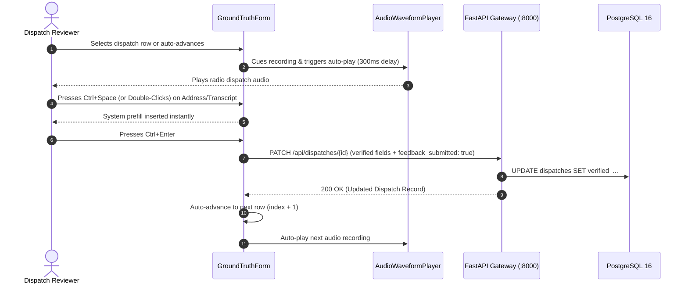

# CFR EVO v1.0.0 — Frontend & Kiosk Ergonomics Architecture Investigation Report

**Author**: Frontend & Kiosk Ergonomics Architecture Explorer  
**Date**: 2026-08-14  
**Target Milestone**: CFR EVO v1.0.0 Feature Freeze, Component Decomposition & Kiosk Hardening  
**Codebase Context**: `frontend/` (React 19, Vite 7, Tailwind CSS 3.4, Leaflet 1.9, React-Leaflet 5, MQTT.js)

---

## Executive Summary

This investigation evaluates the frontend architecture and user experience ergonomics of **CFR EVO v1.0.0** across two operating environments:
1. **Station Bay 10-Foot Kiosk HUD**: Wall-mounted 1080p/4K apparatus bay display designed for 10–25 ft readability, hands-free auto-activation, tactile touch dismissal, high-contrast typography, and multi-panel situational awareness.
2. **Workstation / Laptop Console Client**: Interactive split-pane GIS exploration, dispatcher review, and administrative control.

The investigation identified key architectural strengths, pinpointed critical Rule 1 (`GEMINI.md`) API resolution violations and WAN asset leaks, formulated a complete component decomposition strategy for monolithic modules (specifically `DispatchReview.jsx` at 1,602 lines), streamlined the rapid reviewer workflow, verified offline Leaflet raster/vector rendering against local port `8081`, and defined an actionable, risk-mitigated refactoring roadmap with model tier cost allocations.

---

## 1. Dual-Mode Responsive Layout & Ergonomic Architecture

### 1.1 Operating Environment Comparison

```
+---------------------------------------------------------------------------------------------------------+
|                                    CFR EVO DUAL-MODE ARCHITECTURE                                       |
+-------------------------------------------------------------------+-------------------------------------+
|                     STATION BAY KIOSK (10-FOOT UI)                |     WORKSTATION / LAPTOP CONSOLE    |
+-------------------------------------------------------------------+-------------------------------------+
| Viewing Distance  | 10 - 25 feet across apparatus bay             | 18 - 24 inches (desktop monitor)    |
| Primary Actor     | Responding crew mounting apparatus            | Dispatch officer / GIS administrator|
| Interaction Model | Hands-free / Glanceable / 80px touch targets  | Keyboard shortcuts / Mouse / Modals |
| Color Theme       | Deep Slate/Black (#020617 / #0a0f1d)          | Slate-900 / Slate-950 Dark Theme    |
| Primary Address   | text-4xl to text-7xl font-black uppercase     | text-base to text-xl font-bold      |
| Response Time     | Live count-up timer + 5-min auto-dismiss      | Standard timestamps & latency stats |
| Audio Cues        | High-priority chime on queued dispatches      | Audio recording player & seek bar   |
+-------------------------------------------------------------------+-------------------------------------+
```

### 1.2 Station Bay 10-Foot Kiosk HUD (`KioskView.jsx`)

1. **Header Alert HUD (Top 15–20% Viewport)**:
   - **Incident Priority Code**: High-contrast flashing badges (`🚨 Emergency (Code 3)` in `bg-red-600` vs `🟢 Routine (Code 1)` in `bg-emerald-600`).
   - **Responding Units & Apparatus ETAs**: Real-time calculated arrival estimates (`E1 : 02:30 ETA`, `L1 : 03:45 ETA`, `R1 : 02:15 ETA`) with color-coded unit badge styling:
     - Engine (`E`): Orange (`bg-orange-500/20 text-orange-400 border-orange-500/50`)
     - Rescue (`R`): Red (`bg-rose-500/20 text-rose-400 border-rose-500/50`)
     - Ladder (`L`): Cyan/Sky (`bg-sky-500/20 text-sky-300 border-sky-500/50`)
     - Chief (`C`): Gold/Amber (`bg-amber-500/20 text-amber-300 border-amber-500/50`)
     - Medic (`M`): Emerald (`bg-emerald-500/20 text-emerald-400 border-emerald-500/50`)
   - **Tactical Hydrant Callout**: Nearest City hydrant (`💧 City Hydrant: D-163 (42m)`) and Private hydrant (`🔒 Private: 18m`).
   - **Pre-Incident Plan Button**: One-tap access to building construction PDF modal (`PrePlanModal.jsx`).
   - **Primary Target Heading**: Ultra-large uppercase address (`text-4xl` / `text-5xl`), verified map grid badge (`(GRID 92)`), and test drill warning banner (`⚠️ SYSTEM TEST / DRILL — NOT A LIVE 911 CALL ⚠️`).
   - **Live Timers & Controls**: Elapsed response counter, 5-minute auto-dismiss countdown, and simulation exit buttons.

2. **Main Viewport Layout (80–85% Viewport)**:
   - **Left ~2/3 (RouteOverviewPanel.jsx)**:
     - Full-bleed Leaflet route map showing live turn-by-turn emergency response routing from originating Fire Hall apron (e.g. Hall 1 at 1300 Pinetree Way) to target coordinates.
     - Dynamic container-aware `AutoFitBounds` filling 85–90% of map container area with automatic recentering upon new dispatch arrival.
     - Floating collapsible dispatch details & EMTRAC apparatus ETA card with CP Rail crossing alerts (`🚂 RAIL CROSSING AHEAD`).
   - **Right ~1/3 Equal-Height Detail Stack (3 Panels)**:
     - **Panel 1: BlockParcelPanel.jsx**: Micro-cadastral map displaying the building parcel polygon (`target.rings` with `#0284c7` border and `#38bdf8` fill) and NFPA 291 fire hydrants within 400m.
     - **Panel 2: PropertySatellitePanel.jsx**: High-resolution aerial satellite imagery with building footprint overlay and surrounding road/traffic context.
     - **Panel 3: StreetViewPanel.jsx**: Google Street View 360° street facade oriented via `atan2` front-entrance vector math with database-persisted preferred view angle (`[SAVED PREFERRED VIEW]`).

3. **Autonomous Wake & Event Lifecycle (`useKioskQueue.js`)**:
   - Boots into an idle station monitor listening for Mosquitto MQTT WebSockets events on topic `cfr/dispatches`.
   - Incoming Phase 1 `INSERT` immediately takes over screen from idle mode or review mode.
   - Secondary calls during active response are queued with a visual warning banner (`⚠️ 2 New Calls Queued — Tap to View Next`) and an audible dual-tone chime (`587Hz -> 880Hz`).
   - Touch/click on screen resets the 5-minute timeout countdown.

---

## 2. Component Decomposition Strategy

### 2.1 Problem Analysis: The `DispatchReview.jsx` Monolith

At **1,602 lines of code**, `DispatchReview.jsx` represents the largest single-file maintenance bottleneck in the frontend codebase. It combines five distinct architectural domains into one component:

```
+---------------------------------------------------------------------------------------------------+
|                              CURRENT MONOLITH: DispatchReview.jsx (1602 lines)                    |
+---------------------------------------------------------------------------------------------------+
| 1. Auth & Telemetry  | Session checks, login form, DB status ping, RF listener polling            |
| 2. Search & Filtering| Full-text search, status filter pills, tone dropdown, unit dropdown        |
| 3. Table Rendering   | Table headers, sorting, row layout, tone badges, confidence tags, actions  |
| 4. Audio Playback    | Signed URL resolution, HTML5 audio controls, -5s seek, duration display    |
| 5. Pipeline Timeline | 3-stage collapsible execution flow (Raw STT, Metadata + ETAs, Template)   |
| 6. HITL Form Panel   | Textarea auto-resize, prefill shortcuts, tone toggles, rating, notes, opt-in|
+---------------------------------------------------------------------------------------------------+
```

### 2.2 Proposed Modular Decomposition Architecture

We decompose `DispatchReview.jsx` into a clean, modular structure under `frontend/src/components/review/`:

```
frontend/src/components/review/
├── DispatchReview.jsx                 # Root Container / Layout Orchestrator (~120 lines)
├── context/
│   └── ReviewContext.jsx              # Centralized State Provider (calls, selectedCall, filters, form)
├── hooks/
│   ├── useReviewState.js              # Hook for review data fetching & mutations
│   └── useKeyboardShortcuts.js        # Global hotkey listener (Ctrl+Space, Alt+Enter, Ctrl+Enter)
├── auth/
│   └── AdminLoginModal.jsx            # Admin credentials login dialog (~75 lines)
├── header/
│   ├── ReviewHeader.jsx               # Header bar with DB sync & RF listener status badges (~80 lines)
│   └── SubNavTabs.jsx                 # Review Panel vs System Metrics Tab Switcher (~45 lines)
├── table/
│   ├── TableFilterBar.jsx             # Search bar + Status pills + Tone/Unit selects (~110 lines)
│   ├── DispatchTable.jsx              # Sticky header table container (~90 lines)
│   ├── DispatchRow.jsx                # Individual dispatch row with memoized cell renderers (~120 lines)
│   └── ToneBadgeGroup.jsx             # Memoized Chief/Engine/Rescue circle indicators (~50 lines)
├── player/
│   └── AudioWaveformPlayer.jsx        # Audio element, -5s skip, auto-play settlement, duration (~95 lines)
└── verification/
    ├── VerificationSidebar.jsx        # Right sidebar container & simulate action (~85 lines)
    ├── PipelineExecutionTimeline.jsx  # 3-Stage collapsible accordion timeline (~130 lines)
    ├── GroundTruthForm.jsx            # Form container & submission handler (~110 lines)
    ├── TranscriptEditor.jsx           # Auto-expanding textarea with shortcut listeners (~85 lines)
    ├── ToneSelector.jsx               # 3-way toggle buttons for Chief/Engine/Rescue (~60 lines)
    ├── MetadataFields.jsx             # Units, Incident, Address, Subaddress, TG, Grid (~140 lines)
    ├── QualityRatingBar.jsx           # Perfect / Operational / Failed quick-rate buttons (~55 lines)
    └── WhisperTrainingOptIn.jsx       # Checkbox with <35s cutoff safeguard (~45 lines)
```

---

## 3. Rapid Reviewer Workflow & Ergonomics

### 3.1 Reviewer Pain Points & Solutions

| Reviewer Action | Previous Bottleneck | Rapid Ergonomic Solution |
| :--- | :--- | :--- |
| **Field Population** | Manually re-typing detected speech into form fields | `Ctrl + Space`, `Alt + Enter`, or Double-Click to instantly prefill from AI pipeline extraction. |
| **All-Field Import** | Copy-pasting 6 separate fields | Single-click `📋 Prefill All Fields` button bulk-populates transcript, address, incident, units, subaddress, talkgroup, and map grid. |
| **Audio Scrubbing** | Using small slider to replay missed words | `⏪ -5s` dedicated quick-jump button immediately rewinds audio 5 seconds and resumes playback. |
| **Row Navigation** | Manually clicking next row in table after every save | Auto-advance: saving immediately selects next row (`index + 1`), resets scroll, and auto-plays audio. |
| **Form Submission** | Reaching for mouse to click submit button | `Ctrl + Enter` / `Cmd + Enter` anywhere in form immediately commits verification and triggers auto-advance. |
| **Dataset Poisoning** | Accidental inclusion of cut-off audio in training | Calls `<35.0s` duration are automatically defaulted to `include_in_training: false` with warning `⚠️ Cut-Off Default`. |

### 3.2 Interaction Sequence Diagram



---

## 4. Offline Leaflet Map Rendering & Zero-WAN Hardening

### 4.1 Local Tile Server Integration

The frontend architecture uses a 100% containerized, local offline tile server running on port `8081` on the kiosk host:

* **Dynamic Base URL**: `TILE_BASE_URL = http://${window.location.hostname}:8081`
* **Local Basemap Styles**:
  - `VOYAGER`: `${TILE_BASE_URL}/services/vancouver/tiles/{z}/{x}/{y}.png`
  - `DARK`: `${TILE_BASE_URL}/services/vancouver_dark/tiles/{z}/{x}/{y}.png`
  - `GREY` / `LIGHT`: `${TILE_BASE_URL}/services/vancouver_light/tiles/{z}/{x}/{y}.png`
  - `OSM`: `${TILE_BASE_URL}/services/vancouver/tiles/{z}/{x}/{y}.png`
* **FallbackTileLayer Subclass**: In `MapLayers.jsx`, a custom `L.TileLayer` catches tile load errors and falls back to online Carto/OSM tiles only if `VITE_DISABLE_WAN_FALLBACK !== 'true'`. When `VITE_DISABLE_WAN_FALLBACK=true`, online fallbacks are completely suppressed.

### 4.2 Static GIS Data Asset Audit

| Asset | Local File Path | Purpose | WAN Dependency |
| :--- | :--- | :--- | :--- |
| **Hydrants** | `frontend/dist/data/hydrants.json` | 2,800+ municipal hydrants with NFPA flow ratings | **Zero (100% Offline)** |
| **Emergency Zones** | `frontend/dist/data/zones.json` | Zones 1–134 polygon boundaries & centroids | **Zero (100% Offline)** |
| **Blocks** | `frontend/dist/data/blocks.json` | Street block boundary index | **Zero (100% Offline)** |
| **Addresses** | `frontend/dist/data/addresses.json` | Civic address centroid index | **Zero (100% Offline)** |
| **Intersections** | `frontend/dist/data/intersections.json` | Major intersection cross-streets | **Zero (100% Offline)** |
| **City Boundary** | `frontend/dist/data/coquitlam_city_boundary.json` | Outer municipal border polygon | **Zero (100% Offline)** |
| **Station Aprons** | `frontend/src/components/MapConstants.js` | 4 Fire Hall driveway coordinates | **Zero (100% Offline)** |

---

## 5. Critical Vulnerabilities & Defect Analysis

### 5.1 Violation of `GEMINI.md` Rule 1 (Raw Relative `fetch()` Calls)

**Issue**: `GEMINI.md` Rule 1 explicitly mandates:
> *"All frontend components performing `fetch()` operations MUST import and use `API_BASE_URL` from `frontend/src/apiClient.js` (e.g., `fetch(\`${API_BASE_URL}/api/route?...\`)`). Never use raw relative paths (`fetch('/api/...')`) or hardcoded `localhost` strings, as remote kiosk browsers accessing the UI over Tailscale (`http://100.95.146.94:5173`) will route relative requests to the Vite static server (resulting in 404s)."*

**Direct Observations**:
1. `frontend/src/components/MapBoard.jsx:678`:
   ```javascript
   const fetchFromGateway = fetch("/api/road-closures")
   ```
   *Impact*: When viewed on the station kiosk display over Tailscale (`http://100.95.146.94:5173`), this request targets Vite port 5173 instead of FastAPI port 8000, returning a 404 HTML error page.
2. `frontend/src/components/admin/SystemMetricsPanel.jsx:22`:
   ```javascript
   const res = await fetch("/api/metrics/summary");
   ```
   *Impact*: System metrics dashboard fails to load on the kiosk display over Tailscale.

### 5.2 External CDN Marker Icon Asset Leak

**Direct Observations**:
1. `frontend/src/components/kiosk/RouteOverviewPanel.jsx:63-64`
2. `frontend/src/components/kiosk/BlockParcelPanel.jsx:32-33`
3. `frontend/src/components/kiosk/PropertySatellitePanel.jsx:50-51`
   ```javascript
   const targetIcon = new L.Icon({
     iconUrl: 'https://raw.githubusercontent.com/pointhi/leaflet-color-markers/master/img/marker-icon-2x-gold.png',
     shadowUrl: 'https://cdnjs.cloudflare.com/ajax/libs/leaflet/0.7.7/images/marker-shadow.png',
     ...
   });
   ```
*Impact*: If the station internet connection drops, Leaflet marker pins fail to render or block rendering waiting on HTTP timeouts.

### 5.3 Live ArcGIS MapServer Dependency in `CoquitlamOverlays` & `FireZonesLayer`

**Direct Observations**:
1. `frontend/src/components/MapLayers.jsx:140-145`:
   ```javascript
   const overlayLayer = dynamicMapLayer({
       url: "https://geodata.coquitlam.ca/arcgis/rest/services/DynamicServices/Cadastral/MapServer",
       ...
   });
   ```
2. `frontend/src/components/MapLayers.jsx:171-177`:
   ```javascript
   const layer = dynamicMapLayer({
       url: "https://geodata.coquitlam.ca/arcgis/rest/services/DynamicServices/Planning/MapServer",
       ...
   });
   ```
*Impact*: In offline apparatus bay operation, dynamic MapServer layers will throw request errors. While `CoquitlamOverlays` catches errors to fall back to basemap labels, `FireZonesLayer` has no local fallback unless `zones.json` is rendered via GeoJSON layer.

---

## 6. Component Refactoring Roadmap & Model Tier Allocation Matrix

In compliance with **Requirement R2 (Model Tier & AI Credit Optimization Strategy)**:

| Task ID | Component / Area | Description | Risk | Target Model Tier |
| :--- | :--- | :--- | :--- | :--- |
| **FE-01** | `MapBoard.jsx` & `SystemMetricsPanel.jsx` | Fix raw relative `fetch()` endpoints to use `API_BASE_URL` | Low | **Flash-Lite (Low Effort)** |
| **FE-02** | `RouteOverviewPanel.jsx`, `BlockParcelPanel.jsx`, `PropertySatellitePanel.jsx` | Replace external GitHub/CDN Leaflet marker URLs with local bundled icons in `dist/icons/` | Low | **Flash-Lite (Low Effort)** |
| **FE-03** | `DispatchReview.jsx` | Decompose monolithic 1,602-line component into `frontend/src/components/review/` (`ReviewTable/`, `AudioPlayer/`, `VerificationSidebar/`, `Auth/`) | Medium | **Flash (Medium Effort)** |
| **FE-04** | `ReviewContext.jsx` & `useReviewState.js` | Extract state management, keyboard shortcut listeners (`Ctrl+Space`, `Ctrl+Enter`), and auto-advance logic into custom hook | Medium | **Flash (Medium Effort)** |
| **FE-05** | `MapLayers.jsx` & Offline Hardening | Implement offline GeoJSON vector fallback for Cadastral parcels and Planning Fire Zones when `geodata.coquitlam.ca` is unreachable | High | **Pro (High Reasoning / Spatial)** |
| **FE-06** | `KioskView.jsx` | Optimize multi-map canvas resource disposal to prevent WebGL/Leaflet memory leaks on continuous station kiosk operation | Medium | **Flash (Medium/High Effort)** |

---

## 7. Verification Rubric & Independent Audit Procedures

To independently verify these findings:
1. **API Endpoint Verification**:
   ```bash
   # Search for forbidden raw relative fetch calls in frontend/src
   grep -rn 'fetch("/api' frontend/src/
   grep -rn "fetch('/api" frontend/src/
   ```
2. **External URL / CDN Asset Audit**:
   ```bash
   # Search for non-local URLs in frontend/src
   grep -rn 'https://raw.githubusercontent.com' frontend/src/
   grep -rn 'https://cdnjs.cloudflare.com' frontend/src/
   ```
3. **Kiosk Remote Build Verification**:
   ```bash
   # Execute production build test
   cd frontend && npm run build
   ```
