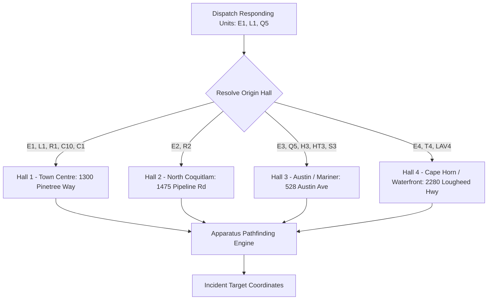
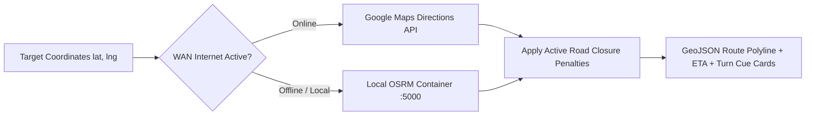

# Emergency Apparatus Routing Engine Runbook

This skill outlines the pathfinding algorithms, station origin mapping, vehicle clearance profiles, and dual-mode (offline OSRM / online Google Directions) routing workflows for **CFR EVO**.

---

## 1. Station Origin Directory & Apparatus Mapping

When a dispatch specifies responding units, the routing engine resolves the departure fire hall:

### Station Coordinates Master Table:
| Station | Address | Latitude | Longitude | Primary Units |
| :--- | :--- | :--- | :--- | :--- |
| **Hall 1 (Headquarters)** | 1300 Pinetree Way, Coquitlam, BC | `49.2882` | `-122.7938` | `E1`, `L1`, `R1`, `C10`, `C1`, `S1`, `M1` |
| **Hall 2 (North)** | 1475 Pipeline Rd, Coquitlam, BC | `49.3095` | `-122.7661` | `E2`, `L2`, `R2` |
| **Hall 3 (Southwest)** | 528 Austin Ave, Coquitlam, BC | `49.2437` | `-122.8834` | `E3`, `Q5` (Quint 5), `H3`, `HT3`, `S3` |
| **Hall 4 (Southeast)** | 2280 Lougheed Hwy, Coquitlam, BC | `49.2551` | `-122.8023` | `E4`, `T4`, `LAV4` |

---

## 2. Dual-Mode Routing Architecture

### A. Online: Google Maps Directions API
* **Endpoint**: `https://maps.googleapis.com/maps/api/directions/json`
* **Parameters**:
  - `origin`: Hall coordinates (e.g. `49.2882,-122.7938`)
  - `destination`: Target incident coordinates
  - `departure_time`: `now`
  - `traffic_model`: `pessimistic` / `best_guess`
* **Output**: Detailed step-by-step instructions, polyline decoded into GeoJSON coordinates, distance in kilometers, duration in traffic.

### B. Offline: Local Containerized OSRM Engine
* **Endpoint**: `http://localhost:5000/route/v1/driving/{origin_lng},{origin_lat};{dest_lng},{dest_lat}?overview=full&geometries=geojson&steps=true`
* **Performance**: Sub-10ms response time with zero internet dependency.

---

## 3. Apparatus Physical Profiles & Road Restrictions

Different vehicle classes require specific path weighting:

| Apparatus Class | Units | Weight / Size | Routing Constraints |
| :--- | :--- | :--- | :--- |
| **Heavy Aerial / Quint** | `L1`, `L2`, `Q5` (Quint 5) | 35–38 Tons, 12'8" Height | • Avoids residential laneways and tight traffic circles • Avoids weight-restricted bridges • Prefers multi-lane arterial roads |
| **Pumper / Engine** | `E1`, `E2`, `E3`, `E4` | 18 Tons, 10'2" Height | • Standard commercial vehicle clearance • Prefers secondary arterials over local alleys |
| **Command / Rescue** | `R1`, `R2`, `C10`, `C1`, `C9` | 3–12 Tons (SUV/Heavy Rescue) | • Standard emergency vehicle clearance • Quickest possible path |

---

## 4. Road Closure & Obstruction Avoidance

When active closures exist (from `road_closures` table):
1. Closed road segments are converted into exclusion coordinate polygons or forbidden bounding boxes.
2. In Google Directions, waypoints are injected to steer around the obstruction.
3. In local OSRM, road segments are excluded or penalized in the speed profile matrix.

---

## 5. Driver Station HUD & Mobile QR Integration

The route output generates three synchronized formats:
1. **Interactive Leaflet/MapLibre Polyline**: Bold glowing emerald line (`#00e676`) with directional arrows.
2. **Turn-by-Turn Cue Cards**: High-contrast, large-format instructions on the bay kiosk display (e.g., `➔ RIGHT onto David Ave in 400m`).
3. **MDT / Mobile Tablet QR Code**: Generates a dynamic QR code on the kiosk screen. Drivers scanning with a rugged tablet or phone instantly open the live route in native Google Maps or Apple Maps.
