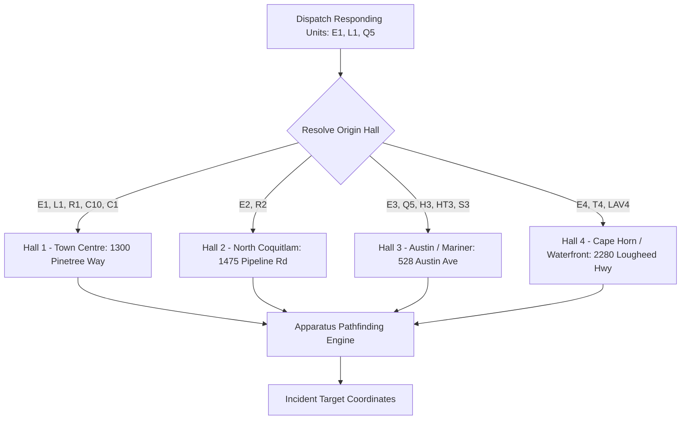
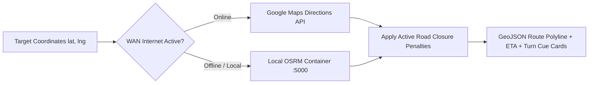

# Emergency Apparatus Routing Engine Runbook

This skill outlines the pathfinding algorithms, station origin mapping, vehicle clearance profiles, and dual-mode (offline OSRM / online Google Directions) routing workflows for **CFR EVO**.

---

## 1. Station Origin Directory & Apparatus Mapping

When a dispatch specifies responding units, the routing engine resolves the departure fire hall:



### Station Coordinates Master Table:
| Station | Address | Latitude | Longitude | Primary Units |
| :--- | :--- | :--- | :--- | :--- |
| **Hall 1 (Headquarters)** | 1300 Pinetree Way, Coquitlam, BC | `49.2882` | `-122.7938` | `E1`, `L1`, `R1`, `C10`, `C1`, `S1`, `M1` |
| **Hall 2 (North)** | 1475 Pipeline Rd, Coquitlam, BC | `49.3095` | `-122.7661` | `E2`, `L2`, `R2` |
| **Hall 3 (Southwest)** | 528 Austin Ave, Coquitlam, BC | `49.2437` | `-122.8834` | `E3`, `Q5` (Quint 5), `H3`, `HT3`, `S3` |
| **Hall 4 (Southeast)** | 2280 Lougheed Hwy, Coquitlam, BC | `49.2551` | `-122.8023` | `E4`, `T4`, `LAV4` |

---

## 2. Dual-Mode Routing Architecture



### A. Online: Google Maps Directions API
* **Endpoint**: `https://maps.googleapis.com/maps/api/directions/json`
* **Parameters**:
  - `origin`: Hall coordinates (e.g. `49.2882,-122.7938`)
  - `destination`: Target incident coordinates
  - `departure_time`: `now`
  - `traffic_model`: `pessimistic` / `best_guess`
* **Output**: Detailed step-by-step instructions, polyline decoded into GeoJSON coordinates, distance in kilometers, duration in traffic.

### B. Offline: Local Containerized OSRM Engine
* **Endpoint**: `http://localhost:5000/route/v1/driving/{origin_lng},{origin_lat};{dest_lng},{dest_lat}?overview=full&geometries=geojson&steps=true`
* **Performance**: Sub-10ms response time with zero internet dependency.

---

## 3. Apparatus Physical Profiles & Road Restrictions

Different vehicle classes require specific path weighting:

| Apparatus Class | Units | Weight / Size | Routing Constraints |
| :--- | :--- | :--- | :--- |
| **Heavy Aerial / Quint** | `L1`, `L2`, `Q5` (Quint 5) | 35–38 Tons, 12'8" Height | • Avoids residential laneways and tight traffic circles<br>• Avoids weight-restricted bridges<br>• Prefers multi-lane arterial roads |
| **Pumper / Engine** | `E1`, `E2`, `E3`, `E4` | 18 Tons, 10'2" Height | • Standard commercial vehicle clearance<br>• Prefers secondary arterials over local alleys |
| **Command / Rescue** | `R1`, `R2`, `C10`, `C1`, `C9` | 3–12 Tons (SUV/Heavy Rescue) | • Standard emergency vehicle clearance<br>• Quickest possible path |

---

## 4. Response Mode Physics & ETAs (Code 3 Emergency vs Code 1 Routine)

The routing engine dynamically adjusts speed profiles, road curvature multipliers, and turnout chute times based on the parsed `response_type`:

| Response Mode | Signal Preemption (EmTrac / Opticom) | Avg Urban Speed | Road Multiplier | Turnout Buffer | Driving Characteristics |
| :--- | :--- | :--- | :--- | :--- | :--- |
| **🚨 Emergency (Code 3)** | **Active** (Lights & Siren, Opticom green-light request) | **45.0 km/h** | `1.35x` | **0.5 min** (30s) | Priority intersection clearance, running red signals safely, Opticom preempted green lights |
| **🟢 Routine (Code 1)** | **Inactive** (Standard Public Drive Time) | **32.0 km/h** | `1.45x` | **1.0 min** (60s) | Obeys all traffic signals, stop signs, speed limits, and standard public traffic congestion |

---

## 5. Road Closure & Obstruction Avoidance

When active closures exist (from `road_closures` table):
1. Closed road segments are converted into exclusion coordinate polygons or forbidden bounding boxes.
2. In Google Directions, waypoints are injected to steer around the obstruction.
3. In local OSRM, road segments are excluded or penalized in the speed profile matrix.

---

## 6. Tactical EVO Routing Biases & Corridor Weighting

When crafting prompt instructions or configuring custom routing rules, use standard **Tactical Emergency Vehicle Operator (EVO)** weighting principles:

### A. Core Tactical Principles:
1. **EmTrac / Opticom Preemption Corridors**:
   - Always prefer multi-lane arterial corridors equipped with EmTrac green-light preemption (e.g. `Pinetree Way`, `Lougheed Hwy`) over shorter residential cut-throughs.
2. **Barrier-Free Lane maneuverability (No Median Islands)**:
   - **Mariner Way Corridor (Station 1 Departure)**: When responding toward Mariner Way / Ranch Park, **always take Guildford Way $\rightarrow$ Johnson St $\rightarrow$ Mariner Way**.
   - *Reason*: Guildford/Johnson has **no center-line median islands or physical concrete barriers**, allowing heavy apparatus to cross center-lines and maneuver around stopped traffic cleanly. (Never take Pinetree $\rightarrow$ Right on Lougheed $\rightarrow$ Left on Mariner, which has dangerous traffic barriers and awkward turns).
3. **Town Centre / Gordon Ave Corridor (Station 1 Departure)**:
   - When responding to the Gordon Ave / Coquitlam Centre sector: **Pinetree Way South $\rightarrow$ Left onto Lougheed Hwy $\rightarrow$ Right onto Christmas Way $\rightarrow$ Right onto Gordon Ave**.
   - *Reason*: Leverages Pinetree's synchronized rolling-green EmTrac wave down to Lougheed.

### B. Implementation via Intermediate Waypoints:
To force an explicit tactical corridor for a target neighborhood:
```json
{
  "hall_1_mariner_corridor": {
    "origin": "1300 Pinetree Way (Hall 1)",
    "target_sector": "Mariner Way / Ranch Park",
    "waypoints": ["Pinetree Way & Guildford Way", "Guildford Way & Johnson St", "Johnson St & Mariner Way"],
    "reason": "Barrier-free lanes; avoids Lougheed/Mariner traffic islands"
  },
  "hall_1_gordon_corridor": {
    "origin": "1300 Pinetree Way (Hall 1)",
    "target_sector": "Gordon Ave / Town Centre",
    "waypoints": ["Pinetree Way & Lougheed Hwy", "Lougheed Hwy & Christmas Way"],
    "reason": "Pinetree rolling-green EmTrac wave; natural right-turn approach"
  }
}
```

---

## 7. Driver Station HUD & Mobile QR Integration

The route output generates three synchronized formats:
1. **Interactive Leaflet/MapLibre Polyline**: Bold glowing emerald line (`#00e676`) with directional arrows.
2. **Turn-by-Turn Cue Cards**: High-contrast, large-format instructions on the bay kiosk display (e.g., `➔ RIGHT onto David Ave in 400m`).
3. **MDT / Mobile Tablet QR Code**: Generates a dynamic QR code on the kiosk screen. Drivers scanning with a rugged tablet or phone instantly open the live route in native Google Maps or Apple Maps.

---

## 8. Iterative Call-Review Calibration Protocol

The emergency routing engine is designed to be tuned and calibrated continuously based on call reviews and firefighter driver feedback:

1. **Review Loop**: As dispatches are reviewed in the UI or audited by analysts, flag routes that take suboptimal residential shortcuts, steep hill climbs, or awkward multi-point apparatus turns.
2. **Profile Calibration**: Adjust OSRM Lua emergency profiles, arterial road speed weights, turn-penalty matrices, and tactical corridor waypoints based on empirical driver behavior.
3. **Regression Testing**: Re-run historical dispatch routing benchmarks after profile adjustments to verify that fixes in one response district do not cause regressions in others.

---

## 9. LiDAR-Based Topographic Slope & Apparatus Hill-Grade Routing Penalties (Future Roadmap)

Coquitlam features extreme topography across Westwood Plateau, Burke Mountain, Chineside, and Austin Heights with roadway grades exceeding $15\% - 25\%$. Future iterations of the routing engine will leverage municipal LiDAR elevation models (DEM) to dynamically calculate slope penalties:

### A. Mathematical Incline/Decline Calculation
For each street edge $(u, v)$ in the routing graph:
$$\text{Grade } (\%) = \left( \frac{z_v - z_u}{\text{Distance}_{u,v}} \right) \times 100$$

### B. Heavy Apparatus Slope Penalty Matrix:
| Road Grade $(\%)$ | Direction | OSRM Speed Adjustment | Operational EVO Rationale |
| :--- | :--- | :---: | :--- |
| **$0\% - 6\%$** | Flat / Mild | `1.0x` (Unrestricted) | Normal Code 3 emergency response speed profile |
| **$7\% - 12\%$** | Downhill | `0.80x` (-20% speed) | Early engine braking; transmission retarder engagement |
| **$7\% - 12\%$** | Uphill | `0.75x` (-25% speed) | Torque-limited heavy apparatus climb rate |
| **$13\% - 18\%$** | Downhill | `0.55x` (-45% speed) | **Severe Brake Fade Prevention**: Caps 50,000 lb engines at $\le 35\text{ km/h}$ |
| **$13\% - 18\%$** | Uphill | `0.50x` (-50% speed) | Low-gear torque crawl (realistic turnout ETA calculation) |
| **$> 18\%$** | Any | `0.30x` (+ Severe Route Weight Penalty) | **Avoided by Pathfinding**: Disincentivizes steep residential chutes unless target address is directly on that segment |

### C. Low-Gradient Arterial Biasing
The OSRM routing profile will actively favor engineered switchback arterials (e.g. *Johnson St*, *Pinetree Way*, *David Ave*) over sheer vertical residential hillside climbs, protecting vehicle brakes and powertrain longevity.
