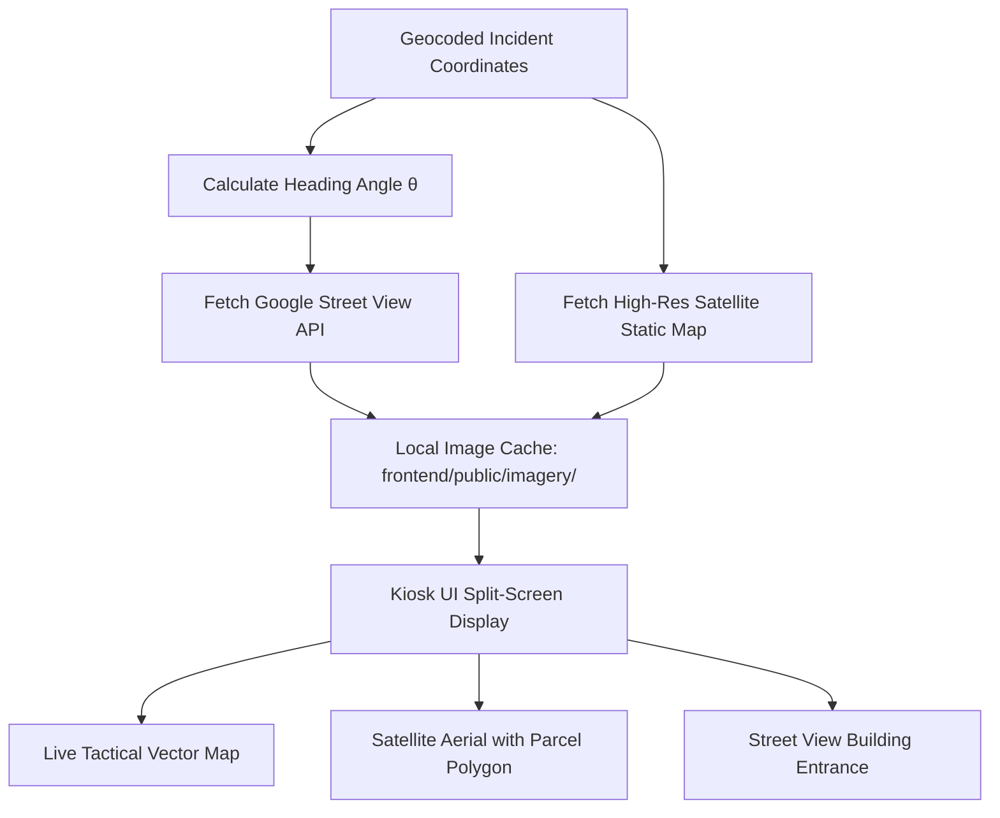

# Satellite Imagery & Street View Enrichment Runbook

This skill outlines how to fetch, orient, cache, and display high-resolution **Google Satellite aerial imagery** and **Street View 360° building facade views** for emergency dispatches in **CFR EVO**.

---

## 1. Tactical Purpose on Station Displays

When arriving at an incident, crew situational awareness is dramatically improved by seeing:
1. **Satellite Aerial Imagery**: Roof structure, commercial access gates, alleyway egress, nearby exposure hazards, and hazardous material storage.
2. **Street View Facade**: Front door location, driveway orientation, building height/stories, and visible security gates.



---

## 2. Dynamic Heading ($\theta$) & Facade Orientation

To ensure Street View points directly at the building entrance (rather than down the road), calculate the bearing from the street access point to the parcel centroid:

```python
import math

def calculate_streetview_heading(street_lat: float, street_lng: float, parcel_lat: float, parcel_lng: float) -> int:
    """
    Calculates compass heading (0-360 degrees) from street point toward building centroid.
    """
    d_lng = math.radians(parcel_lng - street_lng)
    lat1 = math.radians(street_lat)
    lat2 = math.radians(parcel_lat)

    y = math.sin(d_lng) * math.cos(lat2)
    x = math.cos(lat1) * math.sin(lat2) - math.sin(lat1) * math.cos(lat2) * math.cos(d_lng)
    
    bearing = math.degrees(math.atan2(y, x))
    return int((bearing + 360) % 360)
```

---

## 3. Google Static Imagery API Integration

### A. Satellite Aerial View with Parcel Outline & Hydrant Markers
* **Endpoint**: `https://maps.googleapis.com/maps/api/staticmap`
* **Query Parameters**:
  ```properties
  center=49.2781,-122.8123
  zoom=18
  size=640x480
  scale=2
  maptype=satellite
  key=GOOGLE_MAPS_API_KEY
  ```
* **Embedding Parcel Polygon & Hydrant Pins**:
  - `path=color:0x00e676ff|weight:3|fillcolor:0x00e67620|49.2781,-122.8123|49.2782,-122.8124|...`
  - `markers=color:blue|label:H|49.2785,-122.8120` (Nearest NFPA Hydrant)

### B. Street View Static Facade View
* **Endpoint**: `https://maps.googleapis.com/maps/api/streetview`
* **Query Parameters**:
  ```properties
  size=640x480
  location=49.2781,-122.8123
  fov=90
  heading=245
  pitch=10
  key=GOOGLE_MAPS_API_KEY
  ```

---

## 4. Local Caching Strategy (Zero-Latency & Quota Protection)

To minimize API costs and guarantee instant loading on station kiosks:
1. When Phase 1 or Phase 2 geocodes a dispatch, a background task requests both images.
2. The image buffers are persisted directly into `frontend/public/imagery/`:
   - `frontend/public/imagery/{dispatch_id}_satellite.jpg`
   - `frontend/public/imagery/{dispatch_id}_streetview.jpg`
3. The React kiosk UI references local relative paths (`/imagery/{dispatch_id}_streetview.jpg`). If external internet drops, previously fetched imagery continues to display seamlessly.

---

## 5. React Kiosk HUD Component Pattern

```jsx
// frontend/src/components/kiosk/TacticalImageryPanel.jsx
export function TacticalImageryPanel({ dispatchId, lat, lng }) {
  const satelliteUrl = `/imagery/${dispatchId}_satellite.jpg`;
  const streetViewUrl = `/imagery/${dispatchId}_streetview.jpg`;

  return (
    <div className="grid grid-cols-1 md:grid-cols-2 gap-4 h-full">
      {/* Satellite Aerial */}
      <div className="relative rounded-2xl overflow-hidden border border-slate-700 bg-slate-900">
        <span className="absolute top-3 left-3 px-3 py-1 bg-slate-900/80 text-xs font-bold text-emerald-400 rounded-lg">
          SATELLITE RECON
        </span>
        
      </div>

      {/* Street View Facade */}
      <div className="relative rounded-2xl overflow-hidden border border-slate-700 bg-slate-900">
        <span className="absolute top-3 left-3 px-3 py-1 bg-slate-900/80 text-xs font-bold text-cyan-400 rounded-lg">
          STREET VIEW FACADE
        </span>
        
      </div>
    </div>
  );
}
```
