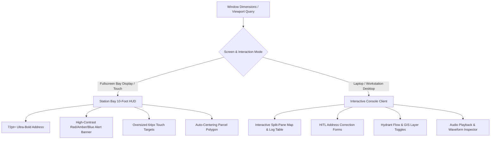

# Kiosk & Workstation Responsive Ergonomics Guide

This skill provides layout rules, typography tokens, and viewport adaptation standards for the **CFR EVO Frontend** across two distinct operating environments:
1. **Station Bay Kiosk (10-Foot UI)**: High-visibility 1080p/4K displays viewed from 10–25 feet away as crew mounts apparatus.
2. **Workstation / Laptop Console**: Interactive split-pane interface used on officer laptops and desk terminals.

---

## 1. Dual-Mode Responsive Architecture



---

## 2. Display Mode Specifications

### Mode A: Station Bay 10-Foot UI Standard (`isKioskMode: true`)
* **Viewing Distance**: 10–25 feet across apparatus bay.
* **Layout Structure**:
  * **Top 30% Viewport**: Active Alert Banner with flashing incident priority, apparatus unit badges (`E1`, `L1`, `R1`), and live response timer.
  * **Bottom 70% Viewport**: Full-bleed map view automatically panning and zooming to the parcel polygon boundary (`target.rings`).
* **Design System Tokens**:
  * Primary Address Font: `text-5xl` to `text-7xl` (`font-black`, uppercase).
  * Unit Badges: `text-3xl font-extrabold px-6 py-3 rounded-2xl`.
  * Background: Deep slate/black (`#0a0f1d`) for maximum contrast and reduced eye strain in dark bay bays.
  * Touch Dismissal: Entire screen tap or giant 80px "Acknowledge" button.

### Mode B: Workstation / Laptop Console (`isKioskMode: false`)
* **Viewing Distance**: 18–24 inches (laptop screen or dual-monitor console).
* **Layout Structure**:
  * **Left Panel (40%)**: Dispatch history feed, confidence badges, audio waveform player, and HITL feedback modal.
  * **Right Panel (60%)**: Interactive map with layer toggles (NFPA hydrants, road closures, emergency zone boundaries).
* **Design System Tokens**:
  * Typography: Clean Inter/Roboto (`text-base` to `text-xl`).
  * Interactive Controls: Compact form inputs, dropdown selectors, copy-to-clipboard coordinates, and street view split toggle.

---

## 3. Implementation Patterns (Tailwind & React)

```jsx
// Example responsive container pattern:
export function DispatchHUD({ dispatch, isKioskView }) {
  return (
    <div className={`transition-all duration-300 ${
      isKioskView 
        ? "h-screen w-screen p-8 bg-slate-950 flex flex-col justify-between" 
        : "max-w-7xl mx-auto p-4 grid grid-cols-1 lg:grid-cols-12 gap-4"
    }`}>
      {/* Dynamic typography based on mode */}
      <h1 className={isKioskView ? "text-6xl font-black text-white" : "text-2xl font-bold text-slate-100"}>
        {dispatch.address}
      </h1>
      
      {/* Unit Badges */}
      <div className="flex flex-wrap gap-3">
        {dispatch.responding_units.map(unit => (
          <span key={unit} className={isKioskView ? "text-3xl font-black px-6 py-3 bg-red-600 rounded-2xl" : "text-sm font-bold px-3 py-1 bg-red-700 rounded-lg"}>
            {unit}
          </span>
        ))}
      </div>
    </div>
  );
}
```

---

## 4. Testing Display Profiles

To simulate both modes in local development:
* **Bay Kiosk Mode**: Press `F11` in browser or append `?mode=kiosk` to `http://localhost:5173`.
* **Workstation Mode**: Open in standard browser window at `http://localhost:5173` or responsive tablet/laptop resolution (1366x768 / 1920x1080).
