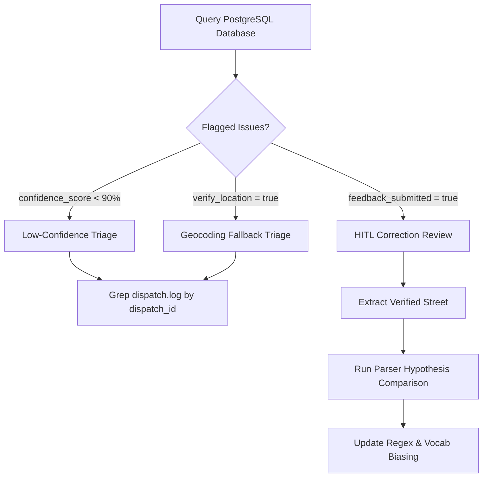

# HITL & Call Log Analysis Runbook

This skill provides operational workflows for auditing dispatch accuracy, triaging low-confidence alerts, evaluating Human-in-the-Loop (HITL) corrections, and comparing raw audio transcripts against parser hypotheses in **CFR EVO**.

---

## 1. Triage Workflow Overview



---

## 2. Querying Flagged Dispatches in PostgreSQL

Run the following SQL queries via `mcp_cfr-postgres_query` or `psql` to identify calls requiring review:

### A. Calls Flagged with Location Verification or Low Confidence:
```sql
SELECT 
    dispatch_id, 
    incident_type, 
    confidence_score, 
    verify_location, 
    target->>'address' AS target_address, 
    sanitized_transcript,
    created_at
FROM dispatches
WHERE verify_location = true OR confidence_score < 90.0
ORDER BY created_at DESC
LIMIT 25;
```

### B. Calls with Human Reviewer Corrections (HITL Submissions):
```sql
SELECT 
    dispatch_id,
    target->>'address' AS system_address,
    verified_address,
    verified_transcript,
    feedback_notes,
    created_at
FROM dispatches
WHERE feedback_submitted = true
ORDER BY created_at DESC
LIMIT 25;
```

---

## 3. Investigating Log Traces for a Specific Dispatch

Filter `dispatch.log` using the `[dispatch_id]` prefix to see the exact sequence of DSP, STT, GIS, and MQTT events:

```powershell
# In PowerShell:
Select-String -Path dispatch.log -Pattern "DISP-2026-1793D9"
```

Look for key audit tags:
* `[METRICS]`: Shows millisecond latency breakdown ($T_{\text{DSP}}, T_{\text{STT}}, T_{\text{GIS}}, T_{\text{Broadcast}}$).
* `[CORRECTION_AUDIT]`: Indicates Phase 2 detected a discrepancy between Round 1 and Round 2 announcements.
* `[Local GIS Check] Match FAILED`: Indicates the parsed address candidate could not be matched against the Coquitlam parcel database.

---

## 4. Comparing Transcripts Against Parser Hypotheses

When an address fails to parse or is parsed incorrectly, run the parser hypothesis test script:

```powershell
.\.venv\Scripts\python.exe backend/scripts/backtest_parser.py --text "coquitlam engine 1 respond medical 2648 sandstone crescent"
```

### Common Root Causes & Fixes:

| Symptom | Probable Cause | Corrective Action |
| :--- | :--- | :--- |
| **Phonetic Mishearing** (e.g. *"low heat highway"*) | Whisper speech-to-text ambiguity | Add replacement to `phonetic_corrections` in `backend/cfr_dispatch/parser/sanitize.py` |
| **Street Suffix Dropped** (e.g. *"sandstone"* vs *"sandstone crescent"*) | Dispatcher spoke abbreviation | Check fuzzy street matcher in `gis_service.CoquitlamDataValidator` |
| **Speech Cutoff in Phase 1** | Preliminary audio buffer sliced before address spoken | Verify `MIN_PHASE_1_DURATION_S` ($\ge 20$s) and `is_round_1_complete_check()` |
| **Unknown Incident Type** | Novel phrasing used by dispatcher | Add incident keyword mapping to `CALL_TYPES` in `backend/cfr_dispatch/parser/` |

---

## 5. Dynamic STT Prompt Biasing Sync

When reviewer corrections are submitted via the kiosk UI, they are automatically fetched and biased on the next Whisper cycle via:
```python
from cfr_dispatch.stt import get_hitl_verified_streets
# Fetches top misheard streets and injects into initial_prompt
```
To force-refresh the in-memory cache immediately:
```powershell
.\.venv\Scripts\python.exe -c "from cfr_dispatch.stt import get_hitl_verified_streets; print(get_hitl_verified_streets())"
```
