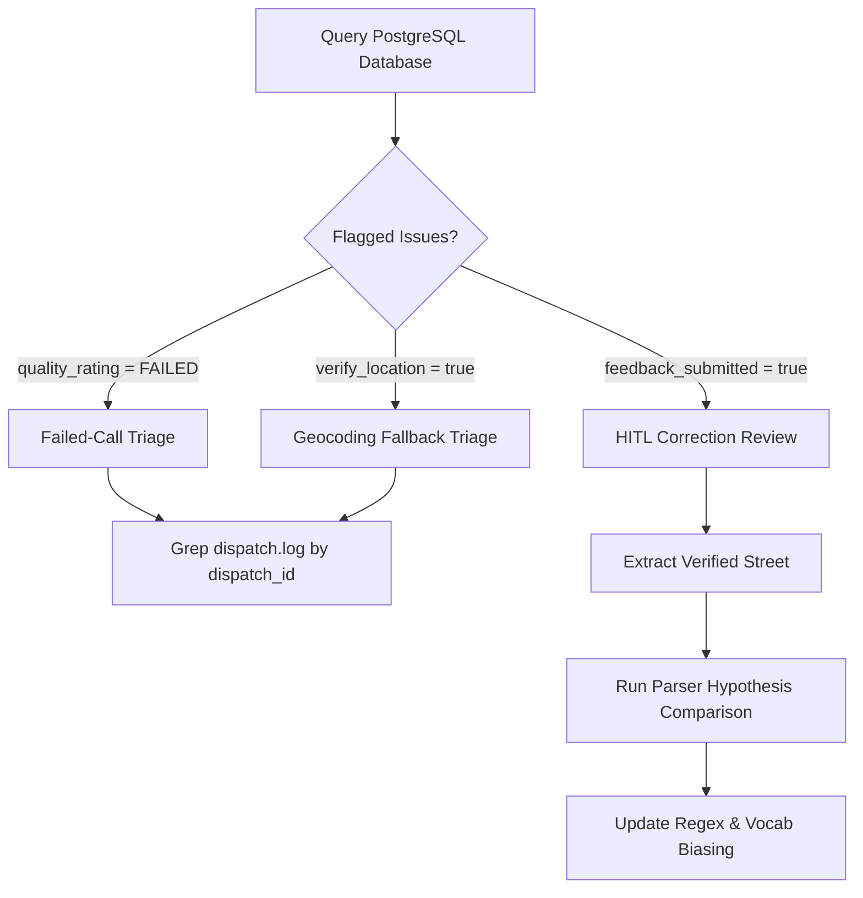

# HITL & Call Log Analysis Runbook

This skill provides operational workflows for auditing dispatch accuracy, triaging low-confidence alerts, evaluating Human-in-the-Loop (HITL) corrections, and comparing raw audio transcripts against parser hypotheses in **CFR EVO**.

---

> [!WARNING]
> **Corrected 2026-08-30. Both queries in §2 were broken and would not run.** They selected
> `confidence_score` (removed from the schema by the operator ruling — see punch-list #54),
> `created_at` (never existed on `dispatches`; the column is `timestamp`) and `feedback_notes`
> (never existed; the column is `review_notes`). Two of those three were wrong from the day
> this file was written, not merely stale.
>
> **Triage on the operator's own rating, not on a derived score.** `quality_rating`
> (`PERFECT` / `OPERATIONAL` / `FAILED` / `PENDING`) and `review_notes` are what the operator
> actually records, and they outperformed every derived metric during the 2026-08-30 review:
> an inferred accuracy metric put a regression a week early and blamed the wrong subsystem,
> while the ratings located it immediately. Watch **PERFECT → OPERATIONAL with FAILED flat** —
> that is the signature of a *dropped field*, not a wrong answer.
>
> Before quoting any rate from these queries, read
> [`docs/qa_harnesses.md`](../../../docs/qa_harnesses.md) — it documents the traps that make a
> rate wrong, and every one has already bitten someone here.

## 1. Triage Workflow Overview



---

## 2. Querying Flagged Dispatches in PostgreSQL

Run the following SQL queries via `mcp_cfr-postgres_query` or `psql` to identify calls requiring review:

### A. Calls the operator rated as problems, or the geocoder could not place:
```sql
SELECT
    dispatch_id,
    incident_type,
    quality_rating,
    review_notes,
    verify_location,
    target->>'address'         AS target_address,
    target->>'resolution_note' AS geocoder_note,
    sanitized_transcript,
    timestamp
FROM dispatches
WHERE quality_rating = 'FAILED'
   OR verify_location = true
   OR target->>'resolution_note' IS NOT NULL
ORDER BY timestamp DESC
LIMIT 25;
```

`resolution_note` is the geocoder saying in its own words that it could not place the address.
It is set on every approximate rung and is frequently the fastest explanation of a bad call.

### B. Calls with Human Reviewer Corrections (HITL Submissions):
```sql
SELECT
    dispatch_id,
    target->>'address' AS system_address,
    verified_address,
    verified_incident,
    verified_transcript,
    quality_rating,
    review_notes,
    timestamp
FROM dispatches
WHERE feedback_submitted = true
ORDER BY timestamp DESC
LIMIT 25;
```

### C. Rating trend — is a change helping or hurting?
```sql
SELECT date_trunc('week', timestamp)::date AS wk,
       count(*) FILTER (WHERE quality_rating IN ('PERFECT','OPERATIONAL','FAILED')) AS rated,
       round(100.0 * count(*) FILTER (WHERE quality_rating = 'PERFECT')
             / nullif(count(*) FILTER (WHERE quality_rating IN ('PERFECT','OPERATIONAL','FAILED')), 0), 1) AS perfect_pct,
       count(*) FILTER (WHERE quality_rating = 'FAILED') AS failed
FROM dispatches
GROUP BY 1 ORDER BY 1;
```

**Read it for the movement, not the level.** The rated set is not a random sample — the operator
reviews what the operator reviews — so these percentages compare weeks to each other, never to a
citywide rate.

---

## 3. Investigating Log Traces for a Specific Dispatch

Filter `dispatch.log` using the `[dispatch_id]` prefix to see the exact sequence of DSP, STT, GIS, and MQTT events:

```powershell
# In PowerShell:
Select-String -Path dispatch.log -Pattern "DISP-2026-1793D9"
```

Look for key audit tags:
* `[METRICS]`: Shows millisecond latency breakdown (`dsp_ms`, `stt_ms`, `gis_ms`, `bcast_ms`).
* `[CORRECTION_AUDIT]`: Phase 2 found the address it parsed differs from Phase 1's.
* ~~`[Local GIS Check] Match FAILED`~~ — **this tag does not exist** (verified 2026-08-30, it
  appears nowhere in the codebase). For a geocoder miss, read `target->>'resolution_note'` on
  the record instead; the geocoder states in its own words why it could not place the address.

---

## 4. Comparing Transcripts Against Parser Hypotheses

> [!WARNING]
> **`backtest_parser.py` takes no arguments** — verified 2026-08-30, it has no `argparse` and
> reads no `sys.argv`. The `--text` flag documented here was silently ignored, and the script
> ran its full corpus comparison instead. Corrected below.

For a **single hypothesis**, parse it inline:

```powershell
.\.venv\Scripts\python.exe -c "from cfr_dispatch.parser import parse_dispatch_announcement; from cfr_dispatch.config import UNITS_VOCABULARY; [print(d) for d in parse_dispatch_announcement('coquitlam engine 1 respond medical 2648 sandstone crescent', UNITS_VOCABULARY)]"
```

For a **corpus run**, use the harnesses — and read
[`docs/qa_harnesses.md`](../../../docs/qa_harnesses.md) first:

| Script | Measures |
| :--- | :--- |
| `backend/scripts/backtest_parser_corpus.py` | parser output vs the operator's `verified_*` |
| `backend/scripts/backtest_regression.py` | before/after a change, over the corpus |
| `backend/scripts/backtest_round_comparison.py` | round 1 vs round 2 agreement, scored against ratings |
| `backend/scripts/backtest_parser.py` | production parser vs the destructive parser (no arguments) |

### Common Root Causes & Fixes:

| Symptom | Probable Cause | Corrective Action |
| :--- | :--- | :--- |
| **Phonetic Mishearing** (e.g. *"low heat highway"*) | Whisper speech-to-text ambiguity | Add replacement to `phonetic_corrections` in `backend/cfr_dispatch/parser/sanitize.py` |
| **Street Suffix Dropped** (e.g. *"sandstone"* vs *"sandstone crescent"*) | Dispatcher spoke abbreviation | Check fuzzy street matcher in `gis_service.CoquitlamDataValidator` |
| **Speech Cutoff in Phase 1** | Preliminary audio buffer sliced before address spoken | Verify `MIN_PHASE_1_DURATION_S` ($\ge 20$s) and `is_round_1_complete_check()` |
| **Unknown Incident Type** | Novel phrasing used by dispatcher | Add incident keyword mapping to `CALL_TYPES` in `backend/cfr_dispatch/parser/` |

---

## 5. Dynamic STT Prompt Biasing Sync

When reviewer corrections are submitted via the kiosk UI, they are automatically fetched and biased on the next Whisper cycle via:
```python
from cfr_dispatch.stt import get_hitl_verified_streets
# Fetches top misheard streets and injects into initial_prompt
```
To force-refresh the in-memory cache immediately:
```powershell
.\.venv\Scripts\python.exe -c "from cfr_dispatch.stt import get_hitl_verified_streets; print(get_hitl_verified_streets())"
```
