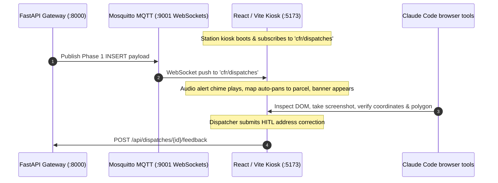

# Station Kiosk UI & Frontend Audit Runbook

This skill provides testing and verification procedures for the **CFR EVO Station Kiosk Frontend** (`frontend/`) using Chrome DevTools browser automation (`/browser`) and live MQTT event simulation.

---

## 1. Frontend Architecture & Real-Time Data Flow



---

## 2. Starting the Frontend Dev Server

To launch the local development server:
```powershell
cd frontend
npm run dev
```
The application will be accessible at `http://localhost:5173`.

---

## 3. UI Verification Checklist

When performing a visual or automated audit using `/browser`:

| Component | Target URL / View | Verification Criteria |
| :--- | :--- | :--- |
| **Active Alert Banner** | `http://localhost:5173` | • Displays flashing incident type badge (e.g. `STRUCTURE FIRE`)<br>• Responding units badges rendered (`E1`, `L1`, `R1`)<br>• Real-time elapsed time counter active |
| **Map & Parcel Polygon** | `http://localhost:5173` | • Map smoothly pans & zooms to dispatch coordinates<br>• Option 2 parcel boundary polygon (`target.rings`) drawn as highlighted overlay<br>• Target building pin centered |
| **NFPA 291 Fire Hydrants**| `http://localhost:5173` | • Nearest hydrants displayed with NFPA flow rate colors:<br>&nbsp;&nbsp;- 🔵 **Blue**: $\ge 1500$ GPM (Class AA)<br>&nbsp;&nbsp;- 🟢 **Green**: $1000-1499$ GPM (Class A)<br>&nbsp;&nbsp;- 🟠 **Orange**: $500-999$ GPM (Class B)<br>&nbsp;&nbsp;- 🔴 **Red**: $<500$ GPM (Class C) |
| **Audio Playback** | `http://localhost:5173` | • Waveform player loads `${LOCAL_API_URL}/recordings/{id}.wav`<br>• Play / Pause / Seek controls functional |
| **HITL Feedback Modal** | `http://localhost:5173` | • Clicking "Correct Address" opens modal<br>• Autocompletes street names from GIS layer<br>• Submitting sends `POST /api/dispatches/{id}/feedback` |

---

## 4. Simulating Live MQTT Dispatches for UI Testing

To test the frontend without waiting for a live radio broadcast, publish a synthetic dispatch payload:

```powershell
.\.venv\Scripts\python.exe -c "from notification_service import publish_mqtt_dispatch; from backend.tests.test_database_integration import TEST_DISPATCHES; from cfr_dispatch.pipeline import build_dispatch_payload; from cfr_dispatch.worker import get_shared_validator; val = get_shared_validator(); p, _ = build_dispatch_payload('DISP-UI-TEST', 'raw', 'coquitlam engine 1 respond structure fire 2648 sandstone crescent', [], val); publish_mqtt_dispatch(p, event_type='INSERT'); print('Simulated Phase 1 Alert sent over MQTT!')"
```

---

## 5. Capturing UI Screenshots with `/browser`

When using `/browser` automation:
1. Navigate to `http://localhost:5173`.
2. Wait 2 seconds for Leaflet/MapLibre tiles to render.
3. Capture a full-page screenshot to verify layout, color contrast, and dark-mode kiosk readability.
