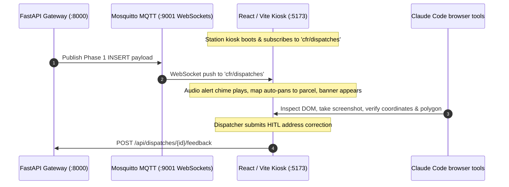

# Station Kiosk UI & Frontend Audit Runbook

This skill provides testing and verification procedures for the **CFR EVO Station Kiosk Frontend** (`frontend/`) using Chrome DevTools browser automation (`/browser`) and the review replay to put a real call on the display.

---

## 1. Frontend Architecture & Real-Time Data Flow



---

## 2. Starting the Frontend Dev Server

To launch the local development server:
```powershell
cd frontend
npm run dev
```
The application will be accessible at `http://localhost:5173`.

---

## 2a. Static checks, before any browser check

Run all three on every frontend change, from `frontend/`. A browser check cannot stand in for
them: it only sees the paths you happened to click.

```bash
npm run lint:crash
```

```bash
npx eslint $( { git diff --name-only --relative HEAD -- src; git ls-files --others --exclude-standard -- src; } | grep -E '\.(js|jsx)$' )
```

```bash
npm run build
```

The middle command runs the **full** `eslint.config.js` on the files you changed, including
new untracked ones. For work already committed, swap the braces for
`git diff --name-only --relative <base> HEAD -- src`. If the file list comes back empty, don't
run it: ESLint with no arguments lints the whole directory.

**Why full eslint as well.** `eslint.crash.config.js` is deliberately narrow: `no-undef`,
`react-hooks/immutability` (the TDZ case) and, since 2026-09-16, `react-hooks/rules-of-hooks`.
Those three are what the pre-commit hook blocks, because each compiles clean through Vite and
throws only in the browser. Everything else full eslint reports is advisory, so it doesn't
block a commit and isn't in `lint:crash`. It is still worth reading on the lines you changed.

**How `rules-of-hooks` got into the guard.** `727c297b` (#89) put a `React.useMemo` after
`RightSidebar`'s `if (!isExplore) return null;`. The crash config didn't include that rule
then, and `npm run build` doesn't check hook order, so it passed both and was deployed. React
19.2's production build throws on a hook-count change between renders: #300 for fewer hooks,
#310 for more (`react-dom-client.production.js`). The only error boundary is the root one
(`main.jsx`), so it fires as the whole-screen "Application Diagnostic Error" card. Full eslint
caught it during #91, and it was fixed in `776b52e5`. The operator then ruled the rule into
`lint:crash`, so the guard and this runbook now agree.

**Reading the result.** Full eslint has pre-existing errors in files nobody touched (three in
`MapBoard.jsx` as of 2026-09-16), and they are not yours to fix mid-freeze. An error is yours
if it is on a line you changed, or if it is absent when you stash your change and re-run.
Anything `lint:crash` reports is a blocker regardless.

---

## 3. UI Verification Checklist

When performing a visual or automated audit using `/browser`:

| Component | Target URL / View | Verification Criteria |
| :--- | :--- | :--- |
| **Active Alert Banner** | `http://localhost:5173` | • Displays flashing incident type badge (e.g. `STRUCTURE FIRE`)<br>• Responding units badges rendered (`E1`, `L1`, `R1`)<br>• Real-time elapsed time counter active |
| **Map & Parcel Polygon** | `http://localhost:5173` | • Map smoothly pans & zooms to dispatch coordinates<br>• Option 2 parcel boundary polygon (`target.rings`) drawn as highlighted overlay<br>• Target building pin centered |
| **NFPA 291 Fire Hydrants**| `http://localhost:5173` | • Nearest hydrants displayed with NFPA flow rate colors:<br>&nbsp;&nbsp;- 🔵 **Blue**: $\ge 1500$ GPM (Class AA)<br>&nbsp;&nbsp;- 🟢 **Green**: $1000-1499$ GPM (Class A)<br>&nbsp;&nbsp;- 🟠 **Orange**: $500-999$ GPM (Class B)<br>&nbsp;&nbsp;- 🔴 **Red**: $<500$ GPM (Class C) |
| **Audio Playback** | `http://localhost:5173` | • Waveform player loads `${LOCAL_API_URL}/recordings/{id}.wav`<br>• Play / Pause / Seek controls functional |
| **HITL Feedback Modal** | `http://localhost:5173` | • Clicking "Correct Address" opens modal<br>• Autocompletes street names from GIS layer<br>• Submitting sends `POST /api/dispatches/{id}/feedback` |

---

## 4. Putting a call on the display without a broadcast

There is no synthetic publisher. CLAUDE.md §6.5 forbids fabricated dispatches, and the test
module the old command here imported (`backend/tests/test_database_integration.py`) was
deleted 2026-08-31. Use the **review replay** instead: in the console, open a historical
dispatch in Kiosk view. `frontend/src/App.jsx` sends it through the same path as a live MQTT
call with `isReview: true`, so the banner reads REVIEW REPLAY and auto-dismiss is paused. What
you see is the call exactly as it was received.

---

## 5. Capturing UI Screenshots with `/browser`

When using `/browser` automation:
1. Navigate to `http://localhost:5173`.
2. Wait 2 seconds for Leaflet tiles to render.
3. Capture a full-page screenshot to verify layout, color contrast, and dark-mode kiosk readability.

<!-- audit-ok: backend/tests/test_database_integration.py -- deleted 2026-08-31; section 4 records that -->
