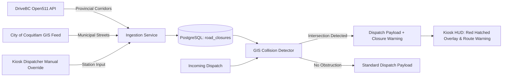

# Road Closure & Traffic Impediment Management Runbook

This skill outlines the architecture, ingestion pipelines, spatial collision detection, and UI warning overlays for tracking **active road closures, construction zones, and CP rail blockages** across Coquitlam.

---

## 1. Operational Overview & Architecture



---

## 2. Ingestion Data Sources

### A. DriveBC Open511 REST API
For provincial highways (Lougheed Hwy 7, Trans-Canada Hwy 1, Barnet Hwy 7A):
* **Endpoint**: `https://api.open511.gov.bc.ca/events?format=json&jurisdiction=bc`
* **Filter**: Bounding box `[-122.95, 49.20, -122.70, 49.38]` (Tri-Cities region).
* **Attributes**: `headline`, `event_type` (CONSTRUCTION, INCIDENT, ROAD_CLOSURE), `geography` (GeoJSON Point / LineString), `schedule`.

### B. Coquitlam Municipal Road Closure GIS Feed
* Ingests planned civic works, water main repairs, and tree clearing from the city's open geospatial feed.

### C. Manual Dispatcher Quick-Override (Station Kiosk UI)
* Allows officers to mark temporary blockages (e.g. CP Rail train stopped across King Edward St or Cape Horn) with a 1-click timer (15m, 30m, 1h, Indefinite).

---

## 3. Database Schema (`road_closures` Table)

```sql
CREATE TABLE IF NOT EXISTS road_closures (
    id SERIAL PRIMARY KEY,
    closure_id VARCHAR(64) UNIQUE NOT NULL,
    street_name VARCHAR(128) NOT NULL,
    source VARCHAR(32) NOT NULL,            -- 'open511', 'city_gis', 'manual_station'
    closure_type VARCHAR(32) NOT NULL,      -- 'FULL_CLOSURE', 'LANE_RESTRICTION', 'RAIL_CROSSING'
    description TEXT,
    geometry JSONB NOT NULL,                -- GeoJSON LineString / Polygon
    start_time TIMESTAMPTZ NOT NULL,
    end_time TIMESTAMPTZ,
    active BOOLEAN DEFAULT TRUE,
    created_at TIMESTAMPTZ DEFAULT NOW()
);

CREATE INDEX IF NOT EXISTS idx_road_closures_active ON road_closures(active);
```

---

## 4. Spatial Collision Detection Workflow

> [!WARNING]
> **Not implemented. Verified 2026-08-30: `closure_warnings` appears nowhere in the codebase**,
> and no corridor-buffer collision check runs during dispatch processing. The section below
> describes a design, not current behaviour, and the worked JSON is an illustration rather than
> a payload you will observe. Treat it as a specification to build against (CLAUDE.md §7.5 —
> absence is recorded, not silent).

When a new dispatch is processed by `cfr_dispatch.pipeline.payload_builder`:
1. The target location point $(lat, lng)$ and estimated primary route corridor are buffered by 100 meters.
2. The buffer is queried against all active `road_closures` in the database.
3. If an obstruction intersects the corridor, a `closure_warnings` array is attached to the dispatch payload:
   ```json
   {
     "dispatch_id": "DISP-2026-1793D9",
     "address": "2648 Sandstone Cres",
     "closure_warnings": [
       {
         "street": "Mariner Way",
         "type": "FULL_CLOSURE",
         "message": "⚠️ Water main repair on Mariner Way between Austin and Foster. Use alternative approach."
       }
     ]
   }
   ```

---

## 5. Frontend Kiosk Visual Warning Overlay

* **Map Overlay**: Active road closures are rendered as high-visibility red/yellow hatched striped line strings (`L.polyline` / `maplibre.addLayer`).
* **Kiosk HUD Warning Pill**: If the active call route is affected, a prominent pulsing amber pill appears in the top alert bar:
  `⚠️ ROAD CLOSURE ON APPROACH: MARINER WAY`
