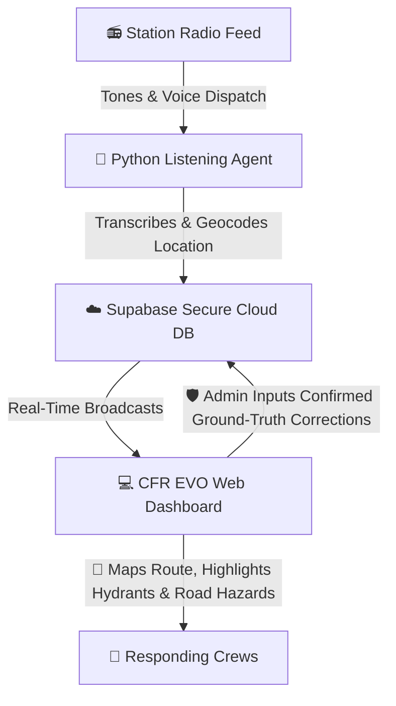

# CFR EVO: Coquitlam Fire Rescue Emergency Vehicle Operator App

An interactive, real-time emergency dispatch mapping assistant and geographical training platform designed for **Emergency Vehicle Operators (EVOs)**.

---

## 🧭 What is CFR EVO?

CFR EVO bridges the gap between station-side dispatch audio and visual mapping for fire apparatus drivers. It captures radio dispatch announcements, processes the location data, and immediately pushes routing metadata to operators' personal mobile devices. 

Designed to operate on personal phones rather than official truck hardware, it provides responders with live navigation paths, hydrant coordinates, and road closures during their response.

Furthermore, it doubles as a geographical training simulator, helping drivers memorize response zones, street intersections, block numbers, and parcel shapes through interactive training games.

---

## ⚡ How It Works (At a Glance)

The entire system operates as a seamless loop, moving from station radio speakers to digital map screens in seconds:

1. **The Radio Dispatch**: When an emergency call comes in, distinct tones play over the radio, followed by the automated voice dispatch announcing the address, incident type, responding units, and map grid.
2. **The Listening Agent (Backend)**: Running quietly on station hardware (or your local computer), a Python script hears the loud tones, records the announcement, sanitizes the text, geocodes the address, and identifies the correct dispatch zone entirely offline.
3. **The Secure Database (Supabase)**: The parsed call metadata is pushed to the cloud, where it is instantly saved and broadcasted.
4. **The Web Dashboard (Frontend)**: Responders load the web page (hosted on GitHub Pages) on station screens, TVs, or mobile devices. The moment a call is uploaded, the web app updates in real-time—suggesting driving routes from the station, highlighting the 3 nearest fire hydrants, and warning of active road closures.
5. **The Feedback Loop (Admin)**: An admin review tab allows station users to enter verified transcripts and address corrections. This creates a data set to compare speech-to-text outputs and continually improve the system's accuracy.

---

## 🌟 Key Features

* **📡 Real-Time WebSocket Updates**: No page reloads needed. Dispatches appear instantly on map screens the moment they are broadcasted.
* **🗺️ Interactive Driver's Aid**: Displays the quickest route from your home station, and highlights municipal fire hydrants with color-coded flow classes.
* **🚧 Active Hazard Warnings**: Pulls road closure and traffic event data in real-time from municipal feeds and DriveBC.
* **🎓 Recruits Training Board**: Map-based games designed to test knowledge of Coquitlam's geography:
  - **Emergency Zones**: Practice identifying which apparatus responds to which boundary area.
  - **Street Intersections**: Locate cross-streets on an unmarked map.
  - **Block Ranges**: Click the exact street segment corresponding to a block range.
  - **Parcel Addresses**: Pinpoint individual property lot boundaries.
* **🛡️ Admin Corrections Panel**: View confidence intervals for every geocoded address, listen to logs, and enter ground-truth corrections to train the parser rules.

---

## 📂 Repository Structure

The project is split into two main subdirectories:

* [**`/agent`**](file:///C:/Users/curti/Documents/GitHub/CFR-EVO-APP/agent) (Backend): The Python script that listens to the microphone audio stream, monitors decibels, and processes transcriptions using Speech-to-Text models.
* [**`/client`**](file:///C:/Users/curti/Documents/GitHub/CFR-EVO-APP/client) (Frontend): The React/Tailwind web app that renders the Leaflet map layers, handles routing, runs training games, and displays the admin review logs.

---

## 🛠️ Quick Installation (Developers)

For detailed developer setup instructions, credential configuration, and dependencies, please refer to the README files inside the respective subfolders:
- Read [**Agent Setup Guide**](file:///C:/Users/curti/Documents/GitHub/CFR-EVO-APP/agent/README.md) for running the listener.
- Read [**Client Setup Guide**](file:///C:/Users/curti/Documents/GitHub/CFR-EVO-APP/client/README.md) for running or deploying the website.

---

## 🗓️ Future Roadmap
- **Two-Phase Dispatch Pipeline**: Implement a Quick-Alert (Phase 1) that slices the first 12 seconds of dispatch audio to geocode and push routing to personal devices within 15 seconds, followed by a Full-Verification (Phase 2) that transcribes the entire call to verify details and push corrections if necessary.
- **Station Touchscreen Kiosk Display**: Display the live routing overlays, active construction hazards, and nearest fire hydrants locally on dedicated touch screen monitors mounted inside each fire hall.
- **Apparatus Shift Subscription**: Implement a web interface allowing drivers to subscribe their personal phones to specific apparatuses (e.g., Engine 1, Ladder 1) for the duration of a shift, filtering alerts to only active responders.

---

## ⚖️ Open Data, Privacy & Compliance

This application operates strictly using completely open, public, and non-sensitive information:
1. **Public Audio Announcements**: Dispatch voice pages are broadcast over open airwaves and station speakers, making them audible to the general public.
2. **Open Geodata**: All parcel layers, boundaries, street grids, and fire hydrant locations are retrieved from public municipal datasets (e.g., Coquitlam Open Data).
3. **Open Road Closure Feeds**: Closed-road information and construction alerts are pulled from public traffic APIs (e.g., DriveBC Open511, Municipal 511).
4. **FOI/Public Record Metadata**: Supporting metadata such as call classification terms, apparatus lists, and station locations are gathered from public records and Freedom of Information (FOI) disclosures.
For detailed privacy design, see [docs/privacy.md](file:///C:/Users/curti/Documents/GitHub/CFR-EVO-APP/docs/privacy.md).

---

## 🤖 Pair-Programming & AI-Assisted Development Disclosure

This project was built using a structured engineering partnership between the lead developer and **Antigravity**, Google DeepMind's agentic AI coding assistant within the **Antigravity IDE**. 

Rather than relying on rapid prototyping or unverified code generation, all features follow a strict, production-grade development process:
1. **Research & Architectural Analysis**: Conducting targeted analysis of external endpoints (e.g. ArcGIS spatial indexing anomalies, CORS proxies, and ALSA audio captures).
2. **Detailed Implementation Planning**: Drafting formal design blueprints and validation workflows in the [docs/](file:///C:/Users/curti/Documents/GitHub/CFR-EVO-APP/docs/) directory prior to modifying any source code.
3. **Automated & Manual Verification**: Executing offline python test suites, local geocoding verification, and compilation checks (`npm run build`).
4. **Offline Resilience Focus**: Transitioning unstable external datasets (such as addresses, emergency zones, and water hydrants) into local cached structures to ensure full hall-kiosk operation even during network outages.

---

## ⚖️ Personal Time & Ownership Disclosure

This project is a personal, independent hobby project developed entirely by Curtis Woodworth on personal time, using personal equipment, and personal funding.

*   **No Employer Affiliation**: This software is not commissioned, sponsored, endorsed, or owned by the City of Coquitlam, Coquitlam Fire Rescue, or any associated municipal or government body.
*   **No Employer Resources Used**: No employer-owned computers, software licenses, network infrastructure, or databases were used during the design, development, compilation, or hosting of this project.
*   **Independent Work Product**: All intellectual property, assets, and code in this repository represent the independent work product of the author, developed strictly outside of official duty hours.

