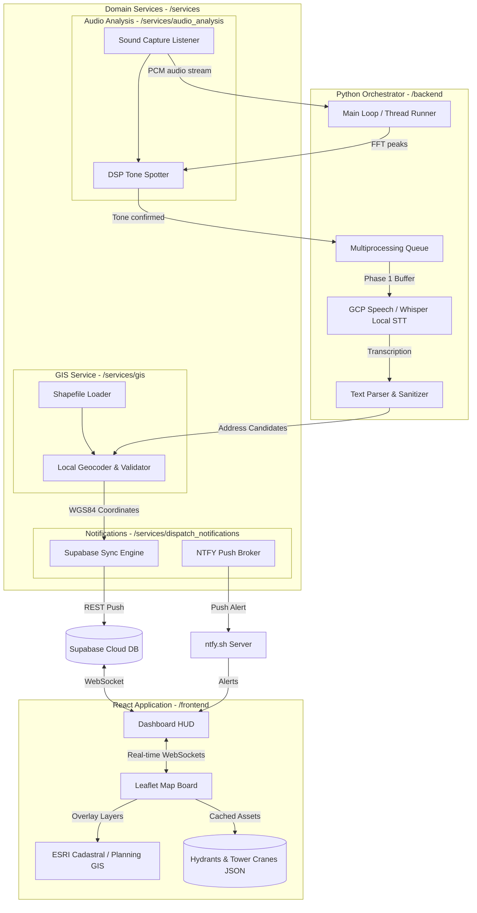
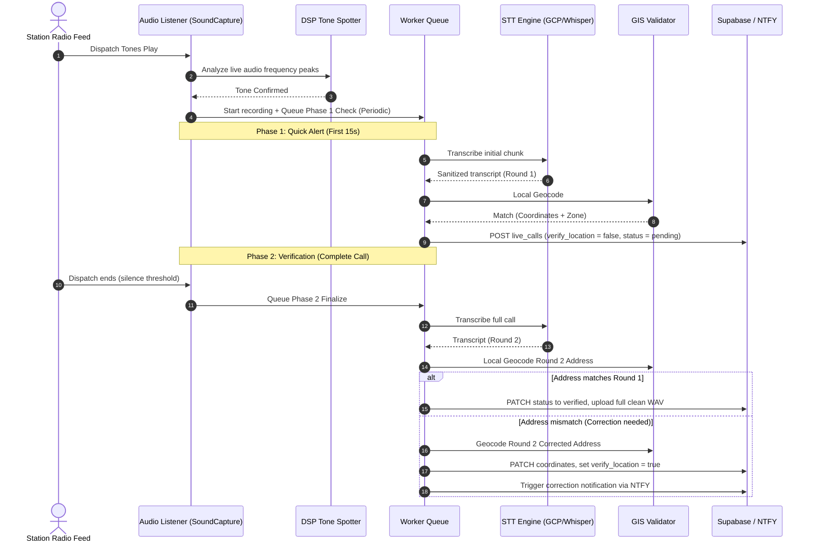

# CFR EVO: Coquitlam Fire Rescue Emergency Vehicle Operator App

An interactive, real-time emergency dispatch mapping assistant and geographical training platform designed for **Emergency Vehicle Operators (EVOs)**.

---

## 🧭 What is CFR EVO?

CFR EVO bridges the gap between station-side dispatch audio and visual mapping for fire apparatus drivers. It captures radio dispatch announcements, processes the location data, and immediately pushes routing metadata to operators' personal mobile devices. 

Designed to operate on personal phones rather than official truck hardware, it provides responders with live navigation paths, hydrant coordinates, and road closures during their response.

Furthermore, it doubles as a geographical training simulator, helping drivers memorize response zones, street intersections, block numbers, and parcel shapes through interactive training games.

---

## ⚡ System Architecture

The entire system is designed around isolated domain packages that interact asynchronously to process audio and dispatch metadata.

---

## 🧭 Two-Phase Dispatch Pipeline

To minimize dispatch latency, the backend splits transcription and notifications into two distinct, sequential phases:

---

## 🌟 Key Features

* **📡 Real-Time WebSocket Updates**: No page reloads needed. Dispatches appear instantly on map screens the moment they are broadcasted.
* **🗺️ Interactive Driver's Aid**: Displays the quickest route from your home station, and highlights municipal fire hydrants with color-coded flow classes.
* **🚧 Active Hazard Warnings**: Pulls road closure and traffic event data in real-time from municipal feeds and DriveBC.
* **🎓 Recruits Training Board**: Map-based games designed to test knowledge of Coquitlam's geography:
  - **Emergency Zones**: Practice identifying which apparatus responds to which boundary area.
  - **Street Intersections**: Locate cross-streets on an unmarked map.
  - **Block Ranges**: Click the exact street segment corresponding to a block range.
  - **Parcel Addresses**: Pinpoint individual property lot boundaries.
* **🛡️ Admin Corrections Panel**: View confidence intervals for every geocoded address, listen to logs, and enter ground-truth corrections to train the parser rules.

---

## 📂 Repository Structure

The project has been split into isolated domain packages to ensure zero cyclical dependencies:

* [**`/backend`**](file:///C:/Users/curti/Documents/GitHub/CFR-EVO-APP/backend): The central orchestrator running the background stream loop, parsing transcriptions, and coordinating API payloads.
* [**`/frontend`**](file:///C:/Users/curti/Documents/GitHub/CFR-EVO-APP/frontend): The React/Vite client dashboard, mapping Leaflet layers, and running geographical training games.
* [**`/services/gis`**](file:///C:/Users/curti/Documents/GitHub/CFR-EVO-APP/services/gis): Sibling GIS service, packaging Coquitlam parcel geocoders and emergency zone spatial indices.
* [**`/services/audio_analysis`**](file:///C:/Users/curti/Documents/GitHub/CFR-EVO-APP/services/audio_analysis): Sibling DSP service, implementing Butterworth filters, Hamming window FFTs, and audio capture streams.
* [**`/services/dispatch_notifications`**](file:///C:/Users/curti/Documents/GitHub/CFR-EVO-APP/services/dispatch_notifications): Sibling notification service, wrapping Supabase sync engine and mobile push notifications.

---

## 🛠️ Quick Installation (Developers)

For detailed developer setup instructions, credential configuration, and dependencies, please refer to the README files inside the respective subfolders:
- Read [**Backend Setup Guide**](file:///C:/Users/curti/Documents/GitHub/CFR-EVO-APP/backend/README.md) for running the listener.
- Read [**Frontend Setup Guide**](file:///C:/Users/curti/Documents/GitHub/CFR-EVO-APP/frontend/README.md) for running or deploying the website.

---

## ⚖️ Open Data, Privacy & Compliance

This application operates strictly using completely open, public, and non-sensitive information:
1. **Public Audio Announcements**: Dispatch voice pages are broadcast over open airwaves and station speakers, making them audible to the general public.
2. **Open Geodata**: All parcel layers, boundaries, street grids, and fire hydrant locations are retrieved from public municipal datasets (e.g., Coquitlam Open Data).
3. **Open Road Closure Feeds**: Closed-road information and construction alerts are pulled from public traffic APIs (e.g., DriveBC Open511, Municipal 511).
4. **FOI/Public Record Metadata**: Supporting metadata such as call classification terms, apparatus lists, and station locations are gathered from public records and Freedom of Information (FOI) disclosures.
For detailed privacy design, see [docs/privacy.md](file:///C:/Users/curti/Documents/GitHub/CFR-EVO-APP/docs/privacy.md).

---

## ⚖️ Personal Time & Ownership Disclosure

This project is a personal, independent hobby project developed entirely by Curtis Woodworth on personal time, using personal equipment, and personal funding.

*   **No Employer Affiliation**: This software is not commissioned, sponsored, endorsed, or owned by the City of Coquitlam, Coquitlam Fire Rescue, or any associated municipal or government body.
*   **No Employer Resources Used**: No employer-owned computers, software licenses, network infrastructure, or databases were used during the design, development, compilation, or hosting of this project.
*   **Independent Work Product**: All intellectual property, assets, and code in this repository represent the independent work product of the author, developed strictly outside of official duty hours.
