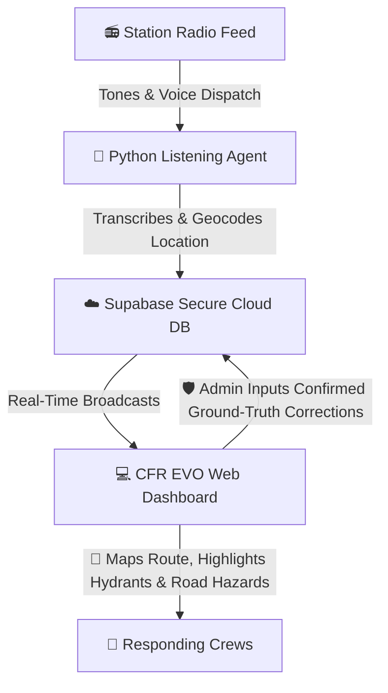

# CFR EVO: Coquitlam Fire Responder Evolution App

An interactive, real-time emergency dispatch mapping assistant and driver training platform designed for Coquitlam Fire Rescue.

---

## 🧭 What is CFR EVO?

CFR EVO bridges the gap between station-side dispatch audio and visual mapping. It captures dispatch announcements, processes the location data, and immediately provides responders with live navigation maps, hydrant coordinates, and road closures.

Furthermore, it doubles as a geography training simulator, helping responders memorize response zones, street intersections, block numbers, and parcel shapes through interactive training games.

---

## ⚡ How It Works (At a Glance)

The entire system operates as a seamless loop, moving from station radio speakers to digital map screens in seconds:

1. **The Radio Dispatch**: When an emergency call comes in, distinct tones play over the radio, followed by the automated voice dispatch announcing the address, incident type, responding units, and map grid.
2. **The Listening Agent (Backend)**: Running quietly on station hardware (or your local computer), a Python script hears the loud tones, records the announcement, sanitizes the text, geocodes the address, and identifies the correct dispatch zone entirely offline.
3. **The Secure Database (Supabase)**: The parsed call metadata is pushed to the cloud, where it is instantly saved and broadcasted.
4. **The Web Dashboard (Frontend)**: Responders load the web page (hosted on GitHub Pages) on station screens, TVs, or mobile devices. The moment a call is uploaded, the web app updates in real-time—suggesting driving routes from the station, highlighting the 3 nearest fire hydrants, and warning of active road closures.
5. **The Feedback Loop (Admin)**: An admin review tab allows station users to enter verified transcripts and address corrections. This creates a data set to compare speech-to-text outputs and continually improve the system's accuracy.

---

## 🌟 Key Features

* **📡 Real-Time WebSocket Updates**: No page reloads needed. Dispatches appear instantly on map screens the moment they are broadcasted.
* **🗺️ Interactive Driver's Aid**: Displays the quickest route from your home station, and highlights municipal fire hydrants with color-coded flow classes.
* **🚧 Active Hazard Warnings**: Pulls road closure and traffic event data in real-time from municipal feeds and DriveBC.
* **🎓 Recruits Training Board**: Map-based games designed to test knowledge of Coquitlam's geography:
  - **Emergency Zones**: Practice identifying which apparatus responds to which boundary area.
  - **Street Intersections**: Locate cross-streets on an unmarked map.
  - **Block Ranges**: Click the exact street segment corresponding to a block range.
  - **Parcel Addresses**: Pinpoint individual property lot boundaries.
* **🛡️ Admin Corrections Panel**: View confidence intervals for every geocoded address, listen to logs, and enter ground-truth corrections to train the parser rules.

---

## 📂 Repository Structure

The project is split into two main subdirectories:

* [**`/agent`**](file:///C:/Users/curti/Documents/GitHub/CFR-EVO-APP/agent) (Backend): The Python script that listens to the microphone audio stream, monitors decibels, and processes transcriptions using Speech-to-Text models.
* [**`/client`**](file:///C:/Users/curti/Documents/GitHub/CFR-EVO-APP/client) (Frontend): The React/Tailwind web app that renders the Leaflet map layers, handles routing, runs training games, and displays the admin review logs.

---

## 🛠️ Quick Installation (Developers)

For detailed developer setup instructions, credential configuration, and dependencies, please refer to the README files inside the respective subfolders:
- Read [**Agent Setup Guide**](file:///C:/Users/curti/Documents/GitHub/CFR-EVO-APP/agent/README.md) for running the listener.
- Read [**Client Setup Guide**](file:///C:/Users/curti/Documents/GitHub/CFR-EVO-APP/client/README.md) for running or deploying the website.
