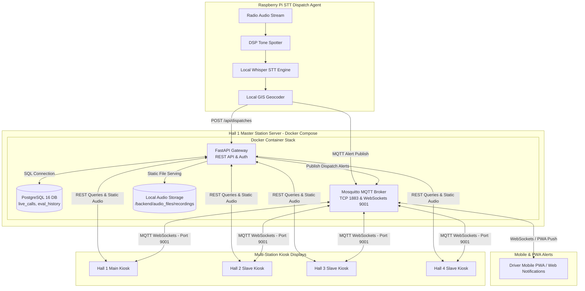
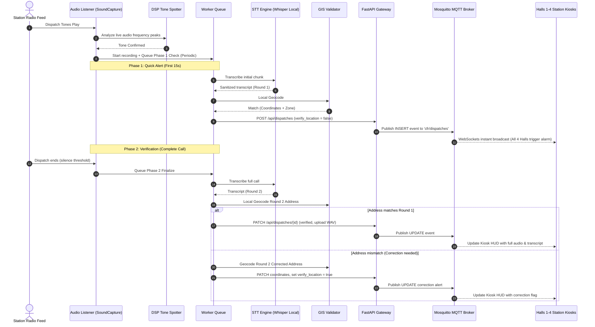

# CFR EVO: Coquitlam Fire Rescue Emergency Vehicle Operator App

An interactive, real-time emergency dispatch mapping assistant and geographical training platform designed for **Emergency Vehicle Operators (EVOs)**.

---

## 🧭 What is CFR EVO?

CFR EVO bridges the gap between station-side dispatch audio and visual mapping for fire apparatus drivers. It captures radio dispatch announcements, processes location data using fine-tuned Whisper STT & local GIS indices, and immediately pushes routing metadata to station kiosk displays and operators' personal mobile devices.

Designed to operate seamlessly across **4 station kiosks** (with Hall 1 serving as the master database server and Halls 2–4 running slave kiosk displays), it provides responders with live navigation paths, hydrant coordinates, and road closures during their response.

Furthermore, it doubles as a geographical training simulator, helping drivers memorize response zones, street intersections, block numbers, and parcel shapes through interactive training games.

---

## ⚡ System Architecture (Containerized Local Stack v2.0)

The entire system runs on a containerized, self-contained local stack hosted on the station server via **Docker Compose**, eliminating cloud database costs and external network dependencies.


```mermaid
flowchart TB
    subgraph Hall1Master [Hall 1 Master Station Server - Docker Compose]
        subgraph Containers [Docker Container Stack]
            PG[(PostgreSQL 16 DB\nlive_calls, eval_history)]
            API[FastAPI Gateway\nREST API & Auth]
            MQTT[Mosquitto MQTT Broker\nTCP 1883 & WebSockets 9001]
            STORAGE[(Local Audio Storage\n/backend/audio_files/recordings)]
        end
        API <-->|SQL Connection| PG
        API -->|Static File Serving| STORAGE
        API -->|Publish Dispatch Alerts| MQTT
    end

    subgraph StationKiosks [Multi-Station Kiosk Displays]
        K1[Hall 1 Main Kiosk]
        K2[Hall 2 Slave Kiosk]
        K3[Hall 3 Slave Kiosk]
        K4[Hall 4 Slave Kiosk]
    end

    subgraph MobileAlerts [Mobile & PWA Alerts]
        PWA[Driver Mobile PWA / Web Notifications]
    end

    subgraph DispatchAgent [Raspberry Pi STT Dispatch Agent]
        AUDIO[Radio Audio Stream] --> DSP[DSP Tone Spotter]
        DSP --> STT[Local Whisper STT Engine]
        STT --> GIS[Local GIS Geocoder]
        GIS -->|POST /api/dispatches| API
        GIS -->|MQTT Alert Publish| MQTT
    end

    %% Real-time Broadcast connections
    MQTT <-->|MQTT WebSockets - Port 9001| K1
    MQTT <-->|MQTT WebSockets - Port 9001| K2
    MQTT <-->|MQTT WebSockets - Port 9001| K3
    MQTT <-->|MQTT WebSockets - Port 9001| K4
    MQTT <-->|WebSockets / PWA Push| PWA

    API <-->|REST Queries & Static Audio| K1
    API <-->|REST Queries & Static Audio| K2
    API <-->|REST Queries & Static Audio| K3
    API <-->|REST Queries & Static Audio| K4
```

---

## 🧭 Two-Phase Dispatch Pipeline

To minimize dispatch latency, the backend splits transcription and notifications into two distinct, sequential phases:


```mermaid
sequenceDiagram
    autonumber
    actor Dispatcher as Station Radio Feed
    participant SoundCapture as Audio Listener (SoundCapture)
    participant DSP as DSP Tone Spotter
    participant Queue as Worker Queue
    participant STT as STT Engine (Whisper Local)
    participant GIS as GIS Validator
    participant API as FastAPI Gateway
    participant MQTT as Mosquitto MQTT Broker
    participant Kiosks as Halls 1-4 Station Kiosks

    Dispatcher->>SoundCapture: Dispatch Tones Play
    SoundCapture->>DSP: Analyze live audio frequency peaks
    DSP-->>SoundCapture: Tone Confirmed
    SoundCapture->>Queue: Start recording + Queue Phase 1 Check (Periodic)
    
    Note over SoundCapture,Queue: Phase 1: Quick Alert (First 15s)
    Queue->>STT: Transcribe initial chunk
    STT-->>Queue: Sanitized transcript (Round 1)
    Queue->>GIS: Local Geocode
    GIS-->>Queue: Match (Coordinates + Zone)
    Queue->>API: POST /api/dispatches (verify_location = false)
    API->>MQTT: Publish INSERT event to 'cfr/dispatches'
    MQTT-->>Kiosks: WebSockets instant broadcast (All 4 Halls trigger alarm)
    
    Note over SoundCapture,Queue: Phase 2: Verification (Complete Call)
    Dispatcher->>SoundCapture: Dispatch ends (silence threshold)
    SoundCapture->>Queue: Queue Phase 2 Finalize
    Queue->>STT: Transcribe full call
    STT-->>Queue: Transcript (Round 2)
    Queue->>GIS: Local Geocode Round 2 Address
    alt Address matches Round 1
        Queue->>API: PATCH /api/dispatches/{id} (verified, upload WAV)
        API->>MQTT: Publish UPDATE event
        MQTT-->>Kiosks: Update Kiosk HUD with full audio & transcript
    else Address mismatch (Correction needed)
        Queue->>GIS: Geocode Round 2 Corrected Address
        Queue->>API: PATCH coordinates, set verify_location = true
        API->>MQTT: Publish UPDATE correction alert
        MQTT-->>Kiosks: Update Kiosk HUD with correction flag
    end
```

---

## 🌟 Key Features

* **📡 Sub-Millisecond Multi-Kiosk Sync**: Mosquitto MQTT WebSockets broadcast dispatches concurrently across Halls 1, 2, 3, and 4 the exact moment a call is received.
* **🏠 Self-Hosted & Containerized**: Runs 100% locally via Docker Compose (PostgreSQL, Mosquitto, FastAPI), eliminating external cloud dependencies and monthly costs.
* **🎵 Smart Audio Storage & IP-Agnostic Serving**: Local WAV files in `backend/audio_files/recordings/` are served dynamically at `/api/audio/{filename}` without hardcoded IP addresses.
* **🗺️ Streamlined HUD & Interactive Driver's Aid**: Features unified mode selectors, Left Control Panel basemap toggles (`GREY MAP` / `DARK MAP`), EVO routing configuration trigger, closure timeframe filters, and exact resource map legends (NFPA 291 hydrants, CP Rail crossings, schools, fire halls).
* **📐 Dynamic Response Zones & City Boundary**: Renders Coquitlam's 134 emergency zones using soft per-hall color-coded vector polygons with centered zone numbers. Features official 1,597-vertex Coquitlam City Boundary vector dataset (`coquitlam_boundary_opt.json`).
* **🚧 Active Hazard Warnings**: Pulls road closure and traffic event data in real-time from municipal feeds and DriveBC.
* **🎓 Recruits Training Board**: Map-based games designed to test knowledge of Coquitlam's geography (Emergency Zones, Intersections, Block Ranges, Parcel Addresses).
* **🛡️ Admin Corrections Panel**: View confidence intervals for every geocoded address, listen to logs, enter ground-truth corrections, and review STT performance history.

---

## 📂 Repository Structure

* [**`/backend`**](./backend): Core orchestrator running the STT engine, parser, GIS geocoder, and the local **FastAPI Gateway** (`backend/api`).
* [**`/frontend`**](./frontend): React/Vite client dashboard, Leaflet mapping layers, MQTT WebSocket listeners, and recruitment training games.
* [**`/services/gis`**](./services/gis): Sibling GIS service packaging Coquitlam parcel geocoders and emergency zone spatial indices.
* [**`/services/audio_analysis`**](./services/audio_analysis): Sibling DSP service implementing Butterworth filters, FFT peak analysis, and audio capture streams.
* [**`/services/dispatch_notifications`**](./services/dispatch_notifications): Sibling notification service wrapping local FastAPI sync engine and Mosquitto MQTT alert broker.
* [**`/services/mosquitto`**](./services/mosquitto): Configuration for Mosquitto MQTT broker (`mosquitto.conf`).

---

## 🛠️ Quick Installation (Local Container Stack)

### 1. Launch Container Infrastructure (Hall 1 Master Server)
```bash
# Start PostgreSQL 16, Mosquitto MQTT, and FastAPI Gateway
docker compose up -d
```

### 2. Import & Preserve Historical Data
```bash
# Run smart migration script (checks local audio files first, downloads missing audio, and populates local Postgres)
python backend/scripts/migrate_supabase_to_local.py
```

### 3. Launch Frontend Kiosks (Halls 1 to 4)
```bash
cd frontend
npm install
npm run dev
```

---

## ⚖️ Open Data, Privacy & Compliance

This application operates strictly using completely open, public, and non-sensitive information:
1. **Public Audio Announcements**: Dispatch voice pages are broadcast over open airwaves and station speakers.
2. **Open Geodata**: All parcel layers, boundaries, street grids, and fire hydrant locations are retrieved from public municipal datasets (e.g., Coquitlam Open Data).
3. **Open Road Closure Feeds**: Closed-road information and construction alerts are pulled from public traffic APIs (e.g., DriveBC Open511, Municipal 511).
4. **FOI/Public Record Metadata**: Call classification terms, apparatus lists, and station locations are gathered from public records and Freedom of Information disclosures.
For detailed privacy design, see [docs/privacy.md](./docs/privacy.md).

---

## ⚖️ Personal Time & Ownership Disclosure

This project is a personal, independent hobby project developed entirely by Curtis Woodworth on personal time, using personal equipment, and personal funding.

* **No Employer Affiliation**: This software is not commissioned, sponsored, endorsed, or owned by the City of Coquitlam, Coquitlam Fire Rescue, or any associated municipal or government body.
* **No Employer Resources Used**: No employer-owned computers, software licenses, network infrastructure, or databases were used during the design, development, compilation, or hosting of this project.
* **Independent Work Product**: All intellectual property, assets, and code in this repository represent the independent work product of the author.
