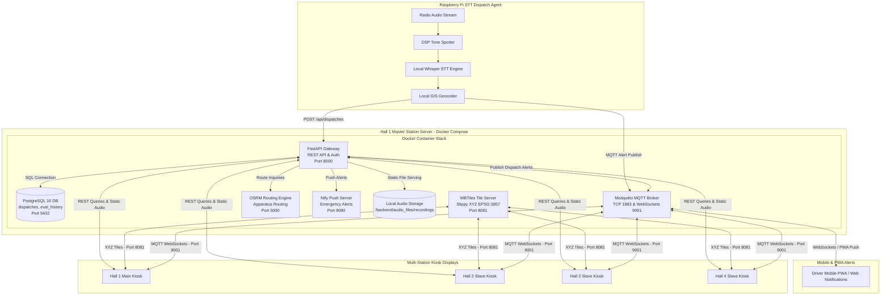
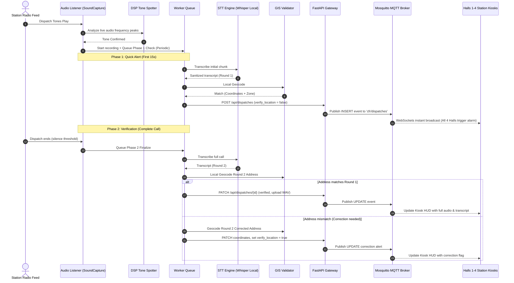

# CFR EVO: Coquitlam Fire Rescue Emergency Vehicle Operator App

An interactive, real-time emergency dispatch mapping assistant and geographical training platform designed for **Emergency Vehicle Operators (EVOs)**.

---

## 🧭 What is CFR EVO?

CFR EVO bridges the gap between station-side dispatch audio and visual mapping for fire apparatus drivers. It captures radio dispatch announcements, processes location data using fine-tuned Whisper STT & local GIS indices, and immediately pushes routing metadata to station kiosk displays and operators' personal mobile devices.

Designed to operate seamlessly across **4 station kiosks** (with Hall 1 serving as the master database server and Halls 2–4 running slave kiosk displays), it provides responders with live navigation paths, hydrant coordinates, and road closures during their response.

> [!NOTE]
> **Current deployment status**: this is the target multi-hall architecture. Right now CFR EVO runs single-hall — one physical test kiosk — while the core dispatch/GIS/routing pipeline is hardened. Multi-hall rollout is tracked as future work in [`docs/PROJECT_IDEAS.md`](./docs/PROJECT_IDEAS.md) (#5).
>
> **The kiosk is a mock production environment.** It runs the full stack on real dispatch audio in a real hall, but one person, the developer, uses it, and only in a testing capacity. No crew depends on it yet. That is what "development" means here, and why the software follows production rules (`CLAUDE.md` §6) while everything around it can still change.

---

## 🏛️ 100% Offline Survival, $0 Subscription-Free & Municipal Data Authority

CFR EVO is purpose-built with a strict **Zero-Cloud, Zero-Subscription, Total Offline Disaster Resilience** architecture. In the event of major storms, cellular network outages, or severed fiber-optic WAN connections, the station kiosks and response routing remain **100% fully functional**.

### 1. Zero Monthly Cost ($0 Subscription-Free Stack)
* **No Cloud Databases**: Completely independent of Supabase, Firebase, AWS RDS, or external backends. All dispatches, call audio, and historical telemetry persist strictly to a local containerized PostgreSQL 16 instance.
* **No Recurring Geocoding/Routing Fees**: All address lookups, parcel searches, and multi-unit apparatus turn-by-turn routes run locally via spatial SQL indexes and an offline Open Source Routing Machine (OSRM) container—eliminating paid Google Maps Platform routing fees on hot dispatch paths.
* **Local Machine Learning**: Faster-Whisper automatic speech recognition (STT) runs directly on the station server CPU/GPU with zero external cloud API dependencies.

### 2. Authoritative City of Coquitlam Municipal Open Data
The system directly ingests and standardizes authoritative municipal geospatial datasets under the **Open Government Licence – City of Coquitlam**:
* **65,400 Clean Property Parcels (`public.parcels`)**: Ingested directly from City of Coquitlam `Cadastral.shp` and `Addresses.shp`, with pre-computed point-in-polygon spatial links to active emergency response zones.
* **118 Active Emergency Response Zones (Zones 1–134)**: Official `Emergency_Response_Zones.shp` boundary polygons used for automatic apparatus district identification and driver territory training.
* **City of Coquitlam 2025 7.5cm Aerial Orthophotography (Z12–Z20)**: High-resolution airborne orthophotos (7.5 cm / 3 inches per pixel) pre-cached locally into SQLite MBTiles archives on the kiosk SSD for sub-decimeter tactical roofline, driveway, and hydrant clarity.
* **Centralized MBTiles Server (`cfr_tiles` on Port 8081)**: Fast, offline tile serving powered by `ghcr.io/consbio/mbtileserver:latest`. Strictly adheres to the **OpenStreetMap Slippy Map Specification** (XYZ Web Mercator `EPSG:3857`, top-left origin) across all base layers and overlays (`satellite`, `street`, `street_nolabels`, and transparent municipal `cadastral` parcel/address overlays).
* **NFPA 291 Fire Hydrant Registry**: Complete municipal hydrant database color-coded by flow rate (AA: Blue $\ge 1500$ GPM, A: Green $1000-1499$ GPM, B: Orange $500-999$ GPM, C: Red $< 500$ GPM) with immediate nearest-hydrant routing.
* **3D Building Footprints & LiDAR Profiles**: Municipal `Buildings.shp` layers containing LiDAR-derived `HEIGHT`, `MIN_ELEVATION`, and `MAX_ELEVATION` attributes for tactical building height profiling and Ladder 1/3 aerial reach validation.
* **Municipal Road Hazards & Railway Crossings**: Real-time road closure ingestion and CP/CN railway corridor hazard warnings.
* **Verified Fire Hall Apron Coordinates**: Accurate GPS coordinates for Town Centre Fire Hall (Hall 1), Mariner (Hall 2), Austin Heights (Hall 3), and Burke Mountain (Hall 4).

---

## ⚡ System Architecture (Containerized Local Stack v2.0)

The entire system runs on a containerized, self-contained local stack hosted on the station server via **Docker Compose**, eliminating cloud database costs and external network dependencies.


```mermaid
flowchart TB
    subgraph Hall1Master [Hall 1 Master Station Server - Docker Compose]
        subgraph Containers [Docker Container Stack]
            PG[(PostgreSQL 16 DB\ndispatches, eval_history\nPort 5432)]
            API[FastAPI Gateway\nREST API & Auth\nPort 8000]
            MQTT[Mosquitto MQTT Broker\nTCP 1883 & WebSockets 9001]
            TILES[MBTiles Tile Server\nSlippy XYZ EPSG:3857\nPort 8081]
            OSRM[OSRM Routing Engine\nApparatus Routing\nPort 5000]
            NTFY[Ntfy Push Server\nEmergency Alerts\nPort 8080]
            STORAGE[(Local Audio Storage\n/backend/audio_files/recordings)]
        end
        API <-->|SQL Connection| PG
        API -->|Static File Serving| STORAGE
        API -->|Publish Dispatch Alerts| MQTT
        API -->|Route Inquiries| OSRM
        API -->|Push Alerts| NTFY
    end

    subgraph StationKiosks [Multi-Station Kiosk Displays]
        K1[Hall 1 Main Kiosk]
        K2[Hall 2 Slave Kiosk]
        K3[Hall 3 Slave Kiosk]
        K4[Hall 4 Slave Kiosk]
    end

    subgraph MobileAlerts [Mobile & PWA Alerts]
        PWA[Driver Mobile PWA / Web Notifications]
    end

    subgraph DispatchAgent [Raspberry Pi STT Dispatch Agent]
        AUDIO[Radio Audio Stream] --> DSP[DSP Tone Spotter]
        DSP --> STT[Local Whisper STT Engine]
        STT --> GIS[Local GIS Geocoder]
        GIS -->|POST /api/dispatches| API
        GIS -->|MQTT Alert Publish| MQTT
    end

    %% Real-time Broadcast connections
    MQTT <-->|MQTT WebSockets - Port 9001| K1
    MQTT <-->|MQTT WebSockets - Port 9001| K2
    MQTT <-->|MQTT WebSockets - Port 9001| K3
    MQTT <-->|MQTT WebSockets - Port 9001| K4
    MQTT <-->|WebSockets / PWA Push| PWA

    %% Direct Tile & REST queries
    TILES <-->|XYZ Tiles - Port 8081| K1
    TILES <-->|XYZ Tiles - Port 8081| K2
    TILES <-->|XYZ Tiles - Port 8081| K3
    TILES <-->|XYZ Tiles - Port 8081| K4

    API <-->|REST Queries & Static Audio| K1
    API <-->|REST Queries & Static Audio| K2
    API <-->|REST Queries & Static Audio| K3
    API <-->|REST Queries & Static Audio| K4
```

---

## 🧭 Two-Phase Dispatch Pipeline

To minimize dispatch latency, the backend splits transcription and notifications into two distinct, sequential phases:


```mermaid
sequenceDiagram
    autonumber
    actor Dispatcher as Station Radio Feed
    participant SoundCapture as Audio Listener (SoundCapture)
    participant DSP as DSP Tone Spotter
    participant Queue as Worker Queue
    participant STT as STT Engine (Whisper Local)
    participant GIS as GIS Validator
    participant API as FastAPI Gateway
    participant MQTT as Mosquitto MQTT Broker
    participant Kiosks as Halls 1-4 Station Kiosks

    Dispatcher->>SoundCapture: Dispatch Tones Play
    SoundCapture->>DSP: Analyze live audio frequency peaks
    DSP-->>SoundCapture: Tone Confirmed
    SoundCapture->>Queue: Start recording + Queue Phase 1 Check (Periodic)
    
    Note over SoundCapture,Queue: Phase 1: Quick Alert (First 15s)
    Queue->>STT: Transcribe initial chunk
    STT-->>Queue: Sanitized transcript (Round 1)
    Queue->>GIS: Local Geocode
    GIS-->>Queue: Match (Coordinates + Zone)
    Queue->>API: POST /api/dispatches (verify_location = false)
    API->>MQTT: Publish INSERT event to 'cfr/dispatches'
    MQTT-->>Kiosks: WebSockets instant broadcast (All 4 Halls trigger alarm)
    
    Note over SoundCapture,Queue: Phase 2: Verification (Complete Call)
    Dispatcher->>SoundCapture: Dispatch ends (silence threshold)
    SoundCapture->>Queue: Queue Phase 2 Finalize
    Queue->>STT: Transcribe full call
    STT-->>Queue: Transcript (Round 2)
    Queue->>GIS: Local Geocode Round 2 Address
    alt Address matches Round 1
        Queue->>API: PATCH /api/dispatches/{id} (verified, upload WAV)
        API->>MQTT: Publish UPDATE event
        MQTT-->>Kiosks: Update Kiosk HUD with full audio & transcript
    else Address mismatch (Correction needed)
        Queue->>GIS: Geocode Round 2 Corrected Address
        Queue->>API: PATCH coordinates, set verify_location = true
        API->>MQTT: Publish UPDATE correction alert
        MQTT-->>Kiosks: Update Kiosk HUD with correction flag
    end
```

---

## 🌟 Key Features

* **📡 Sub-Millisecond Multi-Kiosk Sync**: Mosquitto MQTT WebSockets broadcast dispatches concurrently across Halls 1, 2, 3, and 4 the exact moment a call is received.
* **🏠 Self-Hosted & Containerized**: Runs 100% locally via Docker Compose (PostgreSQL, Mosquitto, FastAPI), eliminating external cloud dependencies and monthly costs.
* **🎵 Smart Audio Storage & IP-Agnostic Serving**: Local WAV files in `backend/audio_files/recordings/` are served dynamically at `/api/audio/{filename}` without hardcoded IP addresses.
* **🗺️ Streamlined HUD & Interactive Driver's Aid**: Features unified mode selectors, Left Control Panel basemap toggles (`GREY MAP` / `DARK MAP`), EVO routing configuration trigger, closure timeframe filters, and exact resource map legends (NFPA 291 hydrants, CP Rail crossings, schools, fire halls).
* **📐 Dynamic Response Zones & City Boundary**: Renders Coquitlam's 134 emergency zones using soft per-hall color-coded vector polygons with centered zone numbers. Features official 1,597-vertex Coquitlam City Boundary vector dataset (`coquitlam_boundary_opt.json`).
* **🚧 Active Hazard Warnings**: Pulls road closure and traffic event data in real-time from municipal feeds and DriveBC.
* **🎓 Recruits Training Board**: Map-based games designed to test knowledge of Coquitlam's geography (Emergency Zones, Intersections, Block Ranges, Parcel Addresses).
* **🛡️ Admin Corrections Panel**: View confidence intervals for every geocoded address, listen to logs, enter ground-truth corrections, and review STT performance history.

---

## 📂 Repository Structure

**The software** is what will be production; today it runs on the mock-production kiosk:

* `backend/cfr_dispatch/` and `backend/main.py`: the dispatch agent. Audio capture, tone detection, Whisper speech-to-text, the parser and the geocoder. Runs as the `cfr-agent` systemd unit.
* `backend/api/`: the FastAPI gateway, in Docker. `backend/migrations/`: the schema history of the PostGIS database.
* `services/gis`, `services/audio_analysis`, `services/dispatch_notifications`: sibling packages the agent imports (see `CLAUDE.md` §2). `services/mosquitto`: the MQTT broker's configuration.
* `frontend/`: the React and Leaflet display, built once and served by nginx on the kiosk.
* `docker-compose.yml` and `setup_kiosk.sh`: the container stack and the script that built the kiosk.
* `backend/scripts/`: what a person runs to *operate* the system: backups, municipal data loads, tile archives, sound-card checks. Grouped by purpose in [its README](./backend/scripts/README.md).

**Development and testing** is what a person runs; the kiosk never runs it on its own:

* `tools/`: everything a developer runs: backtests, training, audits, inspection, the one-shot data fixes, the dev-environment installers. [Its README](./tools/README.md) is checked against the directory on every commit. `backend/tests/`: the pytest suites.
* `docs/`: start at [`docs/README.md`](./docs/README.md), the reading map. `.claude/`: the runbooks (skills) and agent personas, all plain Markdown and readable without any tooling.

---

## 🛠️ Quick Installation (Local Container Stack)

### 1. Launch Container Infrastructure (Hall 1 Master Server)
```bash
# Start PostgreSQL 16, Mosquitto MQTT, and FastAPI Gateway
docker compose up -d
```

### 2. Launch Frontend Kiosks (Halls 1 to 4)
Before building or running the frontend, configure the specific hall identifier for this kiosk display:
1. Create or edit a local environment file `frontend/.env.local` (which is git-ignored and device-specific).
2. Set the default station hall (1, 2, 3, or 4):
   ```env
   VITE_DEFAULT_HALL=1
   ```
3. Run or compile the frontend:
   ```bash
   cd frontend
   npm install
   npm run dev   # for local development
   # OR
   npm run build # for production kiosk hardware setups
   ```

---

## ⚖️ Open Data, Privacy & Compliance

This application operates strictly using completely open, public, and non-sensitive information:
1. **Public Audio Announcements**: Dispatch voice pages are broadcast over open airwaves and station speakers.
2. **Open Geodata**: All parcel layers, boundaries, street grids, and fire hydrant locations are retrieved from public municipal datasets (e.g., Coquitlam Open Data).
3. **Open Road Closure Feeds**: Closed-road information and construction alerts are pulled from public traffic APIs (e.g., DriveBC Open511, Municipal 511).
4. **FOI/Public Record Metadata**: Call classification terms, apparatus lists, and station locations are gathered from public records and Freedom of Information disclosures.
For detailed privacy design, see [docs/privacy.md](./docs/privacy.md).

---

## ⚖️ Personal Time & Ownership Disclosure

This project is a personal, independent hobby project developed entirely by Curtis Woodworth on personal time, using personal equipment, and personal funding.

* **No Employer Affiliation**: This software is not commissioned, sponsored, endorsed, or owned by the City of Coquitlam, Coquitlam Fire Rescue, or any associated municipal or government body.
* **No Employer Resources Used**: No employer-owned computers, software licenses, network infrastructure, or databases were used during the design, development, compilation, or hosting of this project.
* **Independent Work Product**: All intellectual property, assets, and code in this repository represent the independent work product of the author.
