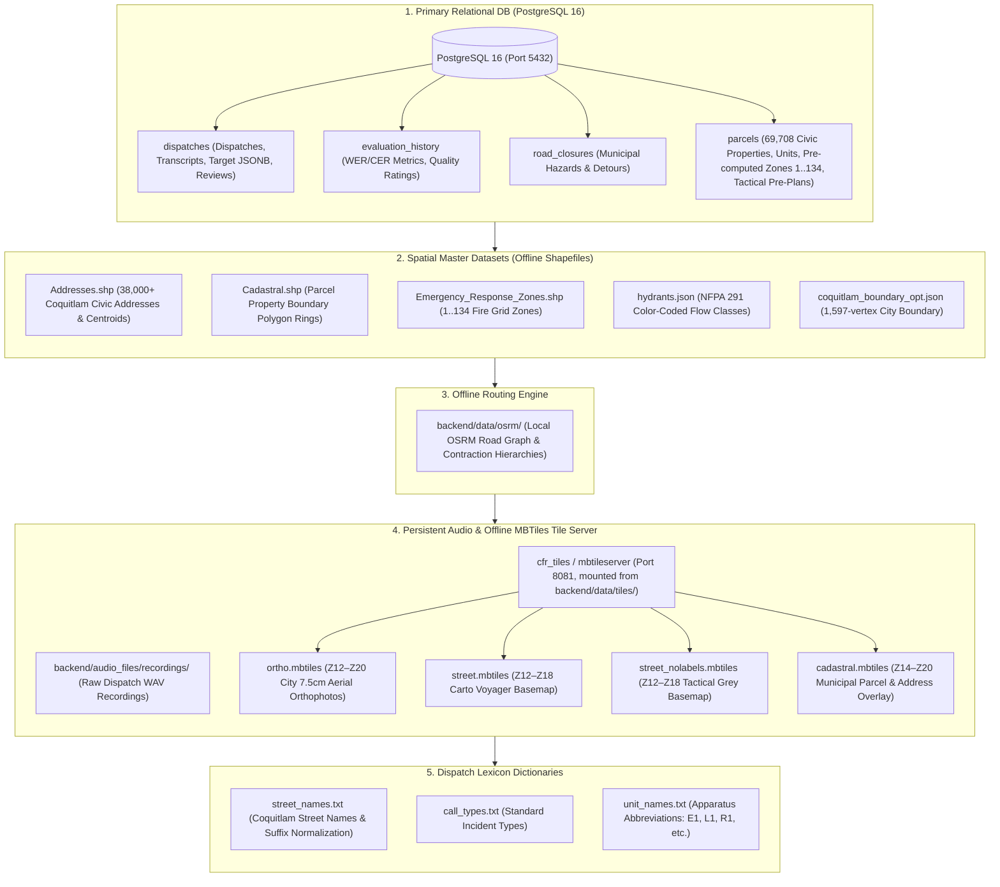

# CFR EVO: Database & Data Stores Architecture

> [!WARNING]
> **Partially stale 2026-08-30.** Two corrections, both verified:
>
> * **`parcels` is 65,401 rows, not 69,708.** 69,708 is the row count of the source
>   `Addresses.shp`; deduplication by normalized address yields 65,401 unique properties
>   (see `docs/development_freeze_summary.md` and `docs/city_gis_data_register.md`).
>   The figure below labels the pre-deduplication shapefile count as the table count.
> * **`hydrants.json` is no longer a frontend datastore.** The frontend reads
>   `public.hydrants` through the API (moved 2026-08-22). The JSON fetch path it replaced,
>   and the endpoint notes that described it, were retired with `docs/gis_endpoints.md`
>   on 2026-09-04.
>
> The overall store map is otherwise current.

This document catalogs all primary databases, local spatial shapefile stores, and offline storage engines in the **CFR EVO** ecosystem, along with the **Zero Online Fallback** hardening protocol.

---

## 📊 Master Data Stores Map

---

## 🚫 Zero Online Fallback Protocol

To guarantee total offline resilience and prevent masked errors, the system enforces **zero online fallbacks**:

| Component | Hardened Offline Engine | Removed Online Fallback |
| :--- | :--- | :--- |
| **Address Geocoding** | Local `Addresses.shp` & PostgreSQL `public.parcels` via `/api/parcels/search` | ❌ External ArcGIS REST MapServer queries |
| **Emergency Routing** | Local containerized OSRM graph (Port 5000) | ❌ Google Maps Directions API |
| **Speech-to-Text (STT)** | Local Whisper engine (`backend/models/`) | ❌ Google Cloud STT API |
| **Map Basemaps & Imagery** | Local MBTiles server (`cfr_tiles:8081` - Satellite, Street, Grey) | ❌ Remote Mapbox / OSM CDN tile fetches |
| **Cadastral & Property Overlay** | Local MBTiles server (`cadastral.mbtiles` on `cfr_tiles:8081`) | ❌ External ArcGIS MapServer `/export` queries |

*The only allowed online network calls are the optional visual PiP augmentations (Google Street View panorama & Satellite photo).*

<!-- audit-ok: docs/gis_endpoints.md -- deleted 2026-09-04; the correction above records it -->
