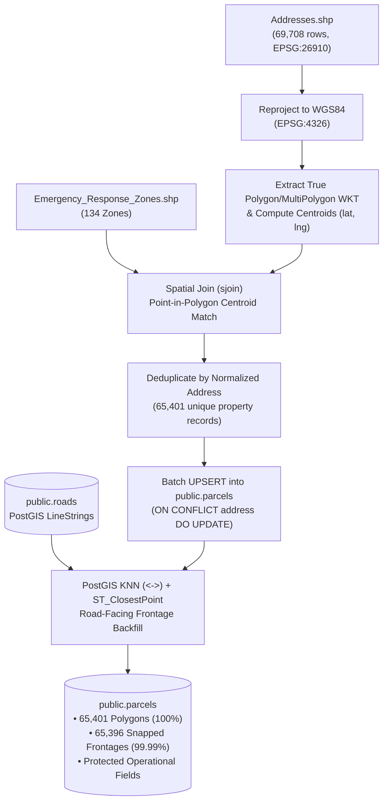

# CFR EVO: Comprehensive Development Freeze & Architectural Review

> [!IMPORTANT]
> **Phases A–F below record the state at the freeze commit `d5fbdcc` (2026-08-20).**
> Substantial work has landed since. Sections 3 and 4 have been corrected to match the
> running system; the Phase A–F narrative is left as the historical record and is no
> longer a description of current code.
>
> For current status, open questions and next steps, read
> [`docs/review_status_handoff.md`](./review_status_handoff.md).

**Freeze Timestamp**: August 20, 2026 (Commit: `d5fbdcc`, supersedes `f80f8a0`)  
**Target Environment**: 100% Local Container Stack (`tcfire@100.95.146.94`, hostname `cfr-mapping-tcfh`) — currently single-hall; multi-hall rollout is tracked as future work (`docs/PROJECT_IDEAS.md` #5).  
**Status**: All containers healthy, geocoder 2.0 active, full PostGIS single-source-of-truth live, training/game mode fully removed from the frontend.

---

## 1. Import Parcels Logic (Detailed Architecture)

The parcel ingestion engine in [`backend/scripts/import_parcels.py`](../backend/scripts/import_parcels.py) operates on a **non-destructive, PostGIS-accelerated pipeline**:



### Ingestion Stages:
1. **CRS Reprojection & Polygon Preservation**:
   - Reads Coquitlam `Addresses.shp` (native UTM Zone 10N `EPSG:26910`) and reprojects to standard `EPSG:4326`.
   - Extracts complete Polygon / MultiPolygon boundaries as WKT into `geom geometry(Geometry, 4326)` with GiST spatial indexing (`idx_parcels_geom`), discarding zero geometric vertices.
2. **Emergency Zone Pre-Computation**:
   - Executes spatial point-in-polygon join (`gpd.sjoin`) between parcel centroids and `Emergency_Response_Zones.shp`, pre-assigning `zone_id` (1–134) to all parcels to eliminate runtime zone lookup overhead.
3. **Non-Destructive UPSERT Protection**:
   - Default CLI mode is non-destructive (`ON CONFLICT (address) DO UPDATE SET ...`).
   - Refreshes municipal GIS fields while **strictly protecting operational firefighter columns** from ever being overwritten:
     - `front_lat`, `front_lng` (custom adjustments)
     - `entrance_lat`, `entrance_lng`
     - `streetview_heading`, `streetview_pitch`, `streetview_fov`
     - `lock_box_notes`, `hazard_notes`, `pre_plan_pdf_url`
     - `construction_type`, `floor_count`, `is_pa_page`
4. **Road-Facing Frontage Computation (`front_lat`, `front_lng`)**:
   - Snaps parcel destination coordinates to the nearest road network centerline using PostGIS spatial KNN indexing:
     ```sql
     ST_ClosestPoint(r.geom, ST_SetSRID(ST_MakePoint(p.lng, p.lat), 4326))
     ```
   - Routes apparatus directly to the street curb rather than the geographical center of large multi-acre parcels.

---

## 2. Multi-Phase Summary of Completed Work

### Phase A: PostGIS Migration & Single Source of Truth
* **Database Container**: Migrated from generic PostgreSQL to `postgis/postgis:16-3.4-alpine` on port `5432`.
* **Zero In-Memory Shapefiles**: Completely purged `shapefile_loader.py` and in-memory GeoDataFrames. All spatial queries (zones, parcels, intersections, city boundaries) run directly against PostgreSQL/PostGIS.
* **Master GIS Ingestion**: Created [`backend/scripts/download_gis_data.py`](../backend/scripts/download_gis_data.py) and [`backend/scripts/import_gis_data.py`](../backend/scripts/import_gis_data.py):
  - `public.roads`: 3,214 operating road segments with address ranges
  - `public.intersections`: 3,947 topological junction points *(6,499 as of 2026-08-21; integrity unverified — punch-list #9/#13)*
  - `public.zones`: 134 emergency response zones
  - `public.city_boundary`: Coquitlam municipal polygon
  - `public.road_names`: 1,079 official street names
  - `public.vocabulary`: 256 rows (units, call types, radio channels, response types, map grids)

### Phase B: STT Whisper Full-Vocabulary Biasing
* Updated [`backend/cfr_dispatch/stt/bias_prompt.py`](../backend/cfr_dispatch/stt/bias_prompt.py) and [`vocab.py`](../backend/cfr_dispatch/config/vocab.py):
  - Un-throttled STT prompt biasing: feeds **all 1,079 Coquitlam road names**, all 66 call types, all units, and HITL corrections directly to Whisper.
  - Eliminated artificial array slicing (`[:25]`, `[:15]`).
  - Added DB-first loading with local text file fallback.

### Phase C: FastAPI Monolith Decomposition
* Refactored [`backend/api/server.py`](../backend/api/server.py) from a 900+ line monolith into a clean ~150-line root coordinating 9 modular `APIRouters`:
  - `backend/api/routers/auth.py`
  - `backend/api/routers/dispatches.py`
  - `backend/api/routers/parcels.py`
  - `backend/api/routers/streetview.py`
  - `backend/api/routers/routing.py`
  - `backend/api/routers/road_closures.py`
  - `backend/api/routers/evaluations.py`
  - `backend/api/routers/audio.py`
  - `backend/api/routers/tiles.py`

### Phase D: Parser Cross-Street Segmentation & `custom_places` Rename
* **Data Model**: Updated [`DispatchData`](../backend/cfr_dispatch/config/models.py) to include `cross_street_1` and `cross_street_2`.
* **Parsers**: Updated both template `parser.py` and `destructive_parser.py` to cleanly isolate nearby crossroads (`near Austin Ave and Mariner Way`) without polluting the primary `intersection` field.
* **Landmarks Rename**: Renamed table and vocabulary references from `landmarks` -> `public.custom_places` to distinguish manually added points of interest from authoritative municipal GIS layers.

### Phase E: Geocoder 2.0 Decomposition & Resolution Order Overhaul
* Decomposed monolithic `geocoder.py` (723 lines) into 6 specialized modules in [`services/gis/src/gis_service/`](../services/gis/src/gis_service/):
  1. [`normalization.py`](../services/gis/src/gis_service/normalization.py) (~80 lines): Pure suffix normalization, intersection keys, address dataclasses.
  2. [`address_resolver.py`](../services/gis/src/gis_service/address_resolver.py) (~200 lines): Exact parcel lookup, block interpolation, cross-road narrowing, parcel/road centroids.
  3. [`intersection_resolver.py`](../services/gis/src/gis_service/intersection_resolver.py) (~120 lines): Pre-cached topological intersection fuzzy matching & dual-junction disambiguation.
  4. [`spatial_queries.py`](../services/gis/src/gis_service/spatial_queries.py) (~120 lines): Zone polygon containment, grid validations, boundary checks.
  5. `custom_places_resolver.py` (~60 lines): Named places fuzzy matching & hardcoded municipal overrides. **DELETED 2026-08-21** — coordinates were script-generated and up to 1.8 km off a parcel, and the step was unreachable because Locution always speaks the civic address before the place name.
  6. [`geocoder.py`](../services/gis/src/gis_service/geocoder.py) (~150 lines): Thin orchestrator implementing the authoritative 8-step resolution cascade.

#### Resolution Cascade (as of the freeze — now 7 steps, see note below):
```
1. Exact Address        → "3030 Gordon Ave" → parcel house + fuzzy street match (returns polygon rings)
2. Intersection         → "Austin Ave & Mariner Way" → public.intersections lookup
3. Block Interpolation  → "1000 Ponderosa St" (no parcel) → ST_LineInterpolatePoint on road segment
4. Cross-Road Narrowing → uses cross_street_1/2 to interpolate midpoint between cross streets
5. Street Centroid      → AVG(lat, lng) of all parcels on the street
6. Road Centroid        → ST_Centroid of road centerline geometry
7. Custom Places (LAST) → "Town Centre Park" → fuzzy match against manual entries
8. Manual Overrides     → Port Mann Bridge, Riverview Hospital
```

> **Current cascade (2026-08-21): 7 steps.** Steps 7 and 8 were both removed — custom
> places for unverified coordinates and no reachable use case, manual overrides because
> string-matching destinations in application code violates CLAUDE.md §6.2. A new
> **step 4b (nearest civic address)** was inserted: when a numbered address exists in
> neither `public.parcels` nor any road segment's address range, it resolves to the
> nearest real civic number on that street, reports the parcel actually used, and
> explains the substitution in `resolution_note`. An address that now resolves to
> nothing returns `None` and surfaces as the Tier 1 warning rather than a guess.

### Phase F: Training/Game Mode Elimination (Commit `d5fbdcc`)
* **Rationale**: The original 4-mode recruit map-training simulator (`TRAINING_ZONES`, `TRAINING_INTERSECTIONS`, `TRAINING_BLOCKS`, `TRAINING_ADDRESSES`) predated the PostGIS migration and depended on a deprecated data pipeline. Removed as part of the freeze rather than carried forward with legacy patterns.
* **Deleted static datasets** (pre-extracted from the old shapefile pipeline, exclusively used by training quiz modes): `frontend/public/data/addresses.json` (~18MB), `blocks.json` (~356KB), `intersections.json` (~145KB).
* **Preserved datasets** (still used by live `EXPLORE`-mode map layers, not training-specific): `zones.json`, `hydrants.json`, `coquitlam_city_boundary.json`.
* **Code changes**: Removed quiz state machines, question loaders, keypress listeners, and tolerance-guessing logic (~470 lines combined) from [`frontend/src/components/MapBoard.jsx`](../frontend/src/components/MapBoard.jsx) and `frontend/src/components/DashboardHUD.jsx`; dropped `TRAINING_*` entries from `MODE_DEFAULTS` in [`MapConstants.js`](../frontend/src/components/MapConstants.js) (remaining supported modes: `EXPLORE`, `KIOSK_VIEW`, `DRIVER_SETUP`, `ADMIN_DISPATCHES`); removed the now-unused `SmartZoom`/`ZoomToFeedback` components from `MapActions.jsx`; deleted orphaned `frontend/src/components/review/SatelliteMiniMap.jsx` and `AudioWaveformPlayer.jsx` (also resolves punch-list items #4 and #5 in `docs/debug_and_qa_punchlist.md`).
* **Verification**: `npm run build` compiled cleanly (0 errors) on both Windows and the remote kiosk with a reduced bundle size. Confirmed independently in this session — `TRAINING_*` and the deleted `.jsx` files are absent from the current working tree.
* **Future work**: Reimplementation as a decoupled, PostGIS-backed standalone module (not `appMode` branches inside the dispatch kiosk components) is tracked as backlog item #4 in `docs/PROJECT_IDEAS.md`.

---

## 3. Database Schema Overview (PostgreSQL 16 + PostGIS)

| Table | Rows | Geometry Column | Description |
|:---|:---|:---|:---|
| `public.parcels` | 65,401 | `geom (Geometry, 4326)` | Complete property parcels with true boundary polygons, centroids, and snapped frontages |
| `public.roads` | 3,214 | `geom (LineString, 4326)` | Operating road centrelines with left/right address ranges |
| `public.intersections`| 6,499 | `geom (Point, 4326)` | Topological road junctions and candidate indexes. **Integrity unverified** — at least one confirmed false intersection; see punch-list #9/#13 |
| `public.zones` | 134 | `geom (Polygon, 4326)` | Official Coquitlam emergency response zones 1–134 |
| `public.city_boundary`| 1 | `geom (MultiPolygon, 4326)`| Authoritative municipal boundary |
| `public.road_names` | 1,079 | *None* | Canonical street names and aliases |
| `public.vocabulary` | 256 | *None* | Units, call types, radio channels, map grids. Sole source of truth; no file fallback |
| `public.hydrants` | 3,390 | `geom (Point, 4326)` | Municipal hydrants. `flow_class` NULL = unrated (853 of them); must render UNRATED |
| `public.dispatches` | 408 | *None* | Dispatch records, audio links, transcripts. Renamed from `live_calls` |
| `public.road_closures`| Dynamic| `geom (Geometry, 4326)` | Active road closures & construction hazards |

---

## 4. Verification Status at the Freeze (Remote Kiosk `100.95.146.94`)

> Snapshot from 2026-08-20. For current status see
> [`docs/review_status_handoff.md`](./review_status_handoff.md).

* **Docker Containers Running & Healthy**:
  - `cfr_api`: Online (FastAPI on Port 8000)
  - `cfr_postgres`: Online (PostgreSQL 16 / PostGIS 3.4 on Port 5432)
  - `cfr_osrm`: Online (Turn-by-turn routing on Port 5000)
  - `cfr_tiles`: Online (MBTiles server on Port 8081)
  - `cfr_mosquitto`: Online (MQTT WebSocket on Port 9001)
  - `cfr_ntfy`: Online (Push notifications on Port 80)
* **Audio Listener**: Active (`cfr-agent` service running, stream open on input `[5] 'default'`, sub-second heartbeat).
* **Test Verification**:
  - `3030 Gordon Ave`: Resolves in Step 1 (`lat: 49.2704, lng: -122.7917`, 8-point polygon ring, 100% confidence).
  - `Christmas Way & Westwood St`: Resolves in Step 2 (`lat: 49.2783, lng: -122.7845`).
  - `Town Centre Park`: Resolves in Step 7 (`lat: 49.2891, lng: -122.7865`, custom place).
  - `OZADA AVE & TASIS AVE`: Resolved via fuzzy matching to `OZADA AVE & TAHSIS AVE` (97% match).

---

## 5. Ready-State Notes for Claude Code

1. **Git State**: Clean at `d5fbdcc` as of the freeze. 30+ commits have landed since; see the handoff.
2. **Local stack**: Docker Compose configuration uses `postgis/postgis:16-3.4-alpine`.
3. **Next Candidate Work** *(superseded — see [`review_status_handoff.md`](./review_status_handoff.md))*:
   - Monitor first live over-the-air dispatch on the new geocoder cascade.
   - Frontend UI audit of the newly populated parcel polygon rings (`rings` array in dispatch payload) on the Leaflet/MapLibre apparatus bay kiosk HUD.
   - Updating agent skill files ([`gis-spatial-analysis/SKILL.md`](../.claude/skills/gis-spatial-analysis/SKILL.md) and [`gis-pipeline-sync/SKILL.md`](../.claude/skills/gis-pipeline-sync/SKILL.md)) to reflect the PostGIS sub-resolver module structure.

<!-- audit-ok: backend/cfr_dispatch/parser.py -- decomposed into the parser/ package after the freeze; the Phase narrative is historical -->
<!-- audit-ok: frontend/src/components/DashboardHUD.jsx -- split into five components 2026-08-21 (4e9d578); historical -->
<!-- audit-ok: frontend/src/components/review/SatelliteMiniMap.jsx -- deleted at the freeze commit d5fbdcc; historical -->
