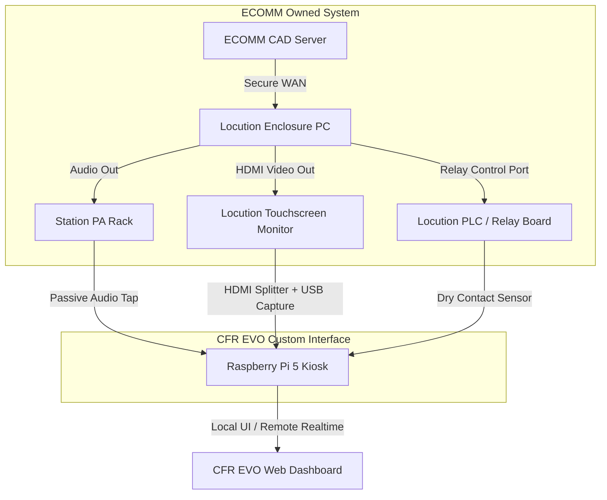

# CFR EVO: Locution PrimeAlert® Passive Integration Guide

This document outlines options for interfacing with the station's **Locution PrimeAlert® Enclosure** and **Enclosure PC** to capture real-time dispatch data. 

Because the hardware and software are owned/operated by **ECOMM**, municipal station staff have:
*   ❌ No administrative rights or OS logins.
*   ❌ No ability to install software on the PC.
*   ❌ No network-level access (VPN/LAN) to the CAD-to-Locution data stream.
*   ❌ No access to the Locution configurator portal or management APIs.

To work around these constraints, we must utilize **fully passive, hardware-level tapping methods** that run in parallel without altering, interfering with, or compromising ECOMM's equipment.

---

## 📋 Integration Architectures



---

## 🛠️ Interfacing Options: Technical Breakdown

We have identified three physical tap points on the Locution hardware:

| Interface Vector | Mechanism | Data Extracted | Complexity | ECOMM IT Friction |
| :--- | :--- | :--- | :--- | :--- |
| **1. HDMI Video Tap & OCR** | Hardware HDMI Splitter -> USB Capture Card -> OCR on Pi | **Full text details** (Address, Incident Type, responding units, grids) | Medium | **Low** (Passive display tap) |
| **2. PA Audio Tap & STT** | Line-in tap from Audio Rack -> Tone matching -> Whisper/Google STT | **Voice announcement text** (Parsed into address, units, channel, grid) | Medium | **Zero** (Completely isolated analog line-out) |
| **3. PLC Relay Dry Contacts** | Optical isolator on physical alarm/light relays -> GPIO triggers | **Trigger event only** (Exact time dispatch occurred; no textual data) | High | **Low-Medium** (Requires wiring terminal access) |

---

### Option 1: HDMI Display Mirroring & OCR (Recommended for Text Accuracy)

The touchscreen monitor mounted to the Locution Enclosure displays a popup window when a call is active. Since the OS is locked down, we can capture the video signal directly from the cable.

#### How it Works:
1.  **Split the Video Signal**: Insert a passive, low-latency **HDMI Splitter** between the Enclosure PC's display output and the touchscreen monitor. 
    *   *Note*: The splitter must support EDID copying to ensure the Enclosure PC continues to output at the native resolution of the touchscreen monitor.
2.  **Capture the Screen**: Feed the duplicate HDMI output into a **USB 3.0 HDMI Capture Card** plugged into the Raspberry Pi 5. The capture card registers on the Pi as a standard USB webcam (`/dev/video0`).
3.  **Perform OCR (Optical Character Recognition)**:
    *   A Python daemon on the Pi takes screenshot frames when a screen change is detected.
    *   Using **OpenCV**, the script crops the frame to the coordinates where the call details popup window appears (Region of Interest - ROI).
    *   The cropped frame is processed through **Tesseract OCR** (or a local fast Vision model) to instantly extract the dispatch text.
4.  **Preserve Touch Functionality**: The touchscreen monitor uses a separate USB cable for touch input. We do **not** touch or split the USB cable; it stays connected directly to the Enclosure PC. The crew can continue interacting with the screen as normal.

> [!TIP]
> **Why Video OCR is Extremely Reliable**:
> Because the Locution popup interface has a highly consistent layout, font size, and color scheme, Tesseract OCR can achieve close to 100% accuracy. Unlike audio speech-to-text, it will not misspell similar-sounding street names (e.g., mishearing "Guildford Way" as "Gilford Way") because the text is extracted directly from the computer's rendering buffer.

---

### Option 2: Station PA Audio Capture & STT (Current System Baseline)

This method captures the audio voice announcement broadcast over the station speaker system.

#### How it Works:
1.  **Analog Audio Tap**: Connect the unused 1/4" output or the 1V utility output from the station's graphic equalizer/amplifier (as detailed in the [hardware_specification.md](file:///c:/Users/curti/Documents/GitHub/CFR-EVO-APP/hardware_specification.md)) to a Behringer UCA202 USB sound card on the Pi.
2.  **Tone & Level Detection**: The Python agent listens for the initial alert tones. When detected, it opens a recording buffer.
3.  **Speech-to-Text (STT)**: The recorded audio file is processed using local **Whisper.cpp** (running on the Pi 5) or sent to the **Google STT API**.
4.  **Template Parsing**: The resulting text is normalized and parsed against our vocabulary dictionaries.

> [!WARNING]
> **Audio STT Limitations**:
> Audio quality can suffer from radio static, background station noise, or announcer volume variations. Complex street names, block numbers, and abbreviations can cause transcription errors that require complex phonetic corrections.

---

### Option 3: Relay Output Dry-Contact Tapping

Locution enclosure controllers (Station Control Units or SCUs) house industrial PLC modules (typically IDEC, Siemens, or Allen-Bradley) that control physical relay outputs to manage station automation. These relays are wired to physical terminal strips on the field wiring side of the cabinet.

#### 🗂️ Types of Available Relays in the Locution Enclosure

If you open the station cabinet or trace the field wiring exiting it, you will find several classes of relay contacts:

1.  **Global Alert Relay (General Dispatch / All Call)**
    *   **Function**: Triggers a global dry-contact closure whenever *any* dispatch goes out to the station.
    *   **Behavior**: Standard maintained or pulsed contact (closed for 5–30 seconds during alert).
    *   **Use Case**: Ideal as a single system-wide trigger to wake up all CFR EVO kiosk displays in the hall simultaneously.
2.  **Zoned Speaker Relays (Audio Gates)**
    *   **Function**: Locution uses these to route 70V or 25V audio lines selectively. For instance, if only Engine 2 is dispatched at 3:00 AM, only the Dorm A speaker relay is closed, preventing the entire station from being woken up.
    *   **Behavior**: Maintained for the duration of the audio page.
    *   **Use Case**: Can be tapped to detect vehicle-specific dispatches (e.g., alert triggers for Dorm A/Engine 2 vs. Dorm B/Rescue 2).
3.  **Apparatus Bay Door Relays**
    *   **Function**: Closes a contact wired in parallel to the wall buttons of individual apparatus bay doors.
    *   **Behavior**: Momentary pulse (typically 1.5 seconds) to trigger the garage door motor.
    *   **Use Case**: Allows CFR EVO to instantly determine *which* apparatus is rolling out (e.g., if Bay Door 2 relay is closed, we immediately display Engine 2’s route on the map).
4.  **Gas Stove Solenoid Valve Interlock**
    *   **Function**: A safety interlock relay designed to cut power to the kitchen's gas solenoid valve to prevent cooking fires during turnouts.
    *   **Behavior**: Maintained contact (Normally Closed loop that opens upon dispatch). It remains open until a crew member presses the physical "Acknowledge" button on the kitchen reset panel.
    *   **Use Case**: Excellent high-reliability indicator that the station is in an active "turnout" state.
5.  **Exhaust Fan / HVAC Damper Relays**
    *   **Function**: Activates station diesel exhaust extraction systems (e.g., Plymovent) or toggles HVAC dampers to clear exhaust fumes.
    *   **Behavior**: Maintained for a pre-configured run timer (e.g., 5 minutes post-alert).

#### 🔌 Electrical Specifications & Wiring Safeties

*   **Contacts**: Typically standard Form A (Normally Open, SPST) or Form C (Common, Normally Open, Normally Closed, SPDT) dry contacts.
*   **Voltage/Current Ratings**: Relays are typically rated for **2A to 10A at 24VDC or 120VAC**.
*   **Isolation is Critical**:
    > [!CAUTION]
    > **Never connect Locution PLC relay contacts directly to Raspberry Pi GPIO pins.**
    > The relays may be switching 12V/24V signals, or sharing circuits with high-inductive loads (like bells, solenoid valves, or door motors) which generate massive voltage spikes (back-EMF) when switched.
    > 
    > **Always use a DIN-Rail Optocoupler (Photocoupler) Module** (e.g., 24VDC input to 3.3VDC output) or a secondary isolated pilot relay to protect the Raspberry Pi's 3.3V GPIO input.

#### How to Wire the GPIO Trigger:
1.  Connect the Locution relay contact to the input side of your optoisolator (e.g., powering the optoisolator LED through a 24V supply loop).
2.  Connect the output side of the optoisolator to a Raspberry Pi GPIO pin (configured with an internal pull-up resistor) and Ground.
3.  Configure a software interrupt on the Raspberry Pi:

```python
from gpiozero import Button
import time

# Pin 21 configured with internal pull-up
dispatch_trigger = Button(21, pull_up=True)

def on_dispatch():
    print("ALERT: Physical dispatch relay triggered!")
    # Actions: Wake screen, start recording, open audio line, log timestamp
    
dispatch_trigger.when_pressed = on_dispatch

# Keep thread running
while True:
    time.sleep(1)
```

> [!IMPORTANT]
> **Best Value**: Relay tapping provides **sub-millisecond notification** that a call has started. It is best used to instantly wake up displays and pre-alert the crew while the HDMI OCR or Audio STT parses the actual call text.

---

## 📋 Comparison & Feasibility Matrix

| Feature / Criteria | Option 1: HDMI + OCR | Option 2: PA Audio + STT | Option 3: Relay Tapping |
| :--- | :--- | :--- | :--- |
| **Data Gained** | 💎 **Excellent** (Exact text, address, units, channel) | 🎚️ **Good** (Voice transcript, requires phonetic cleaning) | ⚡ **Minimal** (Trigger notification only) |
| **Extraction Latency**| < 1.5 seconds (post-render) | 12 - 30 seconds (post-speech) | < 0.1 seconds (instant) |
| **Hardware Required** | HDMI Splitter, USB Capture Card (~$40) | Audio Tap Cables, Behringer UCA202 (~$35) | Optoisolator board, hookup wire (~$15) |
| **Installation Difficulty**| **Easy** (Inline cables behind the screen) | **Easy** (Plugs into back of PA rack) | **Medium-Hard** (Requires terminal block access & wiring) |
| **ECOMM Policy Friction**| **Low** (Purely passive display split, easily reversible) | **Zero** (Standard audio recording tap) | **Medium** (Taps into physical alarm loops) |
| **Reliability** | **High** (If display layout is static) | **Medium-High** (Depends on audio clarity) | **100%** (Hardware contact closure) |

---

## 🛠️ Step-by-Step Implementation: HDMI Capture & OCR

If the department chooses to implement **Option 1**, here is the blueprint for hardware and software configuration.

### 1. Bill of Materials (BOM)
*   **HDMI Splitter (1-in, 2-out)**: *Orei HD-102* or *EZCOOTECH HDMI Splitter* with EDID copy management (prevents the Enclosure PC from detecting a different monitor). ~$15
*   **USB HDMI Capture Card**: *Guermok* or generic *MS2109-based USB HDMI Video Capture Dongle* (supports 1080p @ 30/60fps, plug-and-play). ~$15
*   **HDMI Cables**: Two short (1-3ft) HDMI cables. ~$10

### 2. Verify Capture Device on Raspberry Pi
Connect the hardware as follows:
`Locution PC Out -> HDMI Splitter -> Output 1: Touchscreen Monitor`
`                               -> Output 2: USB Capture Dongle -> Raspberry Pi 5 USB 3.0`

Run the following command on the Raspberry Pi to confirm the device is registered:
```bash
v4l2-ctl --list-devices
```
You should see an entry like:
```
USB Video: USB Video (/dev/video0, /dev/video1)
```

### 3. Python OCR Script
Create a listening service (`agent/locution_ocr.py`) on the Pi to monitor the display and parse notifications:

```python
import cv2
import pytesseract
import time
import re
import requests

# Coordinate bounding boxes for ROI (Region of Interest) cropping.
# Adjust these based on where the Locution call details popup sits on screen.
# Format: [ymin, ymax, xmin, xmax] in percentages or pixels
ROI = {
    "units": (100, 200, 50, 600),
    "incident": (220, 280, 50, 600),
    "address": (300, 400, 50, 600),
}

def preprocess_image(image):
    """Convert to grayscale and apply thresholding to optimize OCR results."""
    gray = cv2.cvtColor(image, cv2.COLOR_BGR2GRAY)
    # Apply Otsu's thresholding
    _, thresh = cv2.threshold(gray, 0, 255, cv2.THRESH_BINARY + cv2.THRESH_OTSU)
    return thresh

def perform_ocr(frame, crop_coords):
    y1, y2, x1, x2 = crop_coords
    cropped = frame[y1:y2, x1:x2]
    preprocessed = preprocess_image(cropped)
    
    # Configure Tesseract options (--psm 6 assumes a single uniform block of text)
    config = "--psm 6"
    text = pytesseract.image_to_string(preprocessed, config=config)
    return text.strip()

def main():
    cap = cv2.VideoCapture(0)
    
    # Set capture resolution (match the touchscreen's resolution, e.g. 1280x800)
    cap.set(cv2.CAP_PROP_FRAME_WIDTH, 1280)
    cap.set(cv2.CAP_PROP_FRAME_HEIGHT, 800)
    
    last_text = ""
    print("Locution OCR Passive Listening Agent Started...")
    
    try:
        while True:
            ret, frame = cap.read()
            if not ret:
                time.sleep(1)
                continue
            
            # Detect popup presence (e.g. check if a specific bounding box contains text)
            incident_text = perform_ocr(frame, ROI["incident"])
            
            if incident_text and incident_text != last_text:
                address_text = perform_ocr(frame, ROI["address"])
                units_text = perform_ocr(frame, ROI["units"])
                
                print(f"--- DISPATCH DETECTED ---")
                print(f"Incident: {incident_text}")
                print(f"Address:  {address_text}")
                print(f"Units:    {units_text}")
                
                # Clean and send to local database
                payload = {
                    "incident_type": incident_text,
                    "address": address_text,
                    "units": [u.strip() for u in units_text.split(",") if u.strip()],
                    "timestamp": time.time()
                }
                # Forward to local CFR EVO websocket server or database API
                # requests.post("http://localhost:8000/api/dispatch", json=payload)
                
                last_text = incident_text
                
            # Idle delay to reduce CPU usage (check screen twice per second)
            time.sleep(0.5)
            
    except KeyboardInterrupt:
        print("Agent stopped.")
    finally:
        cap.release()

if __name__ == "__main__":
    main()
```

---

## 🎯 Proposed Hybrid Approach: The Ultimate Station Interface

To achieve maximum reliability and zero latency, we recommend a **hybrid architecture** combining all three passive methods:

```
                  ┌────────────────────────┐
                  │ Locution Enclosure PC  │
                  └──────────┬─────────────┘
                             │
            ┌────────────────┼────────────────┐
            ▼                ▼                ▼
     [Display Out]      [PA Audio Out]    [Relay Out]
            │                │                │
     (HDMI Splitter)   (Audio Line)     (Optoisolator)
            │                │                │
            ▼                ▼                ▼
     ┌─────────────┐  ┌─────────────┐  ┌─────────────┐
     │  Video OCR  │  │  Audio STT  │  │ Relay Trigger│
     └──────┬──────┘  └──────┬──────┘  └──────┬──────┘
            │                │                │
            │ (Call Details) │ (Transcript)   │ (Wake Screen)
            ▼                ▼                ▼
       ┌──────────────────────────────────────────┐
       │   Raspberry Pi 5 / CFR EVO Dashboard     │
       └──────────────────────────────────────────┘
```

1.  **Relay Trigger (Instant Wake)**: Detects the contact closure and immediately wakes the station screens, sounds a pre-alert tone, and shifts the UI into "Active Alert" mode (0.1 seconds latency).
2.  **HDMI OCR (Immediate Call Details)**: Extracts the exact address, dispatch ID, responding units, and incident type from the popup display (1-2 seconds latency) and plots the route, hydrants, and road hazards immediately.
3.  **Audio STT (Redundant Verification)**: Transcribes the voice announcement in the background. If the OCR failed (e.g. if the popup window was closed or moved), the STT agent acts as a failover to populate the call dashboard.

---

## 📻 Locution Audio Signal Chain & Amplification Interface

Understanding how the Enclosure PC feeds audio to the station PA amplifier helps identify the best places to capture clear, distortion-free audio for CFR EVO.

### 1. The Standard Audio Signal Flow

The typical audio path follows this sequence:

```
┌─────────────────┐       ┌─────────────────┐       ┌──────────────────┐
│  Enclosure PC   ├──────>│  Station Ctrl   ├──────>│ Station PA Amp   │
│  (Analog Out)   │       │   Unit (SCU)    │       │ (Mic/Line Input) │
└─────────────────┘       └────────┬────────┘       └────────┬─────────┘
                                   │                         │
                                   ▼                         ▼
                          [Zoned 70V Relays] <─────── [70V Speaker Out]
                                   │
                                   ▼
                          [Dorm/Bay Speakers]
```

#### Step A: Digital-to-Analog Generation (Enclosure PC)
*   The PC runs the Locution PrimeAlert station software, generating the digital text-to-speech page and alert tones.
*   It outputs this as consumer-grade, unbalanced audio (typically via a 3.5mm line-out jack or a dedicated USB audio interface).

#### Step B: Signal Balancing & Ducking (SCU / Intelligent Audio Switch)
*   The unbalanced PC audio goes into the **Station Control Unit (SCU)** or an **Intelligent Audio Switch (IAS)** card.
*   **Differential Balancing**: The SCU converts the noisy, unbalanced PC output into a low-impedance **balanced/differential audio signal** (+4dBu or 600-ohm). This protects the audio from ground loop hum and RF interference as it travels through the rack.
*   **Priority Ducking**: The SCU intercepts everyday station audio feeds (such as the radio scanner feed, lounge TV, or telephone paging). When a dispatch occurs, the SCU triggers relays to **mute or "duck" these background audio sources**, ensuring the Locution voice announcement has sole priority over the speakers.

#### Step C: Amplification (PA Amplifier)
*   The balanced dispatch audio travels to the input channel of the station’s commercial amplifier (e.g., Peavey UMA-Series, TOA, or Bogen).
*   Typically, this connection uses **3-pin Phoenix terminal blocks** (labeled `+`, `-`, and `GND`) or standard XLR/TRS balanced jacks.
*   The amplifier boosts the line-level signal to high-voltage **70V or 25V constant-voltage speaker signals**.

#### Step D: Zoned Speaker Routing
*   If the station uses zoned dorm alerting (alerting only dispatched crews), the high-voltage 70V speaker output from the amplifier is routed *back* through the SCU's **Zoned Speaker Relays**.
*   The SCU closes only the relays for the dispatched zones (e.g., Dorm 2), sending the 70V audio to those specific speakers while other rooms remain completely quiet.

---

### 2. How to Tap This Audio for CFR EVO

Since we want to capture the audio feed passively, we can tap the signal at three different stages depending on access:

#### Tap Point A: Unbalanced PC Line-Out (Pre-SCU)
*   **Method**: Place a **3.5mm or RCA Y-splitter** directly on the audio output jack of the Enclosure PC before it plugs into the SCU.
*   **Pros**: 100% clean, line-level audio straight from the PC. Free of background radio scanner noise or station ambient noises.
*   **Cons**: Requires physical access to the back of the Enclosure PC (which is often locked inside the cabinet).

#### Tap Point B: Amplifier Auxiliary Output (Pre-70V / Line-Level)
*   **Method**: Plug into the unused **Tape Out**, **Record Out**, or **Line/Utility Output** on the station PA amplifier (as recommended in `hardware_specification.md` Tap Option 1 & 2).
*   **Pros**: Completely external to the locked Locution cabinet. Already line-level (~1V RMS) and isolated.
*   **Cons**: Might include background radio scanner traffic or other audio if the amplifier mixes multiple active inputs together instead of routing them through the SCU's priority gate.

#### Tap Point C: Speaker Line Tap (Post-70V)
*   **Method**: Hook up a **70V-to-Line-Level Converter** (a specialized step-down transformer) in parallel with one of the station speaker lines.
*   **Pros**: Captures exactly what the crew hears.
*   **Cons**:
    *   ⚠️ **HIGH VOLTAGE WARNING**: Directly connecting a 70V speaker line to a Raspberry Pi sound card will instantly fry the card, the Pi, and poses a safety risk. You **must** use a step-down transformer/attenuator.
    *   If you tap a zoned speaker line (e.g., Dorm A), you will only capture alerts that trigger that specific zone. To capture all alerts, you must tap a "Common/All-Call" speaker line.

