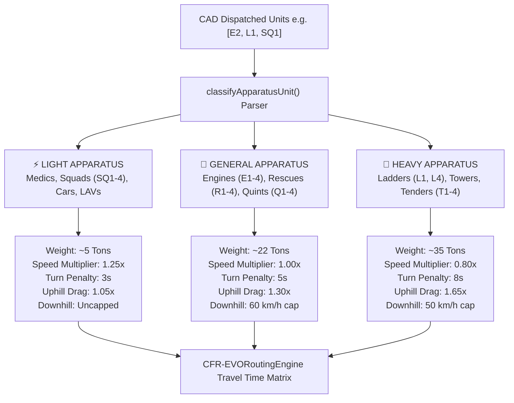

# Coquitlam Fire Rescue EVO Routing Engine (`CFR-EVORoutingEngine`)
## Comprehensive Technical & Operational Architecture Documentation

---

## 1. Operational Background & Domain Context

Emergency Vehicle Operators (EVOs) at **Coquitlam Fire Rescue** respond across a complex urban and topographical landscape characterized by:
- **Steep Mountain Topography**: Severe elevation gains on **Burke Mountain**, **Westwood Plateau**, and **Mariner Way**, which heavily penalize heavy suppression apparatus speeds.
- **Municipal EMTRAC Signal Preemption Grid**: Nearly all traffic signals in the City of Coquitlam are equipped with **EMTRAC preemption**, yielding an empirical **20% to 25% reduction in emergency travel times**.
- **CP Railway Corridor**: The CP Rail mainline traverses southern Coquitlam (along Lougheed Hwy, Brunette Ave, and Mary Hill Bypass), creating potential response delays if at-grade crossings are blocked by trains.
- **Apparatus Weight Diversity**: Vehicle response dynamics vary significantly between 5-ton agile Squad F-350 units and 35-ton heavy Ladder/Tender trucks.

Standard civilian GPS routing engines (Google Maps, HERE, default OSRM) assume standard passenger cars, ignore heavy vehicle slope drag, and assume civilian signal delays (20–40 seconds per red light). `CFR-EVORoutingEngine` replaces standard routing assumptions with emergency vehicle physics tailored for Coquitlam Fire Rescue.

---

## 2. 3-Tier Apparatus Physics Classification Model

Apparatus are grouped into three distinct physics classes based on vehicle weight, acceleration inertia, turn deceleration, and hill-climbing power:



### Classification Reference Table

| Tier Key | Tier Name | Included Units | Weight | Speed Factor | Turn Penalty | Uphill Drag Factor | Downhill Speed Cap |
| :--- | :--- | :--- | :--- | :--- | :--- | :--- | :--- |
| **`LIGHT`** | **⚡ LIGHT APPARATUS** | Squads (`SQ1-4`), Medics (`M1-4`), Command Cars, LAVs | ~5 Tons | **1.25x** | **3.0 seconds** | **1.05x** (Minimal) | Uncapped |
| **`GENERAL`** | **🚒 GENERAL APPARATUS** | Engines (`E1-4`), Rescues (`R1-4`), Quints (`Q1-4`), Pumpers | ~22 Tons | **1.00x** | **5.0 seconds** | **1.30x** (Moderate) | **60 km/h** safety cap |
| **`HEAVY`** | **🚚 HEAVY APPARATUS** | Ladders (`L1`, `L4`), Tower Platforms, Tenders (`T1-4`) | ~35 Tons | **0.80x** | **8.0 seconds** | **1.65x** (High Drag) | **50 km/h** safety cap |

---

## 3. Directional Elevation Grade Drag & Descent Safety Physics

Coquitlam features major incline corridors:
1. **Mariner Way Climb**: Lougheed Hwy $\rightarrow$ Como Lake Rd / Thermal Dr (~6% to 9% grade).
2. **Westwood Plateau Climb**: Johnson St / Pipeline Rd $\rightarrow$ Plateau Blvd / Pinetree Way (~7% to 10% grade).
3. **Burke Mountain Climb**: David Ave / Coast Meridian Rd / Harper Rd $\rightarrow$ Princeton Ave / Coast Meridian top (~8% to 12% grade).

### Incline Physics Formulas

#### Uphill Drag Formula
For an incline segment of length $D$ and slope grade $G\%$:
$$\text{Uphill Travel Time} = \frac{D}{V_{\text{base}} \times \text{SpeedFactor}} \times \left(1.0 + \left(\frac{G\%}{100} \times \text{UphillDragFactor}\right)\right)$$

*Example Impact*: On a 10% grade climbing Burke Mountain:
- **Squad (Light)**: Speed is reduced by **~10%**.
- **Engine (General)**: Speed is reduced by **~30%**.
- **Ladder (Heavy)**: Speed is reduced by **~62%**, correctly modeling heavy diesel engine load under high thermal/inertia stress.

#### Downhill Braking Safety Cap
Heavy apparatus descending steep slopes rely on engine retarders and service brakes to prevent runaway overheating. `CFR-EVORoutingEngine` enforces mandatory speed caps on downhill descents:
- **General Apparatus**: Max **60 km/h**.
- **Heavy Apparatus**: Max **50 km/h**.

---

## 4. EMTRAC Signal Preemption & Rush-Hour Queue Modeling

### EMTRAC Green-Wave Preemption
The City of Coquitlam operates an **EMTRAC preemption system**. Approaching fire apparatus transmit preemption signals to traffic control cabinets, clearing red lights to green before the vehicle arrives.
- **Baseline Unimpeded Velocity**: $52.0\text{ km/h}$ average response velocity across urban signalized corridors.

### Rush Hour Queue Degradation
During peak commuter windows:
- **AM Rush**: 07:00 – 09:00 AM (Westbound commuter congestion on Lougheed, Barnet, Mary Hill Bypass).
- **PM Rush**: 15:30 – 18:30 PM (Eastbound commuter congestion).

While EMTRAC preempts the signal, bumper-to-bumper traffic queues at major intersections require time to flush forward. The engine applies an **EMTRAC Rush Hour Efficiency Factor**:
$$\text{Effective Speed} = V_{\text{base}} \times \left(1.0 - \left(0.40 \times (1.0 - \text{RushHourEfficiency})\right)\right)$$
*Default*: At 60% efficiency during rush hour, preemption speed gains are reduced by **16%** to reflect intersection queue-flushing delays.

---

## 5. CP Rail Crossing Avoidance & Overpass Threshold

The CP Rail mainline runs through southern Coquitlam / Port Coquitlam near Lougheed Hwy, Brunette Ave, and Mary Hill Bypass.

```
       [ At-Grade Track Crossing ]  ──►  ⚠️ Train Delay Risk (+45s to +120s)
                   VS
       [ Grade-Separated Overpass ] ──►  🚂 Guaranteed Clear Route (+0.8km Detour)
```

### Overpass Routing Algorithm
1. **Master Toggle**: `railroadAvoidanceEnabled` (`true` / `false`).
2. **Threshold Evaluation**: `railroadThresholdMinutes` (default: `3.0 minutes`).
   - If an overpass detour (**Mary Hill Bypass overpass**, **Pinetree Way overpass**, **Schoolhouse Rd overpass**) adds less than 3 minutes, the engine routes via the overpass.
3. **Driver Alert Badges**:
   - **Overpass Active (Crossing Avoided)**:
     `🚂 CP RAIL CROSSING AVOIDED — ROUTED VIA MARY HILL OVERPASS (+0.8km)`
   - **At-Grade Crossing Active (Direct Path)**:
     `⚠️ AT-GRADE RAIL CROSSING AHEAD (CP Rail) — TRAIN DELAY RISK`

---

## 6. Multi-Unit Dispatched CAD Payload Processing

When CAD dispatches arrive (e.g. `Units: E2, L1, SQ1`), `calculateEVORouteMetrics()` parses each unit string and computes travel metrics for **all dispatched units simultaneously**:

```javascript
import { calculateEVORouteMetrics } from '../utils/EVORoutingEngine';

const metrics = calculateEVORouteMetrics({
  originCoords: [49.283, -122.793], // Hall 1 (TCFH)
  targetCoords: [49.301, -122.775], // 3100 Ozada Ave
  dispatchedUnits: ['SQ1', 'E1', 'L1'],
  routeCoordinates: osrmPoints,
  config: routingConfig,
  timeOfDay: new Date()
});
```

### Output Structure
```json
{
  "distanceKm": "3.4",
  "railroadWarning": {
    "type": "AVOIDED",
    "badge": "🚂 CP RAIL CROSSING AVOIDED — ROUTED VIA MARY HILL OVERPASS",
    "color": "emerald"
  },
  "isRushHour": false,
  "units": [
    {
      "unit": "SQ1",
      "tierKey": "LIGHT",
      "tierName": "⚡ LIGHT APPARATUS",
      "distanceKm": "3.4",
      "etaMinutes": "2.5",
      "color": "#38bdf8"
    },
    {
      "unit": "E1",
      "tierKey": "GENERAL",
      "tierName": "🚒 GENERAL APPARATUS",
      "distanceKm": "3.4",
      "etaMinutes": "3.1",
      "color": "#10b981"
    },
    {
      "unit": "L1",
      "tierKey": "HEAVY",
      "tierName": "🚚 HEAVY APPARATUS",
      "distanceKm": "3.4",
      "etaMinutes": "4.2",
      "color": "#f59e0b"
    }
  ]
}
```

---

## 7. Interactive Fine-Tuning Modal (`EVORoutingConfigModal.jsx`)

EVOs and Admins can adjust routing engine parameters on the fly via **`⚙️ MAP OPTIONS` $\rightarrow$ `⚙️ ROUTING CONFIG`**:

- **Railroad Avoidance Toggle**: Enable/disable overpass detour routing.
- **Railroad Threshold Slider**: `0.5 to 10.0 minutes` threshold.
- **EMTRAC Preemption Toggle**: Enable/disable green-wave priority calculations.
- **Rush Hour Efficiency Slider**: Adjust preemption queue flushing performance.
- **Elevation Physics Toggle**: Enable/disable incline grade drag.

---

## 8. Source File Sitemap

| File Path | Description |
| :--- | :--- |
| [EVORoutingEngine.js](file:///c:/Users/Curtis/Nextcloud/Documents/Projects/Coding/CFR-EVO-APP/frontend/src/utils/EVORoutingEngine.js) | Core physics engine, apparatus classifiers, slope drag, and EMTRAC math |
| [EVORoutingConfigModal.jsx](file:///c:/Users/Curtis/Nextcloud/Documents/Projects/Coding/CFR-EVO-APP/frontend/src/components/EVORoutingConfigModal.jsx) | Interactive tuning modal with sliders and toggles |
| [MapBoard.jsx](file:///c:/Users/Curtis/Nextcloud/Documents/Projects/Coding/CFR-EVO-APP/frontend/src/components/MapBoard.jsx) | Connects routing engine state to live Leaflet map and CAD dispatches |
| [DashboardHUD.jsx](file:///c:/Users/Curtis/Nextcloud/Documents/Projects/Coding/CFR-EVO-APP/frontend/src/components/DashboardHUD.jsx) | Renders multi-unit ETA list and driver rail warning badges in HUD |
