# CFR EVO: GIS Endpoints & Offline Migration Notes

This document provides a guide to the local GIS datasets currently packaged with the app, their configuration, and the future roadmap for replacing the external municipal servers at `geodata.coquitlam.ca` with local hosting via the **Dynamic Viewport API (Option A)**.

---

## 🗺️ Current Packaged GIS Datasets

The frontend app runs in a local-first capacity by caching spatial databases under `frontend/public/data/`. These files are fetched relative to the application's base URL:

*   **`data/hydrants.json`**: Cached municipal fire hydrants database containing flow rate classification (Class AA/A/B/C), status (Operating/Private/Out-of-Service), ID, and lat/lng coordinates.
*   **`data/zones.json`**: Boundaries and geographic boundaries of response zones for the apparatus dispatch mappings.
*   **`data/intersections.json`**: Street intersection coordinate mappings for driver training games.
*   **`data/blocks.json`**: Street segment blocks and address ranges.

---

## 🚧 Future Migration: Offline Cadastral Map Overlays (Option A)

Currently, the map dashboard displays road and parcel boundaries dynamically by streaming pre-rendered map layer images from:
`https://geodata.coquitlam.ca/arcgis/rest/services/DynamicServices/Cadastral/MapServer`

And address queries autocomplete by making API requests to:
`https://geodata.coquitlam.ca/arcgis/rest/services/DynamicServices/Cadastral/MapServer/15/query`

To achieve 100% internet-independent operation, we will transition the app to **Option A: Dynamic Viewport API** hosted locally by the backend Python agent.

### Option A: Architectural Workflow

```mermaid
sequenceDiagram
    participant UI as React Frontend (Map)
    participant API as Python Local API
    participant GIS as Shapefiles (Addresses.shp)

    rect rgb(30, 41, 59)
        Note over UI, GIS: 1. Address Search Autocomplete
        UI->>API: GET /api/autocomplete?q=428+Nelson
        API->>GIS: Fuzzy match house number & street names
        GIS-->>API: Centroid, full address, & parcel rings
        API-->>UI: JSON Suggestions list
    end

    rect rgb(15, 23, 42)
        Note over UI, GIS: 2. Viewport Cadastral Rendering
        UI->>API: GET /api/parcels?bbox=min_lng,min_lat,max_lng,max_lat
        API->>GIS: Query spatial index for intersecting property polygons
        GIS-->>API: Matching coordinates & attributes
        API-->>UI: Lightweight GeoJSON FeatureCollection
        Note over UI: Render GeoJSON layer on Leaflet
    end
```



### 1. Backend API Implementation Blueprint
The backend agent will run a lightweight, non-blocking HTTP server (e.g., using `FastAPI` or standard library `http.server`) exposing the following endpoints:

#### A. Address Autocomplete
*   **Endpoint**: `GET /api/autocomplete?q=<search_query>`
*   **Processing**:
    1. Parse the search query into a house number and street name.
    2. Query the pre-indexed `Addresses.shp` shapefile using `CoquitlamDataValidator.validate_address_exists()`.
    3. Return matching records as a JSON list.
*   **Response Format**:
    ```json
    [
      {
        "address": "428 Nelson St",
        "lat": 49.27305,
        "lng": -122.88452,
        "rings": [[[ -122.8847, 49.2731 ], [ -122.8843, 49.2731 ], ...]]
      }
    ]
    ```

#### B. Dynamic Viewport Parcels (Bounding Box Query)
*   **Endpoint**: `GET /api/parcels?bbox=<min_lng>,<min_lat>,<max_lng>,<max_lat>`
*   **Processing**:
    1. Parse the bounding box parameters.
    2. Query the shapefile spatial index (`sindex.intersection()`) to extract parcel geometries intersecting the current viewport.
    3. Convert geometries to WGS84 and export to a standard GeoJSON FeatureCollection.
*   **Response Format**:
    ```json
    {
      "type": "FeatureCollection",
      "features": [
        {
          "type": "Feature",
          "geometry": {
            "type": "Polygon",
            "coordinates": [[[ -122.8847, 49.2731 ], ...]]
          },
          "properties": {
            "address": "428 Nelson St",
            "house": "428",
            "street": "Nelson St"
          }
        }
      ]
    }
    ```

---

### 2. Frontend Map Integration Blueprint

*   **Autocomplete Toggle**: Update the `LeftSidebar` autocomplete handler inside `DashboardHUD.jsx` to query the local backend port:
    ```javascript
    const url = `http://localhost:8000/api/autocomplete?q=${encodeURIComponent(searchQuery)}`;
    ```
*   **Dynamic GeoJSON Layer**: In `MapLayers.jsx`, replace the ESRI `dynamicMapLayer` with a Leaflet `GeoJSON` layer that updates dynamically:
    ```javascript
    export function LocalCadastralLayer({ visible }) {
        const map = useMap();
        const [geoJsonData, setGeoJsonData] = useState(null);

        useEffect(() => {
            if (!visible) return;

            const updateParcels = () => {
                const bounds = map.getBounds();
                const bbox = `${bounds.getSouthWest().lng},${bounds.getSouthWest().lat},${bounds.getNorthEast().lng},${bounds.getNorthEast().lat}`;
                
                fetch(`http://localhost:8000/api/parcels?bbox=${bbox}`)
                    .then(r => r.json())
                    .then(data => setGeoJsonData(data))
                    .catch(e => console.warn("Failed to update local parcels:", e));
            };

            map.on('moveend zoomend', updateParcels);
            updateParcels();

            return () => {
                map.off('moveend zoomend', updateParcels);
            };
        }, [map, visible]);

        if (!visible || !geoJsonData) return null;
        return <GeoJSON data={geoJsonData} style={{ color: '#475569', weight: 1, fillOpacity: 0.05 }} />;
    }
    ```

### 3. Advantages of Option A
*   **100% Offline-Capable**: Works completely without internet, pulling directly from local `.shp` files.
*   **Lightweight Resource Footprint**: Does not require running resource-heavy tile-rendering containers (like TileServer-GL) on client kiosks.
*   **Dynamic Data Querying**: The frontend can access raw attributes (address, house numbers) on hovered/clicked parcels directly from the GeoJSON properties.
