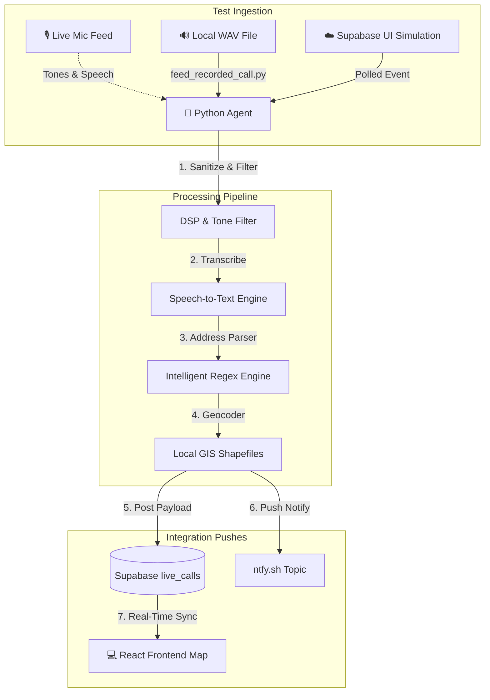

# CFR EVO: Test Procedures & Diagnostics Guideline

This document outlines the standard procedures for verifying, calibrating, and testing the **CFR EVO** emergency dispatch mapping system. It provides step-by-step instructions for running automated unit/integration tests, verifying audio capture, feeding simulated radio calls, and troubleshooting database/UI integrations.

---

## 🧭 Testing Architecture Overview



---

## 🛠️ Environment Prerequisites

Before running any diagnostics or tests, ensure you are in the agent directory and have the virtual environment activated.

```powershell
# Navigate to agent directory
cd agent

# Activate Virtual Environment (Windows PowerShell)
..\.venv\Scripts\Activate.ps1
```

Confirm that the required credentials and settings are defined in the backend environment file (`agent/.env`):
* `SUPABASE_URL` & `SUPABASE_SERVICE_ROLE_KEY`
* `STT_ENGINE` (set to `google` or `whisper`)
* `GOOGLE_APPLICATION_CREDENTIALS` (if using Google STT)

### ☁️ Cloud Synced Dashboard Testing (Recommended Setup)

Since the Supabase backend is hosted in the cloud, you **do not need to run a local React server** (Vite client) on your computer during testing. 

* **Local Component**: You only need to run the local Python script (`main.py` or `feed_recorded_call.py`) in your IDE terminal. This listens to your microphone (or feeds a WAV file), performs processing, and posts the results directly to the cloud Supabase database.
* **Cloud Dashboard**: You can monitor the results live on your hosted **GitHub Pages** app. Because the GitHub Pages site listens to the cloud database via a WebSocket channel, it will instantly update the map, draw routes, and fetch nearest hydrants as soon as the local Python agent posts a new call.

---

## 🧪 Procedure 1: Automated QA & Diagnostics Test Suite

The QA test suite scans for local audio recordings in `agent/test_calls/`, runs them through transcription and parsing, geocodes the resulting locations, and verifies outputs against ground-truth files.

### 🏃 Running the Suite
```powershell
python run_test_suite.py
```

### 📋 What it Validates:
1. **Transcription Accuracy**: Computes a Levenshtein distance similarity score (using `thefuzz`) between the STT output and expected ground-truth text.
2. **Metadata Parsing**: Verifies that the regex parser extracts the correct:
   - Responding apparatuses (e.g., `['E1', 'L1']`).
   - Incident type (e.g., `Structure Fire`, `Medical Aid`).
   - Map grid zones (e.g., `Grid 12`).
3. **Local Geocoder Integrity**: Tests shapefile boundaries in `data/Property_Information/` to verify coordinates and parcel rings are found offline.
4. **Grid Bound Envelopes**: Verifies that the geocoded coordinate point falls within the spatial envelope of the parsed map grid.

---

## 🧪 Procedure 2: Supabase Integration & Schema Contract Verification

This test verifies the data contract between the Python agent and the Supabase PostgreSQL schema. It runs a series of mock transcripts through the entire processing pipeline (without requiring live audio) and checks if the generated payloads match the expected JSON structure.

### 🏃 Running the Test
```powershell
python test_supabase_integration.py
```

### 📋 What it Validates:
* **Payload Structure**: Ensures coordinates are correctly nested under `target` (Option 2) or passed as a lightweight string (Option 1).
* **Placeholder Handlers**: Verifies that specific phrases (e.g., *"contact dispatch for location information"*) correctly resolve to a clean address field with a confidence score of `100.0` and coordinates set to `null` to bypass false maps.
* **Fallbacks**: Confirms that unresolvable addresses fallback to `Unknown Location` and raise the `verify_location` flag.

---

## 🧪 Procedure 3: Live Microphone & DSP Volume Diagnostics

Before leaving the listener active, verify that the microphone is unmuted, has the correct system index, and has a high enough gain to register decibels.

### 1. View & Select Audio Device Index
Run the sounddevice query utility to list all recording interfaces detected by the OS:
```powershell
python -c "import sounddevice as sd; print(sd.query_devices())"
```
*Note the ID number or unique query name string of your microphone array or virtual cable (e.g., `1` or `alsa_input.usb-Burr-Brown_from_TI_USB_Audio_CODEC-00.analog-stereo-input`). Set this value as `AUDIO_DEVICE_ID=...` in your `backend/.env` if you want to lock the agent to a specific device. A stable name string is highly recommended to survive reboot index shifts.*

### 2. Live Volume Meter Calibration
Listen to a microphone and display live signal levels to check if sound is registering:
```powershell
python debug_audio.py
```
*   **Standby/Silence Level**: Should register near `0.00` to `200.00` RMS.
*   **Loud Sound / Tone Spike**: Should easily exceed your configured `NOISE_AMPLITUDE_THRESHOLD` (default: `1500` RMS).
*   *If the RMS level remains under `1.0` while making noise, double-check that your microphone is unmuted in Windows Control Panel / Settings.*

### 3. Tone Verification & Interactive Calibration
To calibrate the DSP threshold so the agent doesn't false-trigger on background noise, run the interactive validator:
```powershell
python calibrate_audio_interactive.py
```
This utility records loud sound events, matches them against the golden frequency profiles for `Chief Tone`, `Engine Tone`, and `Rescue Tone`, and prompts you to log correct matches or false positives.

---

## 🧪 Procedure 4: End-to-End Pipeline Feeding (WAV Simulation)

You can feed a pre-recorded WAV file directly into the listening pipeline to simulate hearing a call over the radio. This tests the transcription, geocoding, audio upload, and Supabase transmission in a single run.

### 🏃 Running the Simulation
```powershell
# Feed the default dispatch sample
python feed_recorded_call.py test_dispatch.wav

# Feed a custom sample and specify the target trigger tone
python feed_recorded_call.py custom_call.wav "Engine Tone"
```

### 📋 Verification Checkpoints:
1. **Local Filesystem**: A clean copy of the filtered audio should be saved to `frontend/public/recordings/[DISP-ID].wav` and `backend/audio_files/recordings/`.
2. **Supabase Storage**: The WAV file should upload to the `dispatch-audio` storage bucket.
3. **Database Insertion**: A new row should appear in the `live_calls` table with a public URL to the audio file.
4. **WebSocket Push**: The web client dashboard (either local `http://localhost:5173/CFR-EVO-APP/` or your live GitHub Pages URL) should instantly center the map on the geocoded address, draw a route line from the station, and highlight the three closest fire hydrants.

---

## 🧪 Procedure 5: Supabase Web Simulation Poller Testing

The python agent runs a background poller thread that checks for simulation requests initiated by developers or station admins via the web app.

### 📋 Testing Steps:
1. Ensure the agent is running:
   ```powershell
   python main.py
   ```
2. Insert a row into the `simulation_requests` table on Supabase with:
   - `status = "pending"`
   - `audio_url = "[URL_TO_WAV_FILE]"`
   - `verified_transcript = "[EXPECTED_TEXT]"` (optional)
3. Check the agent console logs or `dispatch.log`. You should see:
   - *"Processing simulation request [ID]..."*
   - Status transitions to `processing`.
   - Download, transcription, parsing, and geocoding executing.
   - A new dispatch entry pushed to the `live_calls` table.
   - Status transitions to `completed` in the `simulation_requests` table, with the final JSON response saved in the `result` column.

---

## 🛑 Troubleshooting Reference

| Issue | Root Cause | Resolution |
| :--- | :--- | :--- |
| **RMS stays near `0.00`** | Windows Microphone Muted / Blocked | Open Windows Settings -> Privacy -> Microphone. Ensure "Allow apps to access your microphone" is turned ON. Verify device volume is not 0% in Sound Control Panel. |
| **`PaErrorCode -9997`** | Invalid Sample Rate | The input device does not support the default `16000Hz` sample rate. Ensure you are targeting a device that supports 16kHz capture, or use a WASAPI loopback driver. |
| **Geocoding returns `None` coordinates** | Address shapefile mapping issue | Verify that the address suffix matches the Coquitlam database. For example, the parser translates "Sandstone Crescent" to `Sandstone Cres` to match the local GIS shapefiles. Check the spelling in `data/vocabulary/street_names.txt`. |
| **`GOOGLE_APPLICATION_CREDENTIALS` error** | GCP JSON file missing/expired | Ensure your Google Cloud service account key is saved at `backend/cfr-dispatch-mapping-b30ef9734c12.json` and that the file path is correctly specified in your `.env`. |
| **Real-time updates not showing in web app** | Supabase Anon Key invalid | Ensure the publishable key starting with `sb_` or public JWT is updated in `frontend/.env.local` as `VITE_SUPABASE_ANON_KEY`. Check browser developer console (F12) for websocket connection errors. |

