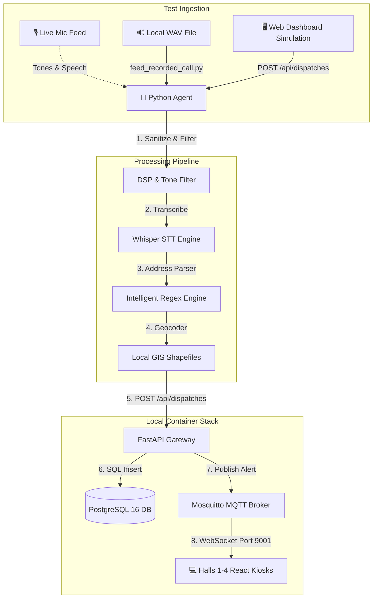

# CFR EVO: Test Procedures & Diagnostics Guideline

This document outlines the standard procedures for verifying, calibrating, and testing the **CFR EVO** emergency dispatch mapping system. It provides step-by-step instructions for running automated unit/integration tests, verifying audio capture, feeding simulated radio calls, and troubleshooting database/UI integrations.

---

## 🧭 Testing Architecture Overview


```mermaid
graph TD
    subgraph Test Ingestion
        A[🎙️ Live Mic Feed] -.->|Tones & Speech| E[🐍 Python Agent]
        B[🔊 Local WAV File] -->|feed_recorded_call.py| E
        C[🖥️ Web Dashboard Simulation] -->|POST /api/dispatches| E
    end
    
    subgraph Processing Pipeline
        E -->|1. Sanitize & Filter| F[DSP & Tone Filter]
        F -->|2. Transcribe| G[Whisper STT Engine]
        G -->|3. Address Parser| H[Intelligent Regex Engine]
        H -->|4. Geocoder| I[Local GIS Shapefiles]
    end
    
    subgraph Local Container Stack
        I -->|5. POST /api/dispatches| J[FastAPI Gateway]
        J -->|6. SQL Insert| K[(PostgreSQL 16 DB)]
        J -->|7. Publish Alert| L[Mosquitto MQTT Broker]
        L -->|8. WebSocket Port 9001| M[💻 Halls 1-4 React Kiosks]
    end
```

---

## 🛠️ Environment Prerequisites

> [!TIP]
> **AI Agent Execution**: When running diagnostics, check the [`local-stack-orchestrator`](file:///c:/Users/Curtis/Nextcloud/Documents/Projects/Coding/CFR-EVO-APP/.agents/skills/local-stack-orchestrator/SKILL.md) skill and use the **`cfr-docker`** MCP tools to inspect container state and **`cfr-postgres`** MCP tools to run verification queries directly.

Before running any diagnostics or tests, ensure you have the Python virtual environment activated:

```powershell
# Navigate to project root
cd c:\Users\Curtis\Nextcloud\Documents\Projects\Coding\CFR-EVO-APP

# Activate Virtual Environment (Windows PowerShell)
.\.venv\Scripts\Activate.ps1
```

Confirm that the local container stack is running (you can also use the `run_command` tool of the **`cfr-docker`** MCP server):
```powershell
docker compose ps
```
The stack runs:
* **PostgreSQL 16**: Port `5432` (`POSTGRES_DB=cfr_dispatch`)
* **FastAPI Gateway**: Port `8000` (`http://localhost:8000/api/dispatches`)
* **Mosquitto MQTT**: Ports `1883` (TCP) and `9001` (WebSockets)
* **Ntfy Server**: Port `8080` (HTTP)

### 🖥️ Local Container Stack Testing Setup

All dispatches and audio recordings persist 100% locally on your machine or station server:
* **Backend Component**: Run the local Python listener (`backend/main.py`) or feeder script (`backend/scripts/feed_recorded_call.py`).
* **Frontend Kiosk HUD**: Start the React dashboard (`cd frontend && npm run dev`) to inspect live map rendering, Turf.js hydrant filters, and route overlays.

---

## 🧪 Procedure 1: Automated QA & Diagnostics Test Suite

> [!NOTE]
> **AI Agent Workflows**: For full end-to-end simulation runs, invoke the specialized [**`dispatch-qa-engineer`**](file:///c:/Users/Curtis/Nextcloud/Documents/Projects/Coding/CFR-EVO-APP/.agents/agents/dispatch-qa-engineer/agent.md) subagent. Detailed validation procedures are maintained in the [`e2e-dispatch-testing`](file:///c:/Users/Curtis/Nextcloud/Documents/Projects/Coding/CFR-EVO-APP/.agents/skills/e2e-dispatch-testing/SKILL.md) skill.

The QA test suite scans for local audio recordings in `backend/tests/test_calls/`, runs them through transcription and parsing, geocodes the resulting locations, and verifies outputs against ground-truth files.

### 🏃 Running the Suite
```powershell
python backend/tests/run_test_suite.py
```

### 📋 What it Validates:
1. **Transcription Accuracy**: Computes a Levenshtein distance similarity score (using `thefuzz`) between the STT output and expected ground-truth text.
2. **Metadata Parsing**: Verifies that the regex parser extracts the correct:
   - Responding apparatuses (e.g., `['E1', 'L1']`).
   - Incident type (e.g., `Structure Fire`, `Medical Aid`).
   - Map grid zones (e.g., `Grid 12`).
3. **Local Geocoder Integrity**: Tests shapefile boundaries in `backend/data/Property_Information/` to verify coordinates and parcel rings are found offline.
4. **Grid Bound Envelopes**: Verifies that the geocoded coordinate point falls within the spatial envelope of the parsed map grid.

---

## 🧪 Procedure 2: Local PostgreSQL & FastAPI Gateway Contract Verification

This test verifies the data contract between the Python backend and the local PostgreSQL database schema via the FastAPI Gateway. It runs a series of mock transcripts through the entire processing pipeline (without requiring live audio) and checks if the generated payloads match the expected JSON structure.

### 🏃 Running the Test
```powershell
python backend/tests/test_supabase_integration.py
```

### 📋 What it Validates:
* **Payload Structure**: Ensures coordinates are correctly nested under `target` (Option 2) or passed as a lightweight string (Option 1).
* **Placeholder Handlers**: Verifies that specific phrases (e.g., *"contact dispatch for location information"*) correctly resolve to a clean address field with a confidence score of `100.0` and coordinates set to `null` to bypass false maps.
* **Fallbacks**: Confirms that unresolvable addresses fallback to `Unknown Location` and raise the `verify_location` flag.

---

## 🧪 Procedure 3: Live Microphone & DSP Volume Diagnostics

Before leaving the listener active, verify that the microphone is unmuted, has the correct system index, and has a high enough gain to register decibels.

### 1. View & Select Audio Device Index
Run the sounddevice query utility to list all recording interfaces detected by the OS:
```powershell
python -c "import sounddevice as sd; print(sd.query_devices())"
```
*Note the ID number or unique query name string of your microphone array or virtual cable (e.g., `1` or `alsa_input.usb-Burr-Brown_from_TI_USB_Audio_CODEC-00.analog-stereo-input`). Set this value as `AUDIO_DEVICE_ID=...` in your `backend/.env` if you want to lock the agent to a specific device.*

### 2. Live Volume Meter Calibration
Listen to a microphone and display live signal levels to check if sound is registering:
```powershell
python backend/scripts/debug_audio.py
```
*   **Standby/Silence Level**: Should register near `0.00` to `200.00` RMS.
*   **Loud Sound / Tone Spike**: Should easily exceed your configured `NOISE_AMPLITUDE_THRESHOLD` (default: `1500` RMS).

### 3. Tone Verification & Interactive Calibration
To calibrate the DSP threshold so the agent doesn't false-trigger on background noise, run the interactive validator:
```powershell
python backend/scripts/calibrate_audio_interactive.py
```
This utility records loud sound events, matches them against the golden frequency profiles for `Chief Tone`, `Engine Tone`, and `Rescue Tone`, and prompts you to log correct matches or false positives.

---

## 🧪 Procedure 4: End-to-End Pipeline Feeding (WAV Simulation)

You can feed a pre-recorded WAV file directly into the listening pipeline to simulate hearing a call over the radio. This tests transcription, geocoding, audio upload, and local API gateway persistence in a single run.

### 🏃 Running the Simulation
```powershell
# Feed the default dispatch sample
python backend/scripts/feed_recorded_call.py backend/tests/test_dispatch.wav

# Feed a custom sample and specify the target trigger tone
python backend/scripts/feed_recorded_call.py backend/audio_files/custom_call.wav "Engine Tone"
```

### 📋 Verification Checkpoints:
1. **Local Filesystem**: A clean copy of the filtered audio is saved to `backend/audio_files/recordings/[DISP-ID].wav`.
2. **FastAPI Gateway**: `POST /api/dispatches` persists the call to the local PostgreSQL `live_calls` table.
3. **MQTT Broadcast**: An `INSERT` event is published to `cfr/dispatches` over Mosquitto MQTT.
4. **WebSocket Push**: The web client dashboard (`http://localhost:5173/`) instantly centers the map on the geocoded address, draws a route line from the station, and highlights the three closest fire hydrants.

## 🧪 Procedure 5: Local Stack Web Simulation Testing

The python agent runs a background runner and FastAPI server that allows developers to trigger simulations via HTTP requests or REST API triggers.

### 📋 Testing Steps:
1. Ensure the container stack and agent are running:
   ```powershell
   python main.py
   ```
2. Trigger a simulation run by sending a POST request to the local FastAPI Gateway endpoint:
   ```powershell
   Invoke-RestMethod -Method Post -Uri "http://localhost:8000/api/dispatches/simulate" -Body (ConvertTo-Json @{
       audio_url = "[URL_TO_WAV_FILE]"
       verified_transcript = "[EXPECTED_TEXT]"
   }) -ContentType "application/json"
   ```
3. Check the agent console logs or `dispatch.log`. You should see:
   - *"Processing simulation request..."*
   - Transcription, parsing, and geocoding executing.
   - A new dispatch entry pushed/upserted to the local PostgreSQL `live_calls` table.
   - Live update published over MQTT to local station kiosk displays.

---

## 🧪 Procedure 6: Comparative Parser Backtesting Suite (`backtest_parser.py`)

This test script evaluates the performance of the production parser ([parser.py](../backend/cfr_dispatch/parser.py)) against alternative parsing modules (such as [destructive_parser.py](../backend/cfr_dispatch/destructive_parser.py)) by benchmarking their extractions against the entire dataset of human-verified calls stored in the local PostgreSQL database.

### 🏃 Running the Backtest Suite
```powershell
.venv\Scripts\python.exe backend/scripts/backtest_parser.py
```

### 📋 What it Validates & Reports:
1. **Ground-Truth Data Pull**: Queries all live calls from the local PostgreSQL database where `feedback_submitted = true`.
2. **Side-by-Side Accuracy Metrics**: Calculates exact precision for 5 key extraction variables:
   - **Address / Location**: Normalizes street suffixes (e.g. `Street` $\rightarrow$ `St`, `Avenue` $\rightarrow$ `Ave`) and performs set-overlap intersection comparisons.
   - **Incident Type**: Evaluates full incident name resolution (e.g. `Medical Aid - Fall` vs generic `Medical Aid`).
   - **Responding Units**: Normalizes parsed apparatuses via `abbreviate_units` and computes set equality.
   - **Map Grid**: Compares extracted grid numbers against verified database grids.
   - **Talk Group**: Compares radio channels (e.g. `10 Combined Response` vs `5`).
3. **Discrepancy Log**: Prints a detailed side-by-side diff table for any dispatches where the parsers diverged, allowing developers to audit edge cases without impacting production listener services.

---

## 🛑 Troubleshooting Reference

| Issue | Root Cause | Resolution |
| :--- | :--- | :--- |
| **RMS stays near `0.00`** | Windows Microphone Muted / Blocked | Open Windows Settings -> Privacy -> Microphone. Ensure "Allow apps to access your microphone" is turned ON. Verify device volume is not 0% in Sound Control Panel. |
| **`PaErrorCode -9997`** | Invalid Sample Rate | The input device does not support the default `16000Hz` sample rate. Ensure you are targeting a device that supports 16kHz capture, or use a WASAPI loopback driver. |
| **Geocoding returns `None` coordinates** | Address shapefile mapping issue | Verify that the address suffix matches the Coquitlam database. For example, the parser translates "Sandstone Crescent" to `Sandstone Cres` to match the local GIS shapefiles. Check the spelling in `data/vocabulary/street_names.txt`. |
| **`GOOGLE_APPLICATION_CREDENTIALS` error** | GCP JSON file missing/expired | Ensure your Google Cloud service account key is saved at `backend/cfr-dispatch-mapping-b30ef9734c12.json` and that the file path is correctly specified in your `.env`. |
| **Real-time updates not showing in web app** | Mosquitto MQTT broker down / WS Port blocked | Ensure Mosquitto MQTT container is running and WebSockets port `9001` is open. Verify MQTT settings in `frontend/.env.local` connect to `ws://localhost:9001/mqtt`. Check browser developer console (F12) for connection errors. |

