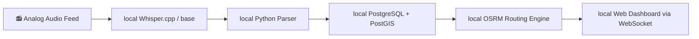
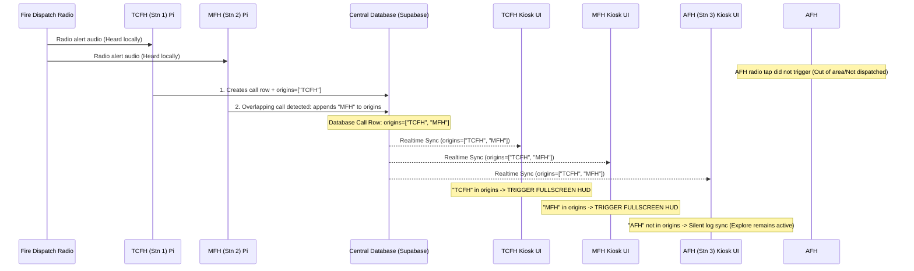

# CFR EVO: Hardware Specification & Integration Guideline

This document provides a comprehensive hardware blueprint and software configuration guide for deploying **CFR EVO** on dedicated station hardware. It covers **Phase 1** (audio monitoring, tone detection, and speech-to-text pickup) and **Phase 2** (integrated touchscreen kiosk running both frontend and backend locally).

---

## 📋 System Architecture Overview

```mermaid
graph TD
    subgraph Rack Hardware
        A[Incoming Radio Feed] --> B[ART 341 Equalizer]
        B -->|Channel 1 OUT| C[Amps & Speakers]
        B -->|Channel 1 Unused 1/4" OUT| D[Line-Level Signal (~1V)]
    end
    
    subgraph Raspberry Pi Kiosk
        D -->|1/4" to RCA Cable| E[Behringer UCA202 USB Sound Card]
        E -->|USB Audio Input| F[Python Dispatch Agent]
        F -->|Local WebSockets or Supabase| G[React Frontend Kiosk]
        G -->|Display Output| H[10.1" Touchscreen Monitor]
    end
```

---

## 🛒 Bill of Materials (BOM)

### Phase 1: Audio Monitoring & Pickup (Estimated Cost: ~$130 - $170 USD)
This phase focuses on capturing dispatch audio via a microphone or line-in feed and executing the Python listening agent.

| Item | Description | Recommended Product | Est. Cost |
| :--- | :--- | :--- | :--- |
| **Single Board Computer** | Raspberry Pi 5 (4GB RAM is sufficient; 8GB provides extra overhead for future offline LLM/Whisper expansion). | Raspberry Pi 5 (4GB or 8GB) | $60 - $80 |
| **Power Supply** | Raspberry Pi 27W USB-C PD power supply (required to supply enough current for the Pi, active cooler, and USB peripherals). | Official Raspberry Pi 27W Power Supply | $15 |
| **Cooling** | High-performance cooling is critical for running continuous audio processing. | Official Raspberry Pi 5 Active Cooler | $10 |
| **Storage** | High-end endurance MicroSD card to withstand continuous logging and database reads/writes. | SanDisk Extreme 64GB MicroSDXC | $15 |
| **Phase 1 Microphone (Trial)** | Discrete, plug-and-play USB microphone. Avoids analog noise/ground loop hum on the Pi's GPIO pins. | Kinobo USB Mini Microphone or PoP Voice USB Lavalier | $10 - $15 |
| **Line-In Interface (Permanent)** | High-quality, low-noise USB sound card with dedicated RCA Line-In (prevents clipping from line-level signals). | Behringer U-Control UCA202 or UCA222 | $30 |

> [!IMPORTANT]
> **Audio Privacy & Passive Monitoring**:
> The microphone or line-in feed operates on a local, passive listening loop and **does not capture or record ambient room conversations**. Much like wake-word activation on Alexa, Siri, or Gemini, the audio agent runs entirely offline in memory, listening only for the specific dispatch sequential alert tones.
> * No audio is recorded or transmitted during normal standby.
> * Recording and transcription trigger only after a valid alert tone sequence is matched.
> * Only structured call details (incident type, address, dispatched units, channels) are parsed and recorded.
> For more details, see [docs/privacy.md](file:///C:/Users/curti/Documents/GitHub/CFR-EVO-APP/docs/privacy.md).

### Phase 2: Touchscreen Kiosk Display (Estimated Cost: +~$120 - $150 USD)
This phase adds a medium-sized wall-mountable touch screen and runs both the React web client and Python agent on the same Pi.

| Item | Description | Recommended Product | Est. Cost |
| :--- | :--- | :--- | :--- |
| **Touchscreen Display** | 10.1-inch Capacitive Touch Screen (1280x800 resolution). Provides the ideal canvas for Leaflet maps, routing overlays, and hydrant displays. | Waveshare 10.1" Capacitive Touch Display (HDMI + USB) | $100 |
| **Display Cables** | Standard HDMI to Micro-HDMI cable (for Pi 5 video) and USB-A to Micro-USB cable (for capacitive touch data). | Waveshare bundled cables | Included |
| **Enclosure / Mount** | Wall-mountable VESA case for Raspberry Pi 5 and the 10.1-inch screen to mount inside the fire hall or appliance bay. | SmartiPi Touch Pro or Waveshare 10.1" metal case | $25 - $40 |

---

## 💻 Alternative: All-in-One x86 Laptop Kiosk (e.g., Lenovo Flex 5)

If you have an unused touchscreen laptop (such as a Lenovo Flex 5), repurposing it as a dedicated station kiosk is a highly cost-effective and powerful alternative to the Raspberry Pi ecosystem.

### Why Use a Touchscreen Laptop?
*   **Zero Hardware Costs**: Eliminates the need to purchase a Pi, touchscreen, power supply, case, and SD card.
*   **Built-in UPS (Battery Backup)**: The laptop's internal battery acts as an automatic uninterruptible power supply, keeping the listening agent and kiosk running during temporary station power fluctuations.
*   **Vastly Superior Performance**: The x86 processor (Core i3/i5/i7) runs local Whisper speech-to-text models (such as `base` or `small`) in under 2 seconds. The React mapping dashboard renders without any GPU lag.
*   **Integrated Large Display**: The 14-inch Full HD (1920x1080) screen offers significantly more canvas space for Leaflet maps and hydrant layouts than a 10.1-inch Pi screen.
*   **Built-in Mic Array**: Ready for Phase 1 voice trial testing immediately without any extra microphone hardware.

### Operating System & Ubuntu Setup
We recommend installing **Ubuntu 24.04 LTS Desktop** (or a lighter flavor like **Lubuntu** if it is a lower-spec model). Ubuntu GNOME has excellent native support for touch digitizers, onscreen keyboards, and automatic screen rotation.

> [!WARNING]
> **Audio Rack Interfacing on Laptops**
> When migrating to the Phase 2 line-in feed, **do not** plug the 1V line-level audio rack output directly into the laptop's built-in 3.5mm combo microphone jack. Laptop mic ports are highly amplified (mic-level) and will severely clip, distort, or damage the laptop's internal audio codec. You should still use the **Behringer UCA202 / UCA222 USB sound card** to capture line-level signals cleanly.

### Ubuntu Kiosk Mode Configuration

#### 1. Enable Automatic Login
Open your system settings: **Settings** -> **Users** -> Unlock (Top Right) -> Toggle **Automatic Login** to **ON**.

#### 2. Prevent Laptop Lid Suspend
Since you will fold the Flex 5 into tablet mode or mount it, you must configure Ubuntu to ignore the lid-closed sensor so it does not go to sleep when folded:
Edit the login daemon configuration file `/etc/systemd/logind.conf`:
```ini
[Login]
HandleLidSwitch=ignore
HandleLidSwitchExternalPower=ignore
```
Apply the changes:
```bash
sudo systemctl restart systemd-logind
```

#### 3. Disable Screen Sleep & Lock
Prevent GNOME from turning off the display:
```bash
# Set screen blank timeout to "Never"
gsettings set org.gnome.desktop.session idle-delay 0
# Disable lock screen
gsettings set org.gnome.desktop.screensaver lock-enabled false
```

#### 4. Configure Kiosk Browser Autostart
To make Chromium boot directly into full-screen kiosk mode pointing to the local dashboard at startup, create a GNOME autostart entry:
Create the file `~/.config/autostart/kiosk.desktop`:
```ini
[Desktop Entry]
Type=Application
Name=CFR EVO Kiosk
Exec=chromium-browser --kiosk --noerrdialogs --disable-infobars --no-first-run http://localhost
X-GNOME-Autostart-enabled=true
```

---

## 🎛️ Audio Integration & Rack Tapping

To transition from the Phase 1 trial microphone to a permanent, static-free line-in feed, tap into the station's existing audio rack. The BMFH (Coquitlam Fire Hall) rack offers three clean tap points:

### Tap Option 1: ART 341 Graphic EQ Channel 1 Output (Recommended)
*   **Location**: The unused 1/4" output jack on Channel 1 on the back of the equalizer.
*   **Why**: It is already line-level, has independent volume controls via the EQ slider, and is completely plug-and-play.
*   **Cabling**: Use a standard **1/4" TS (Mono) to RCA Male Cable** (or a 1/4" to RCA adapter). Plug the 1/4" end into the EQ and the RCA end into the Behringer UCA202 Line-In.

### Tap Option 2: Peavey UMA-Series Amplifier Utility Output
*   **Location**: The 1V / 600Ω screw terminals on the rear barrier strip of the Peavey amplifier.
*   **Why**: A dedicated 1V RMS output designed specifically for recording devices or slave amplifiers.
*   **Cabling**: Strip the ends of an old RCA cable. Connect the inner signal wire to the **1V** screw terminal and the outer shield wire to the **GND** terminal. Plug the RCA end into the Behringer UCA202.

### Tap Option 3: TOA DA-250DH Parallel Inputs
*   **Location**: The 3-pin Phoenix terminal blocks or XLR inputs on the rear of the TOA amplifier.
*   **Cabling**: Tap the Phoenix block pins in parallel (Hot, Cold, Shield) using balanced wiring if using an XLR-compatible sound card, or run unbalanced signal wires to your RCA interface.

> [!CAUTION]
> **HIGH VOLTAGE WARNING**
> Never connect any audio interface or Raspberry Pi component to the **70V, 25V, or direct Speaker Output terminals** on either the Peavey or TOA amplifiers. These carry high-voltage speaker signals (up to 70V AC) that will instantly destroy your USB sound card, your Raspberry Pi, and present a fire hazard.

---

## ⚙️ Software Setup & Installation

### 1. Operating System
Install **Raspberry Pi OS (64-bit) with Desktop** (based on Debian Bookworm) using the Raspberry Pi Imager. 
*   *Why Desktop?* Desktop is required in Phase 2 to display the browser kiosk. For Phase 1, you can run the Lite version, but using Desktop from the start avoids reinstalling later.
*   In the Raspberry Pi Imager, customize the settings to enable SSH, set a custom hostname (e.g., `cfr-kiosk`), and pre-configure Wi-Fi/Ethernet.

### 2. Audio Capture Configuration (ALSA)
Once booted, plug in your USB Microphone (Phase 1) or Behringer UCA202 (Line-In phase).

Find the hardware device index:
```bash
# List all capture cards recognized by ALSA
arecord -l
```
You will see output similar to:
```
card 1: Device [USB Audio Device], device 0: USB Audio [USB Audio]
```
Note the card and device numbers. Test recording to verify audio levels:
```bash
arecord -D hw:1,0 -d 5 -f S16_LE -r 16000 test.wav
```
*(Use a utility like `scp` to copy `test.wav` to your computer and listen to it to ensure there is no clipping or extreme static).*

In your CFR EVO backend `.env` configuration file, set the device ID:
```env
AUDIO_DEVICE_ID=1
STT_ENGINE=google  # Recommended for low CPU load on Pi
```
Run the interactive calibration script to align your amplitude triggers with the background noise of the station:
```bash
python backend/scripts/calibrate_audio_interactive.py
```

### 3. Transferring Shapefiles & Credentials (SCP over Tailscale)
Because shapefiles (`backend/data/`) and configuration credentials (`.env`, Google key JSONs) are large or contain sensitive API credentials, they are excluded from Git source control. 

To copy them securely from your development computer to the kiosk machine over your secure Tailscale network, open a terminal on your development PC and run:

```powershell
# Navigate to the backend folder
cd C:\Users\curti\Documents\GitHub\CFR-EVO-APP\backend

# Copy the geodata shapefiles folder
scp -r data YOUR_USERNAME@<kiosk-tailscale-ip>:/home/YOUR_USERNAME/CFR-EVO-APP/backend/

# Copy your configuration credentials
scp .env YOUR_USERNAME@<kiosk-tailscale-ip>:/home/YOUR_USERNAME/CFR-EVO-APP/backend/
```

> [!WARNING]
> **Credential Security**: Always verify that your `.env` and Google Service Account key files are included in your `.gitignore` rules before transferring them. Never check them into Git control.

---

## 🖥️ Phase 2: Kiosk Mode & Local Run Configuration

In Phase 2, the Raspberry Pi will run both the frontend and backend locally and display the dashboard on the touchscreen at startup.

### 1. Compile and Host the Client Locally
Rather than running Vite's dev server (`npm run dev`) in the background—which consumes precious CPU cycles and RAM—compile the production build and host it using Nginx.

Compile the build:
```bash
cd frontend
npm install
npm run build
```
This generates static files in `frontend/dist`.

Install and configure Nginx:
```bash
sudo apt update
sudo apt install nginx -y
```
Edit the Nginx default configuration (`/etc/nginx/sites-available/default`) to point to the client build:
```nginx
server {
    listen 80 default_server;
    listen [::]:80 default_server;

    root /home/pi/CFR-EVO-APP/frontend/dist;
    index index.html;

    server_name _;

    location / {
        try_files $uri $uri/ /index.html;
    }
}
```
Restart Nginx:
```bash
sudo systemctl restart nginx
```
The CFR EVO frontend is now served locally on port 80 (e.g., `http://localhost`).

### 2. Configure the Python Agent as a systemd Service
To ensure the backend listening agent runs automatically in the background at boot and restarts if it crashes, create a systemd service.

Create the service file `/etc/systemd/system/cfr-agent.service`:
```ini
[Unit]
Description=CFR EVO Dispatch Listening Agent
After=network.target sound.target

[Service]
Type=simple
User=pi
Environment=XDG_RUNTIME_DIR=/run/user/1000
WorkingDirectory=/home/pi/CFR-EVO-APP/backend
ExecStart=/home/pi/CFR-EVO-APP/.venv/bin/python main.py
Restart=always
RestartSec=5
StandardOutput=syslog
StandardError=syslog
SyslogIdentifier=cfr-agent

[Install]
WantedBy=multi-user.target
```
Enable and start the service:
```bash
sudo systemctl daemon-reload
sudo systemctl enable cfr-agent.service
sudo systemctl start cfr-agent.service
```

### 3. Chromium Kiosk Mode (Wayland / Wayfire)
Raspberry Pi OS Bookworm uses the **Wayland** display server with **Wayfire** as the window manager by default. 

To configure the Pi to boot directly into the desktop, auto-login, and launch Chromium in full-screen kiosk mode:

1.  Open `/etc/lightdm/lightdm.conf` and ensure auto-login is active:
    ```ini
    [Seat:*]
    autologin-user=pi
    autologin-user-timeout=0
    ```
2.  Edit the Wayfire configuration file (`~/.config/wayfire.ini`). Under the `[autostart]` block, add:
    ```ini
    [autostart]
    # Disable screen blanking/screensaver
    screensaver = false
    dpms = false
    
    # Launch Chromium in Kiosk mode pointing to the local Nginx server
    chromium = chromium-browser --kiosk --noerrdialogs --disable-infobars --no-first-run --ozone-platform=wayland http://localhost
    ```
3.  To ensure the screen never turns black (blanking), disable DPMS by editing your `~/.config/wayfire.ini` file and adding:
    ```ini
    [idle]
    dpms_timeout = -1
    screensaver_timeout = -1
    ```

---

## 🔒 Remote Access & Management (Tailscale)

Since the hardware will be deployed inside a fire hall (station network), it will sit behind strict firewalls and carrier-grade NATs (CGNAT). Opening router ports or setting up standard dynamic DNS is not secure or feasible on municipal networks. 

To solve this, **Tailscale** is recommended. It creates a secure, zero-config virtual mesh network (overlay VPN) that traverses firewalls automatically.

### 1. Installation on Raspberry Pi
Run the official Tailscale installation script:
```bash
curl -fsSL https://tailscale.com/install.sh | sh
```

### 2. Connect to the Tailnet
Initialize Tailscale and enable **Tailscale SSH** (which manages secure SSH access using your Tailscale identity, eliminating the need to copy SSH keys manually):
```bash
sudo tailscale up --ssh
```
*   This command will output a login URL (e.g., `https://login.tailscale.com/a/...`).
*   Copy and paste this link into a browser, log in, and authorize the Raspberry Pi.

### 3. Remote Management Workflows
Once connected, the Raspberry Pi is assigned a static Tailscale IP (e.g., `100.115.120.30`). You can perform the following tasks from your remote laptop/phone (as long as they are also logged into your Tailscale account):

*   **Remote SSH Terminal Access**:
    ```bash
    ssh pi@100.115.120.30
    ```
*   **Remote Dashboard Access**: Open a web browser on your laptop and navigate to `http://100.115.120.30` to inspect the local React app, view routing, or log in to the admin panel.
*   **Audio Live-Streaming (Remote Debugging)**: You can remotely check if the microphone is picking up sound by streaming the ALSA audio device over SSH:
    ```bash
    ssh pi@100.115.120.30 "arecord -D hw:1,0 -f S16_LE -r 16000 -d 5" > remote_test.wav
    ```

---

## 🗺️ Roadmap: Fully Offline Operation

To transition from cloud dependencies (Supabase, Google Maps, Google Speech-to-Text) to a 100% offline kiosk:



1.  **Local Speech-to-Text**:
    *   Swap `STT_ENGINE=google` to `STT_ENGINE=whisper` in `.env`.
    *   Install **`whisper.cpp`** with Python bindings (`whisper-cpp-python`). Running quantized GGUF models (e.g., `base-q5_1` or `small-q5_1`) on a Raspberry Pi 5 takes less than 3–5 seconds to transcribe a 30-second dispatch, using only a fraction of the Pi's CPU.
2.  **Local Database / Broker**:
    *   Replace Supabase with a local **PostgreSQL** instance with the **PostGIS** extension (for shapefiles and hydrant geocoding).
    *   Implement a lightweight **WebSocket server** (using Python's `websockets` or Node.js) running locally to push new dispatches directly to the frontend.
3.  **Local Geocoding & Routing**:
    *   Replace Google Maps routing with a local instance of **OSRM** (Open Source Routing Machine) or **Valhalla** running in a Docker container on the Pi, loaded with the British Columbia OpenStreetMap extract.

---

## 📻 Roadmap: Multi-Hall Broadcast & Local Alert Origin Tagging

When expanding to all 4 halls, each station will be equipped with a local Raspberry Pi and audio input tap. Because radio frequencies are shared, a single broadcast over the air will be heard by multiple receivers. All dispatches should be broadcast to all four station endpoints so that they are fully recallable at any terminal. However, the fullscreen override HUD should only activate at a specific hall if that dispatch was locally heard and generated.

To accomplish this, we utilize an **Origin Tagging** model.

### Broadcast & Origin Tagging Architecture



### Technical Implementation Details

#### 1. Database Schema
The `live_calls` table requires an array column (e.g. `origins text[]`) to track which single board computers recorded the dispatch.
*   **Column**: `origins text[] DEFAULT '{}'::text[]`
*   **Index**: GIN index on `origins` for quick queries.

#### 2. Local Recording and Deduplication (Python Agent)
When a local Pi's audio gate opens (detected by tone matching or RMS volume spikes):
1.  **Record & Parse**: The Pi records the audio, runs STT, and parses fields (address, call type).
2.  **Lookup Existing**: Before inserting a new row, the Pi checks the database for active calls inserted within the last **45 seconds** with overlapping text or locations.
3.  **Insert/Update Logic**:
    *   **If no overlap exists**: The Pi inserts a new row:
        `INSERT INTO live_calls (dispatch_id, incident_type, target, origins) VALUES (..., ARRAY['TCFH'])`
    *   **If an overlap is found** (another hall already wrote the record): The Pi appends its local ID to the array:
        `UPDATE live_calls SET origins = array_append(origins, 'TCFH') WHERE id = [existing_id]`

#### 3. Client Frontend Kiosk Behavior
Each kiosk runs the React frontend and reads its local station identifier (e.g. `const localStation = "TCFH"` configured via environment or local storage).
*   **Real-time Event**: When the kiosk receives a Supabase INSERT or UPDATE payload:
    *   If `origins` contains `localStation`, the kiosk immediately activates the fullscreen dispatch override HUD, calculates the route from that hall, and alerts the drivers.
    *   If `origins` does *not* contain `localStation`, the kiosk silently logs the dispatch in its history view, allowing the crew to manually select or recall it if needed, without disrupting the default **Notifications / Explore** display.

---

## 🔒 Roadmap: Decentralized Peer-to-Peer Database & Internet Independence

To achieve 100% resilience during internet outages (e.g. municipal WAN failures), the system must operate without relying on a central database server (like cloud Supabase) or external APIs. Each station will run a local database instance that functions independently and synchronizes peer-to-peer (P2P) when connection is available.

### P2P Offline-First Architecture

```mermaid
flowchart TD
    subgraph Station 1 (TCFH)
        Audio1[📻 Radio Feed] --> Pi1[Raspberry Pi 5]
        Pi1 --> DB1[(Local PostgreSQL/PostGIS)]
        Pi1 --> OSRM1[Local OSRM Routing]
        Pi1 --> Tiles1[Local Tile Server]
        DB1 <--> Kiosk1[React Frontend UI]
    end

    subgraph Station 2 (Mariner)
        Audio2[📻 Radio Feed] --> Pi2[Raspberry Pi 5]
        Pi2 --> DB2[(Local PostgreSQL/PostGIS)]
        Pi2 --> OSRM2[Local OSRM Routing]
        Pi2 --> Tiles2[Local Tile Server]
        DB2 <--> Kiosk2[React Frontend UI]
    end

    subgraph Mesh Network (Tailscale VPN)
        DB1 <-->|Bi-directional Sync| DB2
    end
```

### Core Architecture Components

#### 1. Multi-Master Database Replication (Local PostgreSQL + SymmetricDS / pglogical)
Rather than a single client-server connection, each Raspberry Pi runs a local **PostgreSQL** database (with **PostGIS** for hydrant geocoding).
*   **Logical Replication**: Local database transactions are replicated asynchronously between the 4 station nodes via a secure peer-to-peer VPN mesh (e.g., **Tailscale**).
*   **Offline Tolerance**: If Station 1 loses network connectivity, its local database continues to accept writes from the Python listening agent and serve reads to the local touchscreen display.
*   **Conflict Resolution & Split-Brain Merging**: When network connection is restored, logical replication will sync transaction streams. If Station 1 and Station 2 were both isolated from the WAN and both recorded/processed the same multi-hall dispatch, they would generate two separate local database rows with different primary keys (UUIDs). To resolve and merge these:
    *   **Fuzzy Spatiotemporal Deduplication**: A post-sync reconciliation daemon runs locally on each Pi (or via an event-driven database trigger). It scans the table for duplicate rows that share:
        1. A matching extracted dispatch/incident ID, OR
        2. Coordinates within **150 meters** AND timestamps within **60 seconds** of each other.
    *   **Merge & Prune Action**: When duplicate rows are identified:
        1. The daemon selects the "Master" row (e.g. the one with the higher STT transcription confidence score or the earlier timestamp).
        2. It merges the origins: `origins = array_distinct(array_cat(master.origins, duplicate.origins))` to ensure both station codes are listed (which subsequently triggers the fullscreen HUD overrides at both kiosks).
        3. It updates the Master row with the combined origins list, combined responding units, and the best transcript.
        4. It deletes the duplicate row. This automatically resolves split-brain conflicts and guarantees database consistency across all nodes.

#### 2. Local Map Rendering (TileServer GL / MBTiles)
Leaflet typically requests map tiles from third-party CDNs (like CartoDB or Stadia).
*   **Implementation**: Package a complete vector or raster map file (`.mbtiles` format) for the Coquitlam area (derived from OpenStreetMap).
*   **Hosting**: Run a local containerized tile server (e.g., **TileServer GL** or standard Nginx folder serving static tile coordinates) on the Raspberry Pi.
*   **Kiosk URL**: Leaflet is updated to request tiles from the local server:
    `TileLayer URL: "http://localhost:8080/styles/grey/{z}/{x}/{y}.png"`
    This eliminates all internet map loading dependencies.

#### 3. Local Routing & Geocoding (OSRM / Valhalla)
The current routing overlay queries external geodata APIs or OSRM instances.
*   **Implementation**: Run an **OSRM (Open Source Routing Machine)** or **Valhalla** engine locally in a Docker container on each Pi.
*   **Data Source**: Load the OSRM container with the British Columbia OpenStreetMap export (`.osm.pbf`) preprocessed for emergency vehicles (truck weight, turn restrictions).
*   **Kiosk URL**: Update [MapBoard.jsx](file:///C:/Users/curti/Documents/GitHub/CFR-EVO-APP/frontend/src/components/MapBoard.jsx) to target the local route server:
    `Routing URL: "http://localhost:5000/route/v1/driving/{lng1},{lat1};{lng2},{lat2}"`

#### 4. Local Geocoding & Hydrant Queries
*   **Cadastral Address & Hydrant Indexes**: Package the Coquitlam cadastral parcels and hydrants datasets into the local PostgreSQL/PostGIS database on each Pi.
*   **Kiosk Queries**: Address search auto-completes and nearest-hydrant calculations query the local Postgres database via a local Express/Python API instead of Coquitlam's public ArcGIS servers, resolving geocoding instantly and offline.
